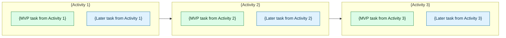

# {Product or Feature Name} User Story Map

## Metadata

| Field | Value |
| --- | --- |
| Product / Feature | {name} |
| Status | {draft/review/final} |
| Primary Actor | {primary actor} |
| Date | {date} |
| Language | {artifact language} |

## Goal & Context

{Outcome the map supports, current context, and any source inputs used such as raw idea, PRD, RFC, issue, or notes.}

## Actors

| Actor | Role in Map |
| --- | --- |
| {Primary Actor} | Primary journey owner |

## User Journey Map

| Field | Value |
| --- | --- |
| Actor | {primary actor} |
| Scenario | {scenario the actor is in} |
| Expectations | {what the actor expects to accomplish or experience} |
| Journey State | {current-state/future-state/hypothesis} |

| Phase | Narrative User Actions | Thoughts / Questions | Emotions / Pain Points | Opportunities | Evidence / Assumptions |
| --- | --- | --- | --- | --- | --- |
| {High-level phase 1} | {narrative actions} | {mindset, thoughts, or questions} | {emotions or pain points} | {takeaways, ownership, or metrics} | {evidence or assumption} |
| {High-level phase 2} | {narrative actions} | {mindset, thoughts, or questions} | {emotions or pain points} | {takeaways, ownership, or metrics} | {evidence or assumption} |
| {High-level phase 3} | {narrative actions} | {mindset, thoughts, or questions} | {emotions or pain points} | {takeaways, ownership, or metrics} | {evidence or assumption} |

## User Journey Backbone

| Order | High-Level Activity / Journey Stage | User Intent |
| --- | --- | --- |
| 1 | {Activity 1} | {intent} |
| 2 | {Activity 2} | {intent} |
| 3 | {Activity 3} | {intent} |

## User Tasks by Activity

| Activity | Slice | User Task |
| --- | --- | --- |
| {Activity 1} | {MVP/Later slice/Unassigned} | {concise user task} |
| {Activity 1} | {MVP/Later slice/Unassigned} | {concise user task} |
| {Activity 2} | {MVP/Later slice/Unassigned} | {concise user task} |
| {Activity 2} | {MVP/Later slice/Unassigned} | {concise user task} |
| {Activity 3} | {MVP/Later slice/Unassigned} | {concise user task} |
| {Activity 3} | {MVP/Later slice/Unassigned} | {concise user task} |

## Slice Plan

### MVP Slice — First End-to-End Walking Skeleton

| Journey Part | Activity | Included Task | Why Included |
| --- | --- | --- | --- |
| Early journey | {Activity} | {MVP task} | {why this is needed for first usable release} |
| Middle journey | {Activity} | {MVP task} | {why this is needed for first usable release} |
| Late journey | {Activity} | {MVP task} | {why this is needed for first usable release} |

### Later Release Slices (Optional)

| Release Slice | End-to-End Journey Outcome | Included Activities / Tasks | Notes |
| --- | --- | --- | --- |
| {Later vertical slice} | {journey outcome} | {activities and tasks across the journey} | {dependency, risk, or learning trigger} |

## Mermaid Story Map

## Open Questions

- {Question, owner if known, and why it matters}

## Risks

- {Risk, impact, and possible mitigation}

## Assumptions

- {Assumption and what would invalidate it}

## Next Steps

- Review the MVP Slice with stakeholders.
- Convert the MVP Slice into buildable issues when ready.
- Resolve the highest-impact open questions before implementation starts.
