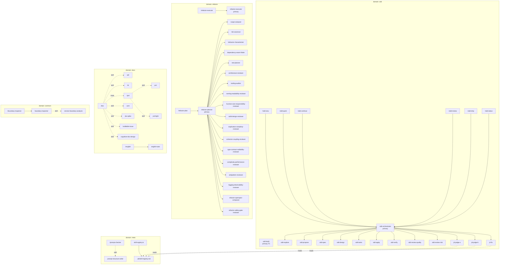
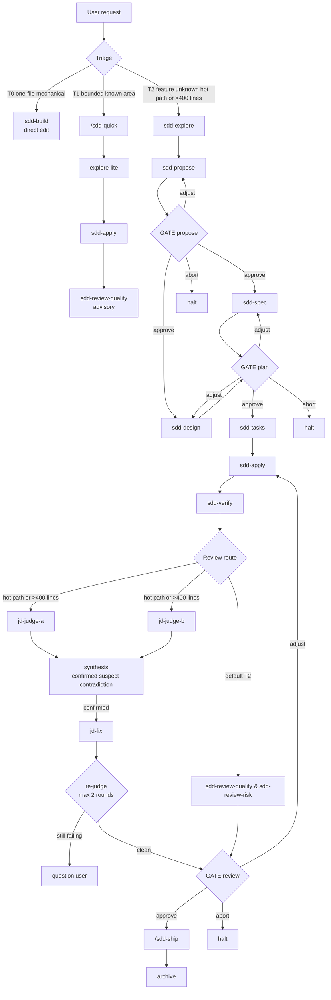
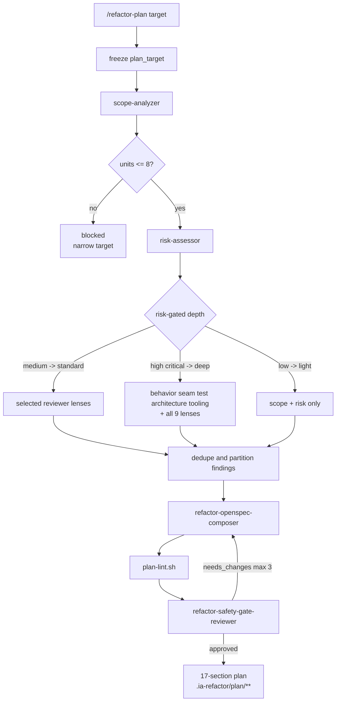
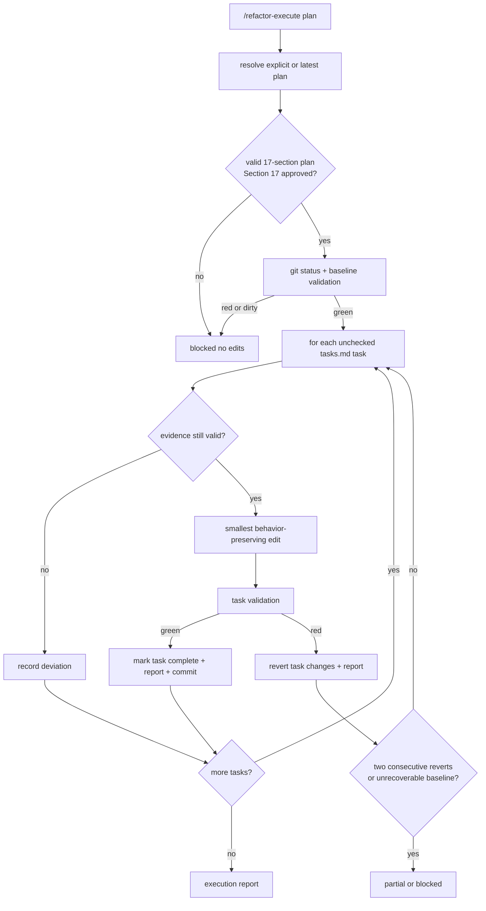
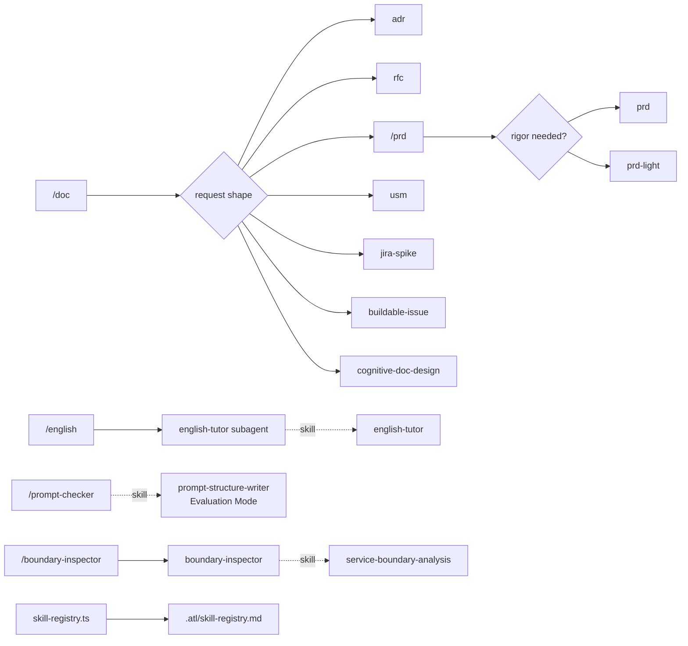
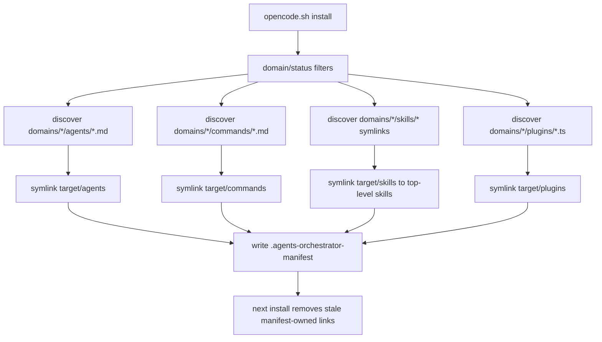

# Harness Flow Map

This document maps the agent harnesses in this repository and evaluates them for overlap, coverage, orchestration cost, and routing gates. It is an analysis artifact: no executable frontmatter, installer behavior, or skill contract changes live here.

## Executive Summary

The repo has two heavy orchestration clusters and three lighter routing domains.

| Cluster | Shape | Primary boundary |
|---|---|---|
| SDD | User-facing triage plus gated phase chain | `sdd-orchestrator` delegates only to its 12 `permission.task` allowlisted subagents and writes only `.arnes/**` state and handoffs. |
| Refactor | Risk-gated planning plus TCR execution | `refactor-planner` delegates only to its 18 `permission.task` allowlisted analysis/composition/gate subagents and writes only `.ia-refactor/plan/**`; `refactor-executor` does not delegate. |
| Docs | Thin command routers | `/doc`, `/prd`, and `/english` select the smallest relevant skill or subagent. |
| Meta | Prompt and registry utilities | `/prompt-checker` routes to `prompt-structure-writer`; `skill-registry.ts` generates `.atl/skill-registry.md`. |
| Common | Reusable inspection | `/boundary-inspector` delegates to the bounded `boundary-inspector` subagent. |

Legend:

| Convention | Meaning |
|---|---|
| `primary` | OpenCode primary agent, usually user-facing or command target. |
| `subagent` | Delegated worker, phase, reviewer, or bounded specialist. |
| `-->` | Delegation edge, authoritative only when present in `permission.task` allowlists for SDD and refactor hubs. |
| `-. skill .->` | Skill load, not subagent delegation. |
| `GATE` | User question, safety review, linter, or explicit execution precondition. |
| `A & B` | Parallel fan-out. |

## Global Map

Delegation edges from `sdd-orchestrator` and `refactor-planner` are taken from their `permission.task` allowlists. Router-to-skill edges are derived from command bodies and agent required-skill sections.

## Harness Diagrams

### SDD

Sources: `domains/sdd/agents/sdd-orchestrator.md`, `skills/sdd-workflow/SKILL.md`, `skills/judgment-day/SKILL.md`, and `docs/workflows/sdd-prd.md`.

Key observations:

| Area | Current behavior |
|---|---|
| Triage | T0 routes away from the coordinator to `sdd-build`; T1 uses a quick chain; T2 uses full SDD. |
| Parallelism | `sdd-spec` and `sdd-design` run in parallel after proposal approval; judgment-day judges run blind and parallel. |
| Gates | Proposal, plan, and review gates are user `question` decisions: approve, adjust, abort. |
| State | `sdd-orchestrator` owns `.arnes/changes/<change>/state.yaml`; subagents return envelopes and handoffs. |

### Refactor Plan

Sources: `domains/refactor/agents/refactor-planner.md` and `docs/workflows/refactor-plan.md`.

Depth fan-out:

| Depth | Trigger | Delegation profile |
|---|---|---|
| `smoke` | explicit `mode=smoke` or `--smoke` | No analysis fan-out; writes a lintable stub plan, not executable. |
| `light` | `risk: low` | `scope-analyzer`, `risk-assessor`, then planner-authored minimal findings. |
| `standard` | `risk: medium` | Always naming and type-contract lenses; additional lenses by method count, collaborators, target size, and logging evidence. |
| `deep` | `risk: high` or `critical` | Five additional workers plus all nine reviewer lenses in one fan-out message, then composer and safety gate. |

### Refactor Execute

Source: `domains/refactor/agents/refactor-executor.md`.

Execution gates:

| Gate | Effect |
|---|---|
| Plan shape | Rejects anything without exactly the expected 17-section contract. |
| `Depth:` | Rejects `smoke`; smoke is for harness validation only. |
| Section 17 | Requires `safety_review.status: "approved"` before any edits. |
| Baseline | Requires clean worktree and an explicit allowed validation command. |
| TCR loop | Green validation commits; red validation reverts the current task only. |

### Docs, Meta, Common

These domains are mostly routers, not multi-phase harnesses. They matter because they introduce reusable skills into the same installation target and because judgment-day can read the generated registry as "Project Standards".

### Installer

Source: `installers/opencode.sh`.

Installer notes:

| Area | Behavior |
|---|---|
| Targets | Default `~/.config/opencode`; `--project` targets `./.opencode`; `--target` supports scratch installs. |
| Status filter | Applies to skills only. Agents, commands, and plugins are not status-filtered because executable frontmatter cannot carry repo-only metadata. |
| Skill source | Domain skill entries must be symlinks to top-level `skills/<skill>`. |
| Sync | The manifest lets future installs remove previously owned links that are no longer selected. |

## Evaluation

### 1. Overlap And Redundancy

| Finding | Evidence | Evaluation |
|---|---|---|
| Dual SDD planning paths | `skills/sdd-draft-{proposal,spec,design,tasks}` support interview-first OpenSpec drafting, while `sdd-{propose,spec,design,tasks}` are orchestrated SDD phase agents under the shared `sdd-workflow` contract. | Useful but overlapping. The repo should keep the distinction explicit: grill SDD is plan drafting; `sdd-orchestrator` is stateful phase orchestration. |
| Multiple review systems | SDD has `sdd-review-quality` and `sdd-review-risk`; judgment-day has dual blind judges; refactor has nine reviewer lenses. | Intentional depth ladder, but review naming should make scope obvious to avoid invoking the expensive path for routine checks. |
| Generic refactor skill overlaps refactor domain | `skills/refactor/SKILL.md` is a 62+ technique catalog, while `domains/refactor` provides planning/execution harnesses. | Keep the skill as technique reference; avoid routing it as a replacement for `/refactor-plan`. |
| `single-responsibility` is reused by two lenses | `function-size-responsibility-reviewer` loads `single-responsibility`; `solid-design-reviewer` also loads it. | Acceptable reuse, but findings can duplicate. The planner reducer is the right dedupe point. |
| Two SDD planning routers | `grill` has `sdd` mode and the repo also has `/sdd-new` through `sdd-orchestrator`. | Clarify entrypoint guidance: use `grill sdd` for interviewing into OpenSpec artifacts; use `/sdd-new` for active `.arnes` stateful work. |

### 2. Coverage And Gaps

| Finding | Evidence | Risk or gap |
|---|---|---|
| No refactor runtime plugin | `domains/refactor/plugins/` has no plugin files. | The write boundary depends on OpenCode permission frontmatter and prompt contracts, not a global write-guard plugin. This is simpler but makes permission drift more important to review. |
| Backlog skills are installable unless filtered out | Current frontmatter count: 10 backlog skills, including `buildable-issue` and `tcr`. `/doc` references `buildable-issue`; `refactor-executor` loads `tcr`. | Status is lifecycle metadata, not a hard runtime block unless installer filters are used. Backlog dependencies should be reviewed before promoting a workflow as stable. |
| `meta` has no agents | `domains/meta/agents/` is absent; meta has one command and one plugin. | Fine for now: prompt checking is skill-only and registry behavior is plugin runtime. Add an agent only when prompt/meta work needs delegation or scoped permissions. |
| Isolated leaf flows | `boundary-inspector` and `english-tutor` are useful leaf agents but not integrated into larger SDD or refactor flows. | This keeps them simple. The tradeoff is duplicated manual invocation when a larger workflow needs boundary or language review. |
| Refactor execution observes tests, not app runtime | `refactor-executor` gates on baseline validation and TCR task validation. | Good for behavior-preserving refactors, but there is no explicit running-app observation phase beyond tests and user-approved validation commands. |

### 3. Cost And Orchestration Depth

| Harness | Tier or depth | Subagent count | Fan-out points | Cost controls |
|---|---:|---:|---|---|
| SDD | T0 | 0 from `sdd-orchestrator`; user switches to `sdd-build` | none | No artifacts, no gates. |
| SDD | T1 | about 3 phases | apply plus advisory review | Triage bounds and escalation rules. |
| SDD | T2 default | about 8 phase/review agents | `sdd-spec` and `sdd-design` in parallel; quality and risk review in parallel | Gates after proposal, plan, and review; envelope-only context. |
| SDD | T2 judgment-day | T2 chain plus 2 judges and `jd-fix`, repeated up to 2 fix rounds | `jd-judge-a` and `jd-judge-b` in blind parallel rounds | Hot-path or >400-line trigger; confirmed-only fixes; max 2 rounds. |
| Refactor plan | light | 2 delegated analysis agents plus composer/gate path as needed | none | `risk: low` skips reviewer panel. |
| Refactor plan | standard | 2 base agents plus selected lenses plus composer and gate | selected reviewer subset | Lens heuristics by size, collaborators, and logging evidence. |
| Refactor plan | deep | 16 analysis/reviewer subagents in one fan-out, then composer and safety gate | 5 workers plus 9 lenses after scope and risk | Risk-gated depth, target unit cap, reducer, lint, and max 3 safety iterations. |
| Refactor execute | approved plan | 0 delegated subagents | none | Section 17 approval, clean baseline, TCR commits/reverts, stop rules. |

### 4. Routing And Gates

| Gate or route | Location | Purpose |
|---|---|---|
| SDD triage | `sdd-orchestrator` and `sdd-workflow` | Route every request to T0, T1, or T2; escalate when scope grows. |
| SDD proposal gate | after `sdd-propose` | Approves intent, scope, approach, and blast radius. |
| SDD plan gate | after `sdd-spec` and `sdd-design` | Approves the implementation contract before tasks. |
| SDD review gate | after review or judgment-day | Approves merge readiness before ship. |
| Judgment-day synthesis | `judgment-day` skill | Separates confirmed, suspect, and contradiction buckets; only confirmed findings go to `jd-fix`. |
| Refactor risk gate | `refactor-planner` | Converts risk to depth and controls fan-out. |
| Refactor safety gate | `refactor-safety-gate-reviewer` plus `plan-lint.sh` | Blocks malformed, speculative, or unsafe plans before completion. |
| Refactor execute gate | `refactor-executor` | Requires valid Section 17 approved plan before edits. |
| Task allowlists | SDD and refactor planner frontmatter | Make delegation boundaries explicit: `*` denied, named subagents allowed. |

## Appendix: Inventory

Current inventory from the working tree:

| Type | Count |
|---|---:|
| Agents | 36 |
| Commands | 13 |
| Skills | 69 |
| Domain skill symlinks | 69 |
| Plugins | 1 |

By domain:

| Domain | Agents | Commands | Skill symlinks | Plugins |
|---|---:|---:|---:|---:|
| common | 1 | 1 | 27 | 0 |
| docs | 1 | 3 | 13 | 0 |
| meta | 0 | 1 | 2 | 1 |
| refactor | 20 | 2 | 18 | 0 |
| sdd | 14 | 6 | 9 | 0 |

Skill lifecycle status, from `skills/*/SKILL.md` frontmatter:

| Status | Count |
|---|---:|
| backlog | 10 |
| in-progress | 40 |
| testing | 16 |
| done | 3 |

### Agent To Skill Loads

This table lists explicit, stable skill loads. Some agents select additional skills dynamically from caller payloads or language detection.

| Agent or command | Explicit skill loads |
|---|---|
| `sdd-orchestrator` | `sdd-workflow`, `judgment-day` when full contracts are needed. |
| `sdd-explore` | No separate homonymous skill; phase behavior is in the agent prompt plus `sdd-workflow` tables. |
| `sdd-propose` | No separate homonymous skill; phase behavior is in the agent prompt plus `sdd-workflow` tables. |
| `sdd-spec` | No separate homonymous skill; phase behavior is in the agent prompt plus `sdd-workflow` tables. |
| `sdd-design` | No separate homonymous skill; phase behavior is in the agent prompt plus `sdd-workflow` tables. |
| `sdd-tasks` | No separate homonymous skill; phase behavior is in the agent prompt plus `sdd-workflow` tables. |
| `sdd-apply` | No separate homonymous skill; phase behavior is in the agent prompt plus `sdd-workflow` tables. |
| `sdd-verify` | No separate homonymous skill; phase behavior is in the agent prompt plus `sdd-workflow` tables. |
| `sdd-review-quality` | No separate homonymous skill; review behavior is in the agent prompt plus `sdd-workflow` routing. |
| `sdd-review-risk` | No separate homonymous skill; review behavior is in the agent prompt plus `sdd-workflow` routing. |
| `refactor-executor` | `tcr`, `work-unit-commits`. |
| `refactor-openspec-composer` | `openspec-refactor-composition`. |
| `refactor-safety-gate-reviewer` | `refactor-plan-safety-gates`. |
| `naming-readability-reviewer` | `reviewer-output-contract`, then `java-naming-readability` or `general-naming-readability`. |
| `function-size-responsibility-reviewer` | `reviewer-output-contract`, `small-functions`, `single-responsibility`. |
| `solid-design-reviewer` | `reviewer-output-contract`, `single-responsibility`, `open-closed-principle`, `dependency-inversion`. |
| `duplication-simplicity-reviewer` | `reviewer-output-contract`, `dry-business-knowledge`, `kiss-yagni`. |
| `cohesion-coupling-reviewer` | `reviewer-output-contract`, `cohesion-coupling`. |
| `type-contract-nullability-reviewer` | `reviewer-output-contract`, `type-contracts`, `null-safety`, `input-validation-preconditions`. |
| `complexity-performance-reviewer` | `reviewer-output-contract`, `complexity-big-o`. |
| `antipattern-reviewer` | `reviewer-output-contract`, `god-object-detection`, `spaghetti-code-detection`. |
| `logging-observability-reviewer` | `reviewer-output-contract`, `logging-observability`. |
| `english-tutor` | `english-tutor`. |
| `boundary-inspector` | `service-boundary-analysis`. |
| `/doc` | `adr`, `rfc`, `usm`, `jira-spike`, `buildable-issue`, `cognitive-doc-design`, or `/prd` by request shape. |
| `/prd` | `prd` or `prd-light` after triage confirmation. |
| `/prompt-checker` | `prompt-structure-writer` Evaluation Mode. |
| `grill` SDD mode | `grilling`, `native-question-ux`, `sdd-draft-proposal`, `sdd-draft-spec`, `sdd-draft-design`, `sdd-draft-tasks`. |

### Verification Checklist

- Mermaid blocks use simple `flowchart` syntax suitable for GitHub preview.
- SDD delegation edges match the 12 named `permission.task` allows in `domains/sdd/agents/sdd-orchestrator.md`.
- Refactor planner delegation edges match the 18 named `permission.task` allows in `domains/refactor/agents/refactor-planner.md`.
- Every agent and skill named in the inventory exists in `domains/*/agents/` or `skills/`.
- This file is documentation-only under `docs/` and does not change executable frontmatter or installer behavior.
