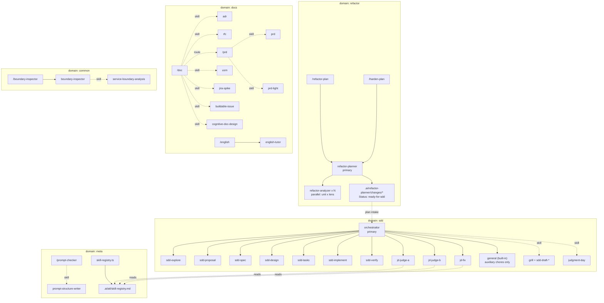
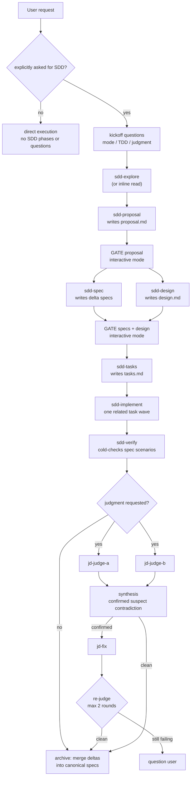
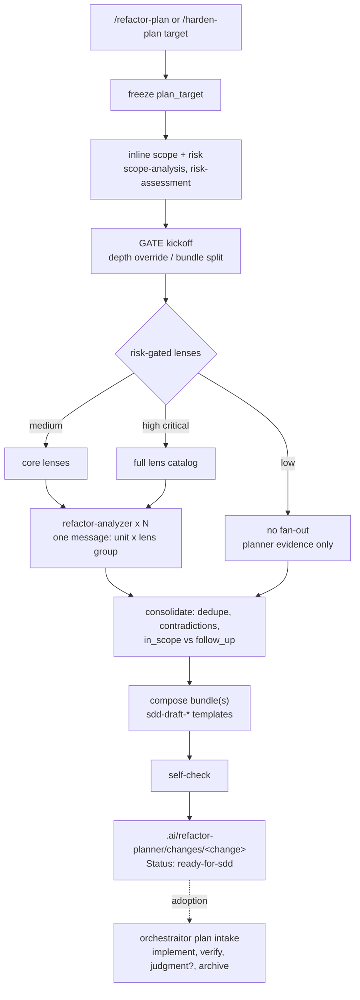
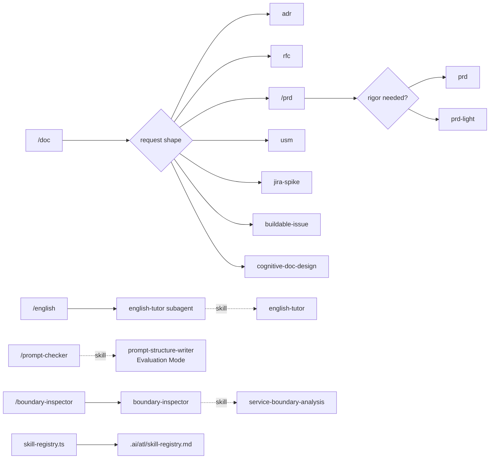
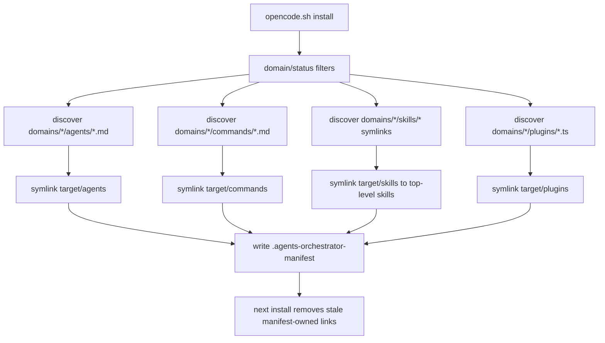

# Harness Flow Map

This document maps the agent harnesses in this repository and evaluates them for overlap, coverage, orchestration cost, and routing gates. It is an analysis artifact: no executable frontmatter, installer behavior, or skill contract changes live here.

## Executive Summary

The repo has two heavy orchestration clusters and three lighter routing domains.

| Cluster | Shape | Primary boundary |
|---|---|---|
| SDD | Opt-in coordinator primary agent with an explicit SDD kickoff | `orchestraitor` executes directly by default; after explicit SDD activation, it keeps the interview, gates, integration, and archive in the main session and delegates phase work to its 11 `permission.task` allowlisted subagents: `sdd-explore`, six phase agents, judgment-day agents, and `general` for auxiliary chores only. Artifacts are managed OpenSpec-style under `.ai/orchestrator/**`. |
| Refactor | Risk-gated refactor and test-hardening (CDD) planning producing ready-for-sdd bundles | `refactor-planner` delegates only to the generic `refactor-analyzer` (N parallel lens instances) and writes only `.ai/refactor-planner/changes/**`; execution happens through sdd plan intake (`docs/plan-handoff.md`). |
| Docs | Thin command routers | `/doc`, `/prd`, and `/english` select the smallest relevant skill or subagent. |
| Meta | Prompt and registry utilities | `/prompt-checker` routes to `prompt-structure-writer`; `skill-registry.ts` generates `.ai/atl/skill-registry.md`. |
| Common | Reusable inspection | `/boundary-inspector` delegates to the bounded `boundary-inspector` subagent. |

Legend:

| Convention | Meaning |
|---|---|
| `primary` | OpenCode primary agent, usually user-facing or command target. |
| `subagent` | Delegated worker, phase, reviewer, or bounded specialist. |
| `-->` | Delegation edge, authoritative only when present in `permission.task` allowlists for SDD and refactor hubs. |
| `-. skill .->` | Skill load, not subagent delegation. |
| `GATE` | User question, safety review, linter, or explicit execution precondition. |
| `A & B` | Parallel fan-out. |

## Global Map

Delegation edges from `orchestraitor` and `refactor-planner` are taken from their `permission.task` allowlists. Router-to-skill edges are derived from command bodies and agent required-skill sections.

## Harness Diagrams

### SDD

Sources: `domains/sdd/agents/orchestraitor.md`, `skills/judgment-day/SKILL.md`, and `docs/sdd-domain-sequence.md`.

Key observations:

| Area | Current behavior |
|---|---|
| Entry | Explicit only: "vamos con sdd", "usa SDD", or equivalent clear intent. Without an SDD mention, execution is direct and `general` is available only for auxiliary chores. `/judgment` is available for standalone adversarial review. |
| Kickoff | Runs only after explicit SDD activation: one question round via `native-question-ux` for interactive/automatic mode, TDD, and judgment. |
| Gates | Interactive mode confirms after the proposal and after specs plus design; automatic mode only stops when genuinely blocked. |
| Phase agents | Dedicated agents handle proposal, spec, design, tasks, implementation, and verification so a model can be assigned per phase via the user's `opencode.json` (see `docs/agent-models.md`). |
| Auxiliary work | `general` stays allowlisted only for self-contained chores such as lateral research, fixtures, or background suites. |
| Artifacts | OpenSpec-style under `.ai/orchestrator/`: canonical `specs/`, active `changes/<name>/`, and `changes/archive/` with deltas merged into canonical specs. |

### Refactor Plan

Sources: `domains/refactor/agents/refactor-planner.md`, `docs/workflows/refactor-plan.md`, `docs/workflows/harden-plan.md`, and `docs/plan-handoff.md`.

Lens fan-out:

| Risk | Fan-out | Profile |
|---|---|---|
| `low` | none | Planner drafts the bundle from its own scope and risk evidence. |
| `medium` | 1-2 analyzer instances per unit | Core lenses (readability, contracts, simplicity) plus size/collaborator heuristics. |
| `high` or `critical` | up to 3 analyzer instances per unit, max 12 per message | Full catalog including behavior-safety, test-safety-net, architecture, tooling. |
| `hardening` plan kind (`/harden-plan`) | exactly 3 lens groups per unit | No risk gating: always behavior-safety, test-safety-net, tooling; structural lenses never run. Fixed CDD task order: tooling enablement → seams → characterization/unit tests → coverage/mutation baseline vs kickoff thresholds. |

Execution is no longer part of this domain: `/refactor-execute` was removed, and adopted bundles run through the normal SDD flow (implement waves, verify, optional judgment, archive).

### Docs, Meta, Common

These domains are mostly routers, not multi-phase harnesses. They matter because they introduce reusable skills into the same installation target and because judgment-day can read the generated registry as "Project Standards".

### Installer

Source: `installers/opencode.sh`.

Installer notes:

| Area | Behavior |
|---|---|
| Targets | Default `~/.config/opencode`; `--project` targets `./.opencode`; `--target` supports scratch installs. |
| Status filter | Applies to skills only. Agents, commands, and plugins are not status-filtered because executable frontmatter cannot carry repo-only metadata. |
| Skill source | Domain skill entries must be symlinks to top-level `skills/<skill>`. |
| Sync | The manifest lets future installs remove previously owned links that are no longer selected. |

## Evaluation

### 1. Overlap And Redundancy

| Finding | Evidence | Evaluation |
|---|---|---|
| SDD phase agents reintroduced with narrower roles | The 2026-07-06 simplification removed earlier phase agents because they duplicated interviewing and drafting decisions. The 2026-07-07 design reintroduces phase agents as single-responsibility workers with no user interview and one artifact or task wave each. | Intentional pivot: the coordinator still owns decisions and gates, while dedicated agents make per-phase model assignment possible through the user's `opencode.json` (see `docs/agent-models.md`) without returning to duplicated orchestration. |
| Multiple review systems | SDD uses judgment-day dual blind judges (opt-in); refactor runs parallel analyzer lenses at plan time. | Intentional depth ladder, but review naming should make scope obvious to avoid invoking the expensive path for routine checks. |
| Generic refactor skill overlaps refactor domain | `skills/refactor/SKILL.md` is a 62+ technique catalog, while `domains/refactor` provides the planning harness. | Keep the skill as technique reference; avoid routing it as a replacement for `/refactor-plan`. |
| Lens skills can overlap across analyzer briefs | The design and simplicity lenses both touch responsibility and duplication concerns. | Acceptable reuse, but findings can duplicate. The planner reducer is the right dedupe point. |
| Two SDD entrypoints | `grill` keeps its standalone `sdd` mode for pure planning interviews; `orchestraitor` runs the full build cycle only after explicit SDD activation, using the same `sdd-draft-*` skills through dedicated phase agents. | Acceptable: `grill sdd` is plan-only drafting in chat; explicit SDD activation in `orchestraitor` coordinates the full cycle, delegating formal phases to `sdd-*` agents. Both write `.ai/orchestrator/changes/`. |

### 2. Coverage And Gaps

| Finding | Evidence | Risk or gap |
|---|---|---|
| No refactor runtime plugin | `domains/refactor/plugins/` has no plugin files. | The write boundary depends on OpenCode permission frontmatter and prompt contracts, not a global write-guard plugin. This is simpler but makes permission drift more important to review. |
| Backlog skills are installable unless filtered out | Current frontmatter count: 10 backlog skills, including `buildable-issue` and `tcr`. `/doc` references `buildable-issue`; `orchestraitor` offers `tcr` for TDD cadence. | Status is lifecycle metadata, not a hard runtime block unless installer filters are used. Backlog dependencies should be reviewed before promoting a workflow as stable. |
| `meta` has no agents | `domains/meta/agents/` is absent; meta has one command and one plugin. | Fine for now: prompt checking is skill-only and registry behavior is plugin runtime. Add an agent only when prompt/meta work needs delegation or scoped permissions. |
| Isolated leaf flows | `boundary-inspector` and `english-tutor` are useful leaf agents but not integrated into larger SDD or refactor flows. | This keeps them simple. The tradeoff is duplicated manual invocation when a larger workflow needs boundary or language review. |
| Refactor execution rides on SDD verification | Adopted bundles are executed by `sdd-implement` waves and cold-checked by `sdd-verify` against the bundle's characterization scenarios. | Behavior preservation depends on the quality of the bundle's spec deltas; there is no separate refactor-specific execution gate anymore. |

### 3. Cost And Orchestration Depth

| Harness | Tier or depth | Subagent count | Fan-out points | Cost controls |
|---|---:|---:|---|---|
| Direct request | no SDD mention | 0 SDD phase subagents | none | Direct execution; no kickoff questions or `.ai/orchestrator/changes/` artifacts. |
| SDD | explicit activation | 0-1 (`sdd-explore` only when the area is unknown or large), plus phase agents: `sdd-proposal`, `sdd-spec`, `sdd-design`, `sdd-tasks`, `sdd-implement` waves, and `sdd-verify` | drafting wave 2 (specs and design in parallel); independent implementation waves in parallel | Kickoff choices; interactive gates after proposal and specs+design; task grouping into waves bounds implementation subagent count. |
| SDD | explicit activation with judgment | explore plus 2 judges and `jd-fix`, repeated up to 2 fix rounds | `jd-judge-a` and `jd-judge-b` in blind parallel rounds | Opt-in at kickoff; confirmed-only fixes; max 2 rounds. |
| Refactor plan | `risk: low` | 0 delegated subagents | none | Planner drafts from inline scope and risk evidence. |
| Refactor plan | `risk: medium` | 1-2 `refactor-analyzer` instances per unit | one parallel message | Core lenses only; size/collaborator heuristics. |
| Refactor plan | `risk: high/critical` | up to 3 `refactor-analyzer` instances per unit, max 12 per message | one parallel message, batched by unit beyond the cap | Full lens catalog; reducer dedupe; self-check before reporting. |
| Refactor execution | via sdd adoption | sdd phase agents | sdd implementation waves | Kickoff-lite at adoption; normal SDD gates, verify, and optional judgment. |

### 4. Routing And Gates

| Gate or route | Location | Purpose |
|---|---|---|
| SDD kickoff | `orchestraitor` | Runs only after explicit SDD activation; one question round: mode (interactive/automatic), TDD, judgment. |
| SDD proposal gate | interactive mode, after the proposal draft | Approves intent, scope, approach, and capability binding. |
| SDD plan gate | interactive mode, after specs plus design | Approves the implementation contract before tasks. |
| Judgment-day synthesis | `judgment-day` skill | Separates confirmed, suspect, and contradiction buckets; only confirmed findings go to `jd-fix`. |
| Refactor risk gate | `refactor-planner` | Converts risk to lens selection and controls fan-out size. |
| Refactor self-check | `refactor-planner` | Verifies marker line, artifact completeness, task shape, and evidence before reporting. |
| Plan intake gate | `orchestraitor` | Adopts only `Status: ready-for-sdd` bundles; never overwrites; asks the kickoff-lite round once. |
| Task allowlists | `orchestraitor` and refactor planner frontmatter | Make delegation boundaries explicit: `*` denied, named subagents allowed. |

## Appendix: Inventory

Current inventory from the working tree:

| Type | Count |
|---|---:|
| Agents | 15 |
| Commands | 8 |
| Skills | 65 |
| Domain skill symlinks | 71 |
| Plugins | 1 |

By domain:

| Domain | Agents | Commands | Skill symlinks | Plugins |
|---|---:|---:|---:|---:|
| common | 1 | 1 | 27 | 0 |
| docs | 1 | 3 | 13 | 0 |
| meta | 0 | 1 | 4 | 1 |
| refactor | 2 | 2 | 19 | 0 |
| sdd | 11 | 1 | 8 | 0 |

Skill lifecycle status, from `skills/*/SKILL.md` frontmatter:

| Status | Count |
|---|---:|
| backlog | 10 |
| in-progress | 35 |
| testing | 17 |
| done | 3 |

### Agent To Skill Loads

This table lists explicit, stable skill loads. Some agents select additional skills dynamically from caller payloads or language detection.

| Agent or command | Explicit skill loads |
|---|---|
| `orchestraitor` | `native-question-ux` for the kickoff and gates; `code-conventions` for any code it writes; delegates drafting to `sdd-proposal`, `sdd-spec`, `sdd-design`, and `sdd-tasks`; delegates implementation to `sdd-implement` (which loads `code-conventions`); delegates verification to `sdd-verify`; loads `judgment-day` when judgment is requested; offers `tcr` for TDD cadence. |
| `sdd-explore` | No separate homonymous skill; discovery behavior is in the agent prompt. |
| `refactor-planner` | `scope-analysis`, `risk-assessment`, `native-question-ux` inline; `sdd-draft-proposal`, `sdd-draft-spec`, `sdd-draft-design`, `sdd-draft-tasks` for bundle composition; lens skills selected per brief from the lens catalog. |
| `refactor-analyzer` | Loads exactly the skills listed in each planner brief (lens catalog: readability, design, simplicity, contracts, behavior-safety, test-safety-net, architecture, tooling, observability). |
| `english-tutor` | `english-tutor`. |
| `boundary-inspector` | `service-boundary-analysis`. |
| `/doc` | `adr`, `rfc`, `usm`, `jira-spike`, `buildable-issue`, `cognitive-doc-design`, or `/prd` by request shape. |
| `/prd` | `prd` or `prd-light` after triage confirmation. |
| `/prompt-checker` | `prompt-structure-writer` Evaluation Mode. |
| `grill` SDD mode | `grilling`, `native-question-ux`, `sdd-draft-proposal`, `sdd-draft-spec`, `sdd-draft-design`, `sdd-draft-tasks`. |

### Verification Checklist

- Mermaid blocks use simple `flowchart` syntax suitable for GitHub preview.
- SDD delegation edges match the 11 named `permission.task` allows in `domains/sdd/agents/orchestraitor.md` (including OpenCode's built-in `general` for auxiliary chores only).
- Refactor planner delegation edges match the single named `permission.task` allow (`refactor-analyzer`) in `domains/refactor/agents/refactor-planner.md`.
- Every agent and skill named in the inventory exists in `domains/*/agents/` or `skills/`.
- This file is documentation-only under `docs/` and does not change executable frontmatter or installer behavior.
