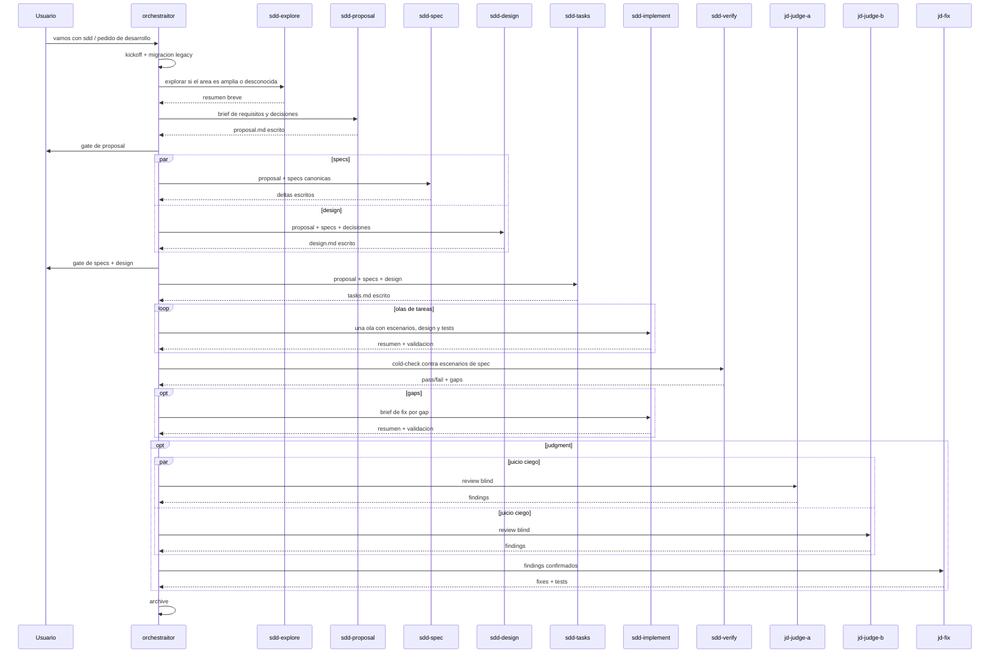

# SDD Domain: Flujo del Orchestraitor

`orchestraitor` coordina el ciclo SDD, pero las fases ahora viven en subagentes dedicados. Eso permite fijar `model:` por fase más adelante sin cambiar la experiencia del usuario ni mezclar responsabilidades.

## Kickoff

Una sola ronda de preguntas (omite lo que ya dijiste en el pedido):

| Pregunta | Opciones |
|---|---|
| Modo | `interactivo` (entrevista + gates de confirmación) / `automático` (redacta, implementa y resume al final) |
| TDD | test-first por tarea / tests junto a la implementación |
| Juicio | judgment-day al final / sin review adversarial |

Si el pedido es trivial (typo, rename, config), no hay kickoff ni artefactos: lo hace directo.

## Flujo



- **explore**: `sdd-explore` cuando la zona es desconocida o grande; lectura inline si el cambio es acotado.
- **proposal/specs/design/tasks**: `sdd-proposal`, `sdd-spec`, `sdd-design` y `sdd-tasks` escriben un solo artefacto cada uno y devuelven 1-3 líneas.
- **implement**: `sdd-implement` ejecuta una ola relacionada de `tasks.md`; olas independientes pueden ir en paralelo.
- **verify**: `sdd-verify` hace cold-check read-only por escenario de spec; los gaps vuelven como briefs de fix a `sdd-implement`.
- **judgment**: `jd-judge-a` y `jd-judge-b` corren ciegos; solo findings confirmados pasan a `jd-fix`.
- **general**: queda solo para chores auxiliares autocontenidos, nunca para drafting, implementación o verify.

## Archivos (.ai/orchestrator/)

```text
.ai/orchestrator/
  project.md                     # contexto del proyecto
  specs/<capability>/spec.md     # specs canonicas: lo que el sistema hace hoy
  changes/<change>/
    proposal.md                  # por que y que cambia
    design.md                    # enfoque tecnico (opcional si es simple)
    specs/<capability>/spec.md   # deltas ADDED / MODIFIED / REMOVED
    tasks.md                     # checklist de implementacion
  changes/archive/<YYYY-MM-DD>-<change>/
```

Convención tomada de OpenSpec: las specs canónicas siempre reflejan lo construido; los cambios activos son propuestas en vuelo, y al archivar sus deltas se fusionan en las canónicas.

## Migración Legacy

Al inicio de cualquier cambio o resume, si existe `.orchestraitor/` o `.orchestrator/` y no existe `.ai/orchestrator/`, el orchestraitor mueve el directorio legacy a `.ai/orchestrator/` y reporta una línea. Si existen ambos, mueve solo entradas faltantes, no sobrescribe, y reporta conflictos. Nunca borra contenido legacy sin haberlo movido.

## Resume / Contexto Largo

Los artefactos son el estado; la conversación es desechable. Si la sesión se pone pesada a mitad de un cambio, ciérrala y en una sesión nueva di "continúa <change>": el orchestraitor relee `.ai/orchestrator/changes/<change>/` y retoma desde la primera tarea sin marcar, sin repetir el kickoff.
