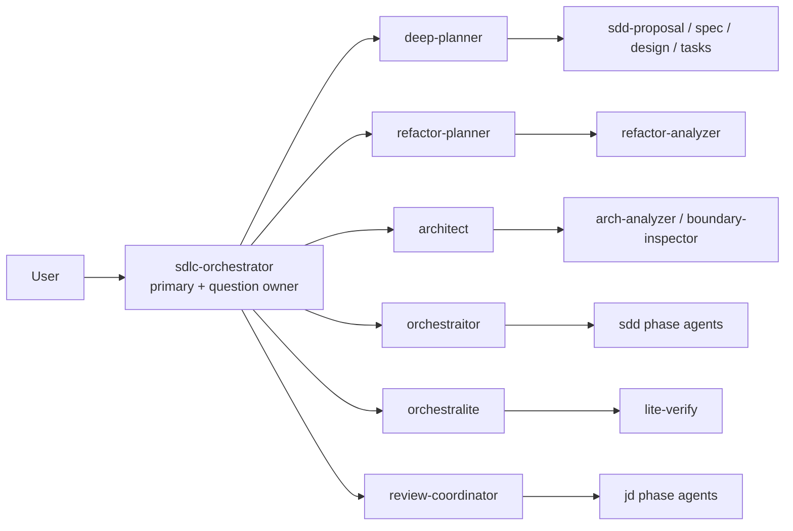

# SDLC Orchestrator POC

Status: opt-in project profile. It is not the repository's global install default and does not replace standalone domains outside the selected profile.

## Outcome

The POC gives one natural-language entrypoint, `sdlc-orchestrator`, responsibility for route selection and every user-facing question. It delegates domain work to six coordinators; those coordinators delegate only their own phase agents. The primary cannot edit files or run commands.



The two-level child topology depends on OpenCode's project configuration and task continuation contracts. Relevant upstream references are the official [configuration](https://opencode.ai/docs/config/), [agents](https://opencode.ai/docs/agents/), [commands](https://opencode.ai/docs/commands/), and [permissions](https://opencode.ai/docs/permissions/) documentation, plus the pinned [OpenCode 1.18.10 Task implementation](https://github.com/anomalyco/opencode/blob/v1.18.10/packages/opencode/src/tool/task.ts). This POC requires OpenCode 1.18.10 or a compatible release with `default_agent`, `subagent_depth`, and Task `task_id` continuation behavior.

## Install, inspect, and remove

Always name an absolute project root. The profile owns only that project's `.opencode/` directory.

```bash
scripts/sdlc-orchestrator-poc.sh install --project-root /absolute/path/to/project
scripts/sdlc-orchestrator-poc.sh status --project-root /absolute/path/to/project
scripts/sdlc-orchestrator-poc.sh uninstall --project-root /absolute/path/to/project
```

Install selects exactly these domains:

```text
sdlc,plan,sdd,architecture,refactor,sdd-lite,common
```

It then applies these comment-preserving project properties:

```jsonc
{
  "default_agent": "sdlc-orchestrator",
  "subagent_depth": 2
}
```

Learning and its `mentor` primary are intentionally outside the profile. The generic installer remains available for standalone or global domain installations; the POC wrapper is the only supported way to apply this profile.

## Natural routes

The primary routes immediately when intent is clear. It shows a compact menu only for genuinely ambiguous intent or an explicit help request.

| Intent | Coordinator | Operation |
|---|---|---|
| Executable or decision planning | `deep-planner` | `deep-plan` or `wayfinder` |
| Test safety-net planning | `refactor-planner` | `hardening` |
| Behavior-preserving refactor planning | `refactor-planner` | `refactor` |
| Full implementation, resume, or ready bundle | `orchestraitor` | `direct-sdd`, `resume`, or `execute-handoff` |
| Obviously bounded low-risk implementation | `orchestralite` | `sdd-lite` |
| Architecture map, review, PRD, ideation, audit, or boundary inspection | `architect` | matching architecture operation |
| Judgment or Socratic defense | `review-coordinator` | `judgment` or `defend` |

Refactor and SDD Lite are named `[Beta] Refactor` and `[Beta] SDD Lite` in user-facing route choices.

The compatibility aliases routed through the primary are exactly:

```text
/arch-audit  /arch-ideate  /arch-map  /arch-prd  /arch-review
/boundary-inspector  /deep-plan  /wayfinder  /harden-plan
/refactor-plan  /judgment  /defend
```

`/graphify-index`, `/grill`, and commands from domains outside the profile remain unchanged and do not route through this primary.

## Coordinator dependencies

| Coordinator | Owns | May delegate to | Durable output |
|---|---|---|---|
| `deep-planner` | Deep Plan and Wayfinder | `general`, four SDD drafting agents | `.ai/deep-planner/`, `.ai/roadmaps/`, `.ai/wayfinder/` |
| `refactor-planner` | Hardening and refactor plans | `refactor-analyzer` | `.ai/refactor-planner/changes/` |
| `architect` | Six architecture operations | `arch-analyzer`, `boundary-inspector` | project architecture docs, `.ai/architect/` |
| `orchestraitor` | Full SDD and ready-bundle execution | SDD phase agents | `.ai/orchestrator/` or the producer bundle root |
| `orchestralite` | Bounded implementation in one child | `lite-verify` only | `.ai/sdd-lite/` |
| `review-coordinator` | Judgment and Defend | `jd-judge-a`, `jd-judge-b`, `jd-solo`, `jd-fix` | review receipt and any workflow ledger |

Every coordinator returns one `sdlc-coordinator-receipt/v1`. A `needs_input` receipt contains exactly the next unresolved question. The primary asks it, then resumes the same coordinator child with the Task `task_id`; it does not create a replacement child or answer for the user. The same rule preserves SDD Lite's retained pre-approval draft and optional audit or Git-history consent.

## Plan to SDD without redrafting

Deep Plan, Hard Plan, Refactor Plan, and architecture ideation produce a complete four-artifact bundle under their producer root:

```text
.ai/<producer>/changes/<change>/
  proposal.md
  design.md
  specs/<capability>/spec.md
  tasks.md
```

The planning receipt names the exact producer, change, and bundle path. When the user asks to implement, the primary sends that receipt and path to `orchestraitor` as `execute-handoff`. SDD validates the marker and shape, makes the producer directory its active root, adds only execution state and kickoff settings, and starts at implementation. It does not copy or move the bundle into `.ai/orchestrator/changes/`, and it does not relaunch proposal, spec, design, or task drafting. On completion, it archives beside the producer's `changes/` directory.

Direct SDD remains different: without a ready handoff, `orchestraitor` owns planning under `.ai/orchestrator/changes/` before implementation.

## Session continuity and reconstruction

Within one primary conversation, Task IDs are stored per coordinator. A response to `needs_input` or a continuation of the same operation resumes that exact child. Crossing from Plan to SDD starts a separate SDD child but keeps the planning receipt and planner Task ID as provenance in the same parent session.

A prior chat is not required for recovery. In a new primary session, the exact ready-for-sdd marker and four artifacts on disk reconstruct the handoff. In-flight SDD resumes from `state.md`, kickoff settings, task checkboxes, and the exact active root. Ambiguous duplicate paths return `needs_input`; the primary never guesses.

## Ownership, tamper checks, and rollback

The wrapper composes two narrow ownership records:

- `.agents-orchestrator-manifest` owns the selected installer links, verified external files, and created directories.
- `.sdlc-orchestrator-poc-manifest` owns the profile selection, installer-manifest checksum, and the previous JSONC states and values for `default_agent` and `subagent_depth`.

Before mutation, install rejects `/`, the user's home, this source repository and its worktrees, a foreign installer manifest, foreign expected destinations, invalid JSONC, and paths escaping the supplied project. Downloads and checksums complete before the transactional installer mutates the target.

`status` and `uninstall` fail closed if the installer manifest becomes broad or foreign, its checksum changes, either managed config value is changed, or a selected component is stale, missing, or foreign. A failed uninstall leaves components in place for inspection. A clean uninstall removes only manifest-owned components, restores the exact prior scalar values (or removes properties that were originally absent), preserves comments and foreign JSONC keys, and removes the profile manifest.

## Validation

Free checks:

```bash
scripts/test-sdlc-orchestrator-contracts.sh
scripts/test-sdlc-orchestrator-poc.sh
scripts/test-external-plugin-install.sh contracts
scripts/validate-harness.sh
```

The structure contract checks the single primary, single question owner, six coordinator allowlist, coordinator receipts, nested question denies, exact 12 aliases, and unchanged excluded commands. The profile suite uses scratch projects and deterministic external-plugin fixtures to cover install/status/idempotence/uninstall, absent and existing JSONC values, comments and foreign keys, tampering, broad and foreign manifests, foreign destinations, invalid JSONC, exact domain selection, and source-worktree refusal.

The paid proof is explicit and is never part of the deterministic harness:

```bash
SDLC_POC_E2E_CONFIRM=run-exactly-two-paid-workflows \
  OPENCODE_BIN=/absolute/path/to/opencode \
  scripts/test-sdlc-orchestrator-e2e.sh
```

It performs exactly two workflows once each with no retry loop: Deep Plan followed by SDD in the same primary session, and one natural bounded request through SDD Lite. Those two workflows require three OpenCode turns because the Plan workflow deliberately has a planning turn and a same-session execution turn. Evidence includes raw parent events, sanitized exports for the full recursive session tree, coordinator and phase routes, token/cost totals, resolved project config, profile status, manifests, producer paths, `.ai/` state, Git diff/status, and Maven logs. It is stored under ignored `.ai/evidence/sdlc-orchestrator-poc/<timestamp>/` and is never committed.

### Recorded real-model run

The one authorized run is recorded after execution in this section. A failure remains evidence and is not retried.

## Limitations

- This is an opt-in POC, not a migration of every repository domain to one primary. Learning, docs, meta utilities, Graphify lifecycle, and Grill remain outside the profile unless explicitly selected through other install paths.
- Route quality is model behavior constrained by a deterministic contract, not a static parser. The optional menu is a recovery surface for genuine ambiguity.
- `subagent_depth: 2` is load-bearing: primary → coordinator → phase agent. Coordinators cannot introduce a deeper delegation layer without revisiting the profile.
- Question centralization applies to the selected profile. Standalone learning agents keep their own interactive contracts.
- Same-child continuation depends on OpenCode preserving Task IDs. Durable artifacts cover a new session, but not unpersisted pre-approval reasoning from a lost child.
- The wrapper does not reconcile user edits to owned values automatically. It stops and requires the user to restore or intentionally resolve the conflict.

## Markdown documentation audit

Audit baseline: `b7dff6a36415987b34ffc776f9bf248c0f388678`. The audit covered all 302 Markdown paths present at that base plus the five Markdown paths introduced by this POC: 307 current paths, zero removals. Every path was classified against primary/coordinator role names, question ownership, command routing, project installation, Plan→SDD location semantics, profile scope, validation instructions, and relative links. Relative documentation links resolve; ten links inside reusable templates deliberately remain placeholders such as `overview.md`, `tickets/<ticket-slug>.md`, and generated context paths.

### Changed: 43

The 43 changed paths are the contract or documentation surfaces whose behavior, examples, role labels, or validation instructions changed:

- Root and reference docs (10): `AGENTS.md`, `README.md`, `docs/agent-models.md`, `docs/architecture/adr/0001-adopt-sdlc-orchestrator.md`, `docs/delegation-receipts.md`, `docs/learning-domain.md`, `docs/plan-handoff.md`, `docs/sdd-automode.md`, `docs/sdd-test-plan.md`, and this report.
- Domain overviews (7): `domains/architecture/README.md`, `domains/learning/README.md`, `domains/plan/README.md`, `domains/refactor/README.md`, `domains/sdd/README.md`, `domains/sdd-lite/README.md`, `domains/sdlc/README.md`.
- Agent contracts (13): the three architecture agents, `deep-planner`, both refactor agents, `orchestraitor`, `orchestralite`, `sdd-proposal`, `sdd-implement`, `sdd-verify`, `review-coordinator`, and `sdlc-orchestrator`.
- Command contracts (12): the six architecture aliases, `deep-plan`, `wayfinder`, `harden-plan`, `refactor-plan`, `judgment`, and `defend`.
- Fixture documentation (1): `scripts/fixtures/sdd-agent-routes/java-orders/README.md`.

### Unchanged: 264

The unchanged classification is also concrete: 224 skill contracts/assets, 23 unaffected domain Markdown files (`common` 3, `docs` 4, `learning` 4, `meta` 3, `sdd` 8, `sdd-lite` 1), 11 fixture state artifacts, 4 unrelated reference guides (`graphify`, `hot-reload`, `lm-studio`, `opencode-db-growth`), `global/AGENTS.md`, and the `CLAUDE.md` symlink. They do not state a conflicting selected-profile primary, command route, question owner, or producer-bundle movement contract, so changing them would add churn without correcting behavior.
