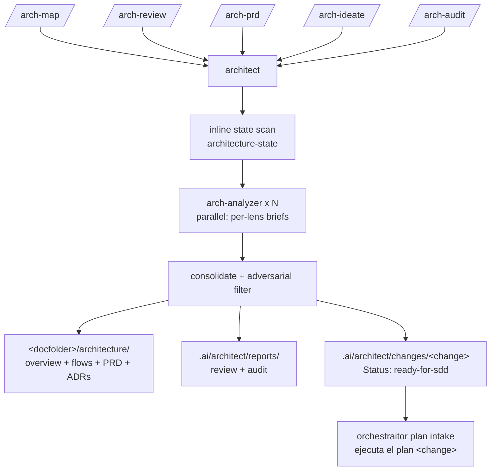

# Architecture Domain

Project-architecture analysis: visual C4-lite docs, state reviews with gap analysis, reverse-engineered PRDs, security/observability audits, and question-driven architecture refactor ideation. Architecture-level only — code-level style and class refactors belong to the `refactor` domain.

One primary agent: `architect`. One subagent: `arch-analyzer` (generic read-only analysis instance, launched N times in parallel with per-lens briefs). A second agent/command pair: `boundary-inspector` (backend service boundary mapping via `service-boundary-analysis`). Five commands sharing the primary: `/arch-map` (C4-lite Mermaid doc set with drift refresh), `/arch-review` (project state + gaps + ranked issue shortlist), `/arch-prd` (reverse-engineered PRD via `prd`/`prd-light`), `/arch-ideate` (ADR + ready-for-sdd bundle), and `/arch-audit` (dependency CVEs, runtime EOL, secrets heuristics, logging posture).

Every mode starts from an inline `architecture-state` scan (toolchain with evidence, architecture style, gaps with fitness-function proposals). Visual docs and PRDs land under the target project's `<docfolder>/architecture/` (existing `docs/`, else `doc/`, else a created `doc/`); reports land under `.ai/architect/reports/`. `/arch-ideate` composes OpenSpec bundles under `.ai/architect/changes/<change>/` using the `sdd-draft-*` templates, adopted by the sdd `orchestraitor` via `docs/plan-handoff.md` ("ejecuta el plan <change>"); group 1 of every ideation bundle turns the decided boundaries into fitness functions (ArchUnit / Spring Modulith / dependency-cruiser / import-linter).

Deliberate precedent: `architect` is the repo's first agent with non-deny bash — an ask-gated allowlist of read-only audit commands (`npm audit`, `mvn dependency:tree`, `pip-audit`, `osv-scanner`, …) under a default `"*": deny`, used only in `/arch-audit`; a denied or missing tool degrades to manifest inspection (`method: manifest-fallback`). `arch-analyzer` stays fully read-only with `bash: deny`.

Full lens coverage assumes the `common` domain is installed (lens skills such as `cohesion-coupling` or `logging-observability` live there, as do the transversal `code-conventions` and `risk-assessment`); missing lens skills are reported as skipped, never as failures. Bundle composition uses the `sdd-draft-*` templates from the `sdd` domain.

