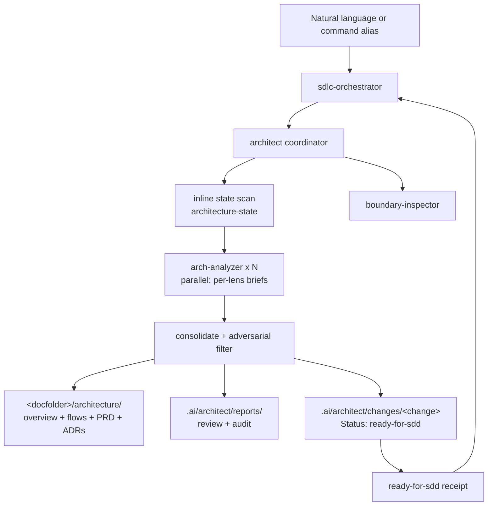

# Architecture Domain

Project-architecture analysis: visual C4-lite docs, state reviews with gap analysis, reverse-engineered PRDs, security/observability audits, and question-driven architecture refactor ideation. Architecture-level only — code-level style and class refactors belong to the `refactor` domain.

One subagent coordinator, `architect`, owns six operations. Its phase agents are `arch-analyzer` (generic read-only analysis launched N times with per-lens briefs) and `boundary-inspector` (backend service boundary mapping via `service-boundary-analysis`). The six commands are compatibility aliases through `sdlc-orchestrator`: `/arch-map`, `/arch-review`, `/arch-prd`, `/arch-ideate`, `/arch-audit`, and `/boundary-inspector`.

Every mode starts from an inline `architecture-state` scan (toolchain with evidence, architecture style, gaps with fitness-function proposals). Visual docs and PRDs land under the target project's `<docfolder>/architecture/` (existing `docs/`, else `doc/`, else a created `doc/`); reports land under `.ai/architect/reports/`. `/arch-ideate` composes OpenSpec bundles under `.ai/architect/changes/<change>/` using the `sdd-draft-*` templates, adopted by the sdd `orchestraitor` via `docs/plan-handoff.md` ("ejecuta el plan <change>"); group 1 of every ideation bundle turns the decided boundaries into fitness functions (ArchUnit / Spring Modulith / dependency-cruiser / import-linter).

`architect` keeps a narrow allowlist of read-only audit commands (`npm audit`, `mvn dependency:tree`, `pip-audit`, `osv-scanner`, …) under a default `"*": deny`, used only for the audit operation. Consent is obtained through a `needs_input` receipt so `sdlc-orchestrator` remains the only question owner; a denied or missing tool degrades to manifest inspection (`method: manifest-fallback`). `arch-analyzer` stays fully read-only with `bash: deny`.

Structural exploration is Graphify-first (`docs/graphify.md`): `architect` probes the graph once per repository during the inline state scan and passes `graphify: available | absent` in every analyzer brief; `arch-analyzer` and `boundary-inspector` query the graph via MCP only and never run lifecycle commands. Multi-project workspaces (nested manifests or repos) are analyzed per project: per-project toolchains and styles from `architecture-state`, per-deployable containers from `architecture-map`, one `service-boundary-analysis` report per service, and cross-repository claims backed by manifests (the global Graphify graph may corroborate, never replace, that evidence).

The coordinator profile assumes the `sdlc`, `common`, and `sdd` domains are installed. Full lens coverage uses common skills such as `cohesion-coupling` and `logging-observability`; missing lens skills are reported as skipped, never as failures. Bundle composition uses the `sdd-draft-*` templates from the `sdd` domain.

## Components

| Type | Name | Purpose |
|---|---|---|
| Agent (subagent coordinator) | `architect` | Owns architecture operations and returns public receipts |
| Agent (subagent) | `arch-analyzer` | Analyzes one architecture lens read-only |
| Agent (subagent) | `boundary-inspector` | Maps backend service boundaries read-only |
| Command | `/arch-audit` | Audits security and observability read-only |
| Command | `/arch-ideate` | Produces an ADR and ready-for-sdd bundle |
| Command | `/arch-map` | Generates or refreshes C4-lite architecture docs |
| Command | `/arch-prd` | Reverse-engineers a PRD from code |
| Command | `/arch-review` | Ranks evidence-backed architecture issues |
| Command | `/boundary-inspector` | Inspects service inputs and outputs |
| Skill | `adr` | Document decisions and architectural trade-offs |
| Skill | `architecture-ideation` | Produce ADR and ready-for-sdd architecture bundle |
| Skill | `architecture-impact-review` | Classify risk as local or architectural |
| Skill | `architecture-map` | Generate evidence-backed C4-lite Mermaid docs |
| Skill | `architecture-state` | Detect architecture gaps and propose fitness functions |
| Skill | `cognitive-doc-design` | Design docs that reduce cognitive load |
| Skill | `dependency-security-audit` | Audit dependency and observability posture |
| Skill | `java-secure-coding` | Review Java security practices |
| Skill | `prd` | Create rigorous high-stakes PRDs |
| Skill | `prd-light` | Create lightweight MVP PRDs |
| Skill | `repo-issues` | Rank evidence-backed repository issues |
| Skill | `service-boundary-analysis` | Map service boundaries with evidence |
| Skill | `tooling-audit` | Detect test safety tooling gaps |
| Skill | `tooling-compatibility-matrix` | Guide test, coverage, and mutation tooling |

```mermaid
graph TD
  user["Natural language or command alias"] --> sdlc[sdlc-orchestrator]
  sdlc --> architect[architect coordinator]
  architect --> state[inline state scan<br/>architecture-state]
  state --> fanout[arch-analyzer x N<br/>parallel: per-lens briefs]
  architect --> boundary[boundary-inspector]
  fanout --> consolidate[consolidate + adversarial filter]
  consolidate --> docfolder["&lt;docfolder&gt;/architecture/<br/>overview + flows + PRD + ADRs"]
  consolidate --> reports[".ai/architect/reports/<br/>review + audit"]
  consolidate --> bundle[".ai/architect/changes/&lt;change&gt;<br/>Status: ready-for-sdd"]
  bundle --> receipt[ready-for-sdd receipt]
  receipt --> sdlc
```
