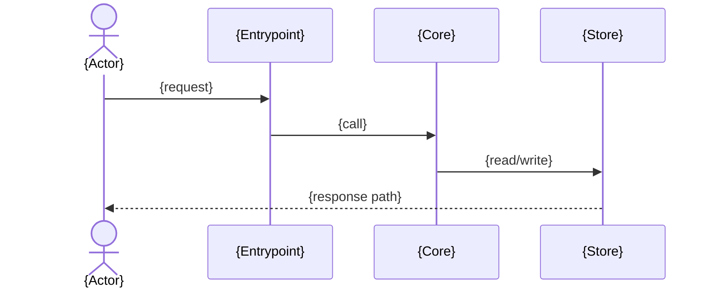

# Architecture Doc Skeletons

Use one file by default. Split only when node or line budgets require it.

## index.md

````markdown
# {System} Architecture

Generated: {YYYY-MM-DD} · Source commit: `{short-sha}` · Regenerate with `/arch-map`.

## System Context

```mermaid
flowchart LR
  user([{Actor}]) --> system[{System}]
  system --> external[({External dependency})]
```

{One short evidence-backed paragraph.}

## Containers

```mermaid
flowchart TB
  subgraph system[{System}]
    entry[{API / entrypoint}]
    core[{Core module}]
    store[({Store})]
  end
  entry --> core --> store
```

{One short evidence-backed paragraph.}

## {Representative flow}



{One short paragraph with `file:line` anchors.}
````

## Split form

When `index.md` exceeds a budget, keep its metadata and links, move context and containers to `overview.md`, move flows to `flows.md`, and add `projects/{name}.md` only for deployables that need separate container diagrams.
