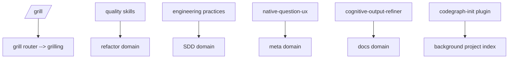

# Common Domain

Shared engineering, quality, native question UX, and output-refinement components used by other domains.

## Components

| Type | Name | Purpose |
|---|---|---|
| Command | `/defend` | Reviews decisions through Socratic defense |
| Command | `/grill` | Routes plain, docs, or SDD interviews |
| Skill | `chained-pr` | Split oversized work into reviewable PR slices |
| Skill | `code-conventions` | Apply Andres's code and test conventions |
| Skill | `cognitive-output-refiner` | Condense output without losing meaning |
| Skill | `cohesion-coupling` | Detect cohesion and coupling problems |
| Skill | `complexity-big-o` | Evaluate algorithmic and control complexity |
| Skill | `dependency-inversion` | Detect concrete boundary dependency risks |
| Skill | `design-patterns-pragmatic` | Apply patterns only to real forces |
| Skill | `domain-modeling` | Build and sharpen domain models |
| Skill | `dry-business-knowledge` | Distinguish knowledge duplication from similarity |
| Skill | `general-naming-readability` | Improve language-neutral naming and readability |
| Skill | `god-object-detection` | Detect oversized multi-responsibility objects |
| Skill | `grill` | Route relentless interview modes |
| Skill | `grilling` | Stress-test plans through relentless interviews |
| Skill | `input-validation-preconditions` | Detect missing or duplicated preconditions |
| Skill | `judgment-day` | Run dual blind adversarial reviews |
| Skill | `kiss-yagni` | Prevent speculative refactor complexity |
| Skill | `logging-observability` | Evaluate operational logging and observability |
| Skill | `native-question-ux` | Present questions through portable native UX |
| Skill | `open-closed-principle` | Detect extension pressure without speculation |
| Skill | `programming-practices-core` | Evaluate language-neutral code quality |
| Skill | `risk-assessment` | Classify technical and functional legacy risk |
| Skill | `single-responsibility` | Detect multiple reasons to change |
| Skill | `small-functions` | Detect oversized and extractable functions |
| Skill | `spaghetti-code-detection` | Detect tangled flow and hidden ordering |
| Skill | `tcr` | Apply test-commit-revert micro-cycles |
| Skill | `work-unit-commits` | Plan reviewable, cohesive commits |
| Plugin | `codegraph-init` | Initializes and repairs CodeGraph indexes in the background (default-on; aggregates non-git workspace roots) |

Use common skills by reference from domain-specific agents instead of duplicating them into each domain. Common is the single home for transversal skills used by 3+ domains (`grilling`, `judgment-day`, `native-question-ux`, `domain-modeling`, `code-conventions`, `risk-assessment`); consuming domains declare the dependency in their README instead of duplicating symlinks.

