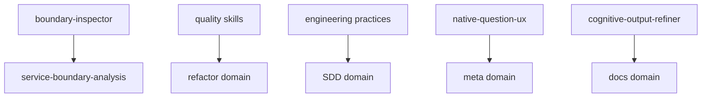

# Common Domain

Shared engineering, quality, service-boundary, native question UX, and output-refinement components used by other domains.

Agent and command entry: `boundary-inspector`. Command: `/defend` (Socratic review where the user defends the design decisions in a diff; weak defenses become findings).

Use common skills by reference from domain-specific agents instead of duplicating them into each domain.

