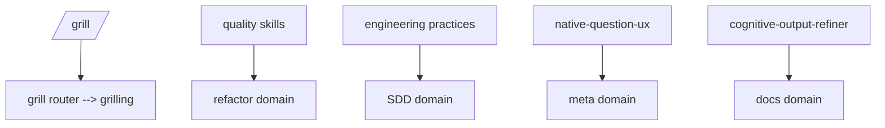

# Common Domain

Shared engineering, quality, native question UX, and output-refinement components used by other domains.

Commands: `/defend` (Socratic review where the user defends the design decisions in a diff; weak defenses become findings) and `/grill` (interview router: `/grill [me|docs|sdd] <topic>`).

Use common skills by reference from domain-specific agents instead of duplicating them into each domain. Common is the single home for transversal skills used by 3+ domains (`grilling`, `judgment-day`, `native-question-ux`, `domain-modeling`, `code-conventions`, `risk-assessment`); consuming domains declare the dependency in their README instead of duplicating symlinks.

