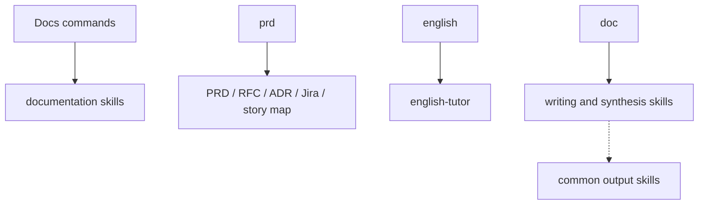

# Docs Domain

Product documentation, Jira tickets, English tutoring, summaries, slide decks, and transcription-oriented skills.

## Components

| Type | Name | Purpose |
|---|---|---|
| Agent (subagent) | `english-tutor` | Provides explicit English coaching |
| Command | `/decide` | Converges a decision interview into an ADR |
| Command | `/doc` | Routes documentation work to the right skill |
| Command | `/english` | Coaches English through corrections and practice |
| Command | `/prd` | Selects the appropriate PRD workflow |
| Skill | `adr` | Document decisions and architectural trade-offs |
| Skill | `buildable-issue` | Create agent-ready implementation issues |
| Skill | `cognitive-doc-design` | Design docs that reduce cognitive load |
| Skill | `english-tutor` | Improve provided English with explicit coaching |
| Skill | `jira-spike` | Create research-ready Jira Spikes |
| Skill | `jira-task` | Create developer-ready Jira Tasks |
| Skill | `jira-user-story` | Create developer-ready Jira User Stories |
| Skill | `prd` | Create rigorous high-stakes PRDs |
| Skill | `prd-light` | Create lightweight MVP PRDs |
| Skill | `rfc` | Create technical proposals with trade-offs |
| Skill | `slidev-retro-deck` | Build retro Slidev decks — three switchable CRT themes with day/night schemes, themed Mermaid diagrams, and a PNG-verified export loop |
| Skill | `summarize` | Synthesize book chapters pedagogically |
| Skill | `usm` | Create journey-first MVP story maps |
| Skill | `whisper-extract` | Transcribe and summarize audio or video |

Assumes the `common` domain is installed: `grilling` and `native-question-ux` live there.

