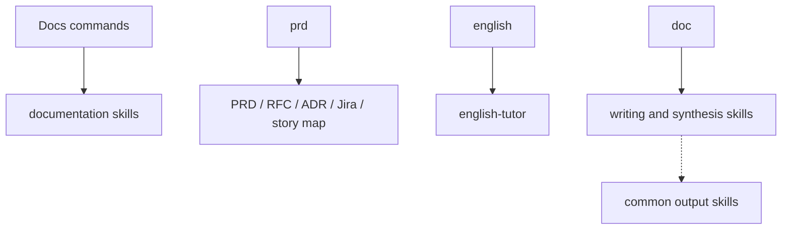

# Docs Domain

Product documentation, Jira tickets, English tutoring, summaries, and transcription-oriented skills.

Agent entry: `english-tutor`.

Commands: `doc`, `prd`, `english`, `decide` (grilling-style decision interview that converges into an ADR).

