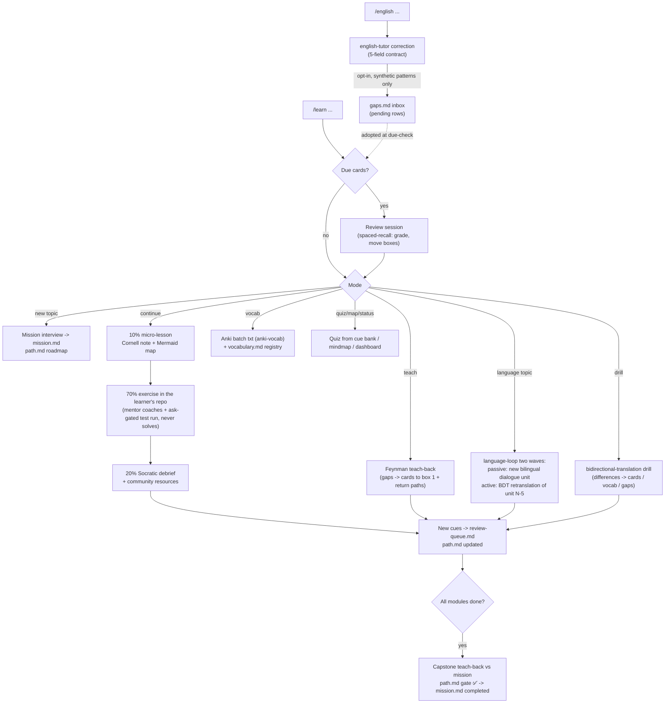

# learning

Interactive, multi-session learning built around one command: `/learn`. Inspired by Matt Pocock's `teach` skill, reworked for how Andres learns: Markdown artifacts only (no HTML), Mermaid mindmaps and flowcharts, question-driven retrieval, Cornell note-taking, Leitner spaced repetition, Feynman teach-backs, and the 70-20-10 model (70% doing real exercises in the learner's own repos, 20% Socratic debrief plus community resources, 10% formal micro-lessons with primary sources).

The domain has a primary agent and a hidden one: `mentor` is `mode: primary` — like sdd's `orchestraitor`, it appears in OpenCode's agent switcher and can be talked to directly (direct messages are routed like `/learn` input) — with `/learn` (`agent: mentor`) as its front door; `english-tutor` stays `mode: subagent`, invoked only through `/english`. The `learning-loop` skill is the methodology contract; `cornell-notes` defines lesson capture, `spaced-recall` defines the review queue and box transitions (leeches, ~15-card chunks, interleaving, environment-sourced dates), `feynman-teachback` defines teach-back sessions where the learner explains to a naive-student mentor and gaps demote recall cards, and `anki-vocab` defines Anki vocabulary batch exports for language topics (situation-driven natural phrases reinforced from already-learned vocabulary, translated into the learner's native language — Spanish by default). The mentor reads the learner's repo graph-first (CodeGraph when available) to design exercises and has ask-gated, narrow bash (the `date` command and the learner's tests/build) — it never edits the learner's repos. Usage guide: `docs/learning-domain.md`. All questions go through `native-question-ux` and interviews follow `grilling` (both live in the `common` domain, which this domain assumes installed).

English is a subdomain of learning. Language topics (a `mission.md` naming a target language) swap the 70-20-10 module flow for `language-loop`'s input-first two-wave session — one new bilingual dialogue unit (passive wave, comprehensible i+1 built from known vocabulary) plus a delayed retranslation of an older unit (active wave) per `bidirectional-translation` (Lampariello: native → target from memory, compare vs the original, notice differences). The `english-tutor` skill is the on-demand correction surface (`/english`, five-field contract) and the **producer** in an sdd-style handoff: with the learner's opt-in it appends gap categories with synthetic example patterns (never learner raw text) as `pending` rows in the topic's `gaps.md` inbox; the mentor is the **consumer**, adopting pending rows as recall cards or drills in the next `/learn` session. Methodology absorbed from Assimil (two waves), Lampariello (bidirectional translation), Kaufmann (input-first compelling content), and Krashen (i+1, silent period, affective filter).

All state lives under `.ai/learning/`: a `dashboard.md` plus one `<topic-slug>/` directory per topic with `mission.md`, `path.md` (Mermaid roadmap + capstone completion gate), `review-queue.md`, `resources.md`, `vocabulary.md` (Anki export inventory), and `notes/`, `exercises/`, `quizzes/`, `anki/` files — language topics add `dialogues/` (bilingual units) and the `gaps.md` inbox. Every `/learn` invocation runs the spaced-repetition due-check first — there is no scheduler; the queue is pull-based. The `recall-calc` plugin registers two read-only calculator tools (`recall_due`, `recall_schedule`) so due lists and Leitner date arithmetic come from deterministic code — the mentor transcribes the results into `review-queue.md` and falls back to `spaced-recall`'s manual tables when the plugin is absent.

## Components

| Type | Name | Purpose |
|---|---|---|
| Agent (primary) | `mentor` | Drives multi-session learning flows (agent switcher + `/learn`) |
| Agent (subagent) | `english-tutor` | Provides explicit English coaching and feeds the gaps inbox |
| Command | `/learn` | Routes learning, review, quiz, drill, and status modes |
| Command | `/english` | Coaches English through corrections and practice |
| Plugin | `recall-calc` | Registers read-only `recall_due`/`recall_schedule` Leitner calculator tools |
| Skill | `anki-vocab` | Create situation-driven Anki vocabulary batches |
| Skill | `bidirectional-translation` | Run delayed retranslation drills that surface differences |
| Skill | `cornell-notes` | Capture micro-lessons as Cornell notes |
| Skill | `english-tutor` | Improve provided English and hand gaps to the loop |
| Skill | `feynman-teachback` | Run learner-led Feynman teach-backs |
| Skill | `language-loop` | Run input-first two-wave language sessions |
| Skill | `learning-loop` | Run mission-grounded 70-20-10 learning loops |
| Skill | `spaced-recall` | Schedule Leitner-style Markdown recall reviews |

Install with `installers/opencode.sh install --domain learning`. Known fallback: if native questions do not surface well from `/english`'s subtask session, drop `subtask: true` from that command or temporarily set `english-tutor` to `mode: primary`; `/learn` runs in the mentor's own primary session and is not affected.
