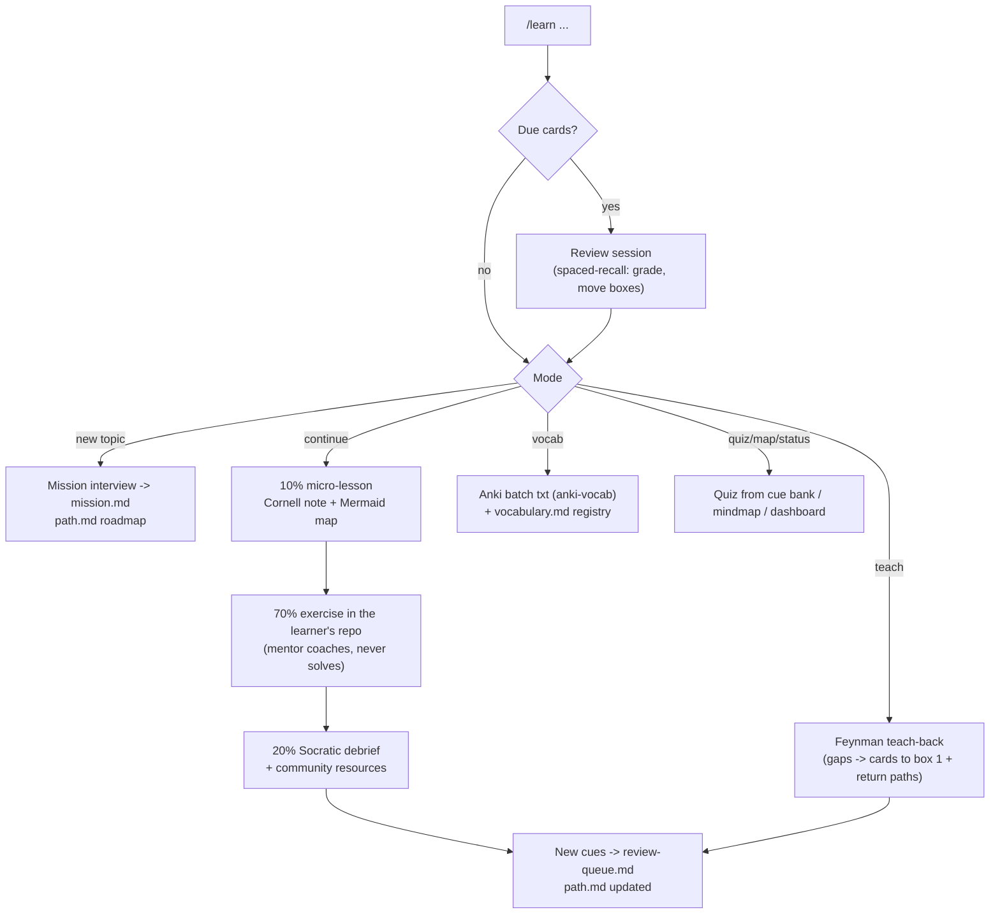

# learning

Interactive, multi-session learning built around one command: `/learn`. Inspired by Matt Pocock's `teach` skill, reworked for how Andres learns: Markdown artifacts only (no HTML), Mermaid mindmaps and flowcharts, question-driven retrieval, Cornell note-taking, Leitner spaced repetition, Feynman teach-backs, and the 70-20-10 model (70% doing real exercises in the learner's own repos, 20% Socratic debrief plus community resources, 10% formal micro-lessons with primary sources).

The domain has a single hidden agent, `mentor` (`mode: subagent`, so it never appears in OpenCode's agent switcher), invoked only through `/learn` (`agent: mentor` + `subtask: true`). The `learning-loop` skill is the methodology contract; `cornell-notes` defines lesson capture, `spaced-recall` defines the review queue and box transitions, `feynman-teachback` defines teach-back sessions where the learner explains to a naive-student mentor and gaps demote recall cards, and `anki-vocab` defines Anki vocabulary batch exports for language topics (situation-driven natural phrases reinforced from already-learned vocabulary). Usage guide: `docs/learning-domain.md`. All questions go through `native-question-ux` and interviews follow `grilling` (both live in the `common` domain, which this domain assumes installed).

All state lives under `.ai/learning/`: a `dashboard.md` plus one `<topic-slug>/` directory per topic with `mission.md`, `path.md` (Mermaid roadmap), `review-queue.md`, `resources.md`, `vocabulary.md` (Anki export inventory), and `notes/`, `exercises/`, `quizzes/`, `anki/` files. Every `/learn` invocation runs the spaced-repetition due-check first — there is no scheduler; the queue is pull-based.

OpenCode-only for now: install with `installers/opencode.sh install --domain learning` and simply do not select this domain in `claude.sh`/`codex.sh` (there is no per-runtime flag; the `agent:`/`subtask:` delegation is OpenCode-specific anyway). Known fallback: if native questions do not surface well from the subtask session, change `mentor` to `mode: primary` (it becomes visible) or drop `subtask: true` from the command.
