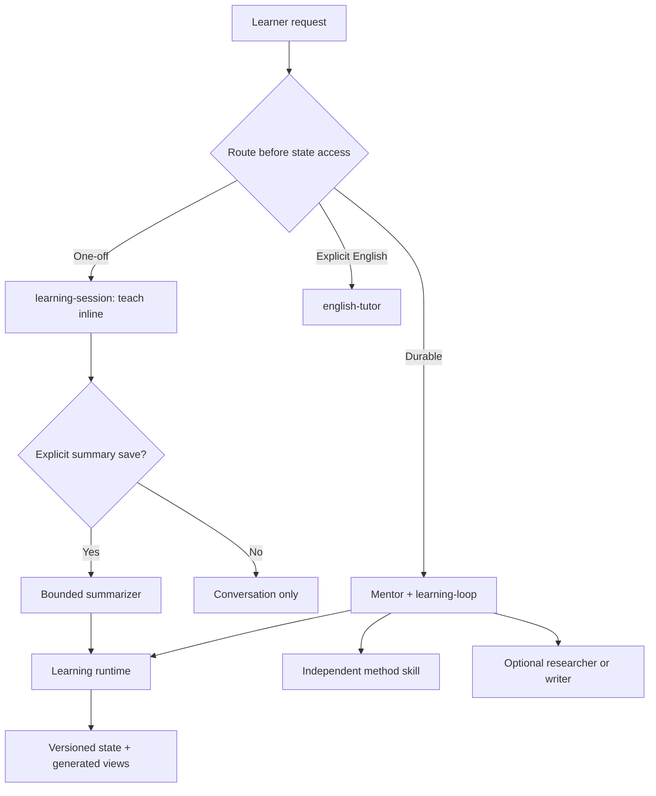

# Learning Domain

Learning provides one-off teaching, durable learning paths, explicit English coaching, on-demand review, and optional Anki exports. The domain is self-contained: installing `learning` provides its agents, commands, eight skills, and the deterministic state runtime.

## Quick start

```bash
installers/opencode.sh install --domain learning
```

Use an explicit route when you know what you want:

```text
/learn session explícame por qué HTTP es stateless con un ejemplo
/learn path validación de caché HTTP para decidir reutilizar, revalidar o descargar
/english I have worked here since three years
```

A one-off session stays in conversation unless the learner explicitly approves a standalone summary. A path stores authoritative state and generated views under the active project's `.ai/learning/` directory. A genuinely ambiguous request such as `/learn pizza` presents a localized session/path choice before reading state.

See the [operator guide](../../docs/learning-domain.md) for isolated setup, runtime boundaries, state recovery, and verification.

## Flow


```mermaid
flowchart TD
    U["Learner request"] --> R{"Route before state access"}
    R -->|"One-off"| S["learning-session: teach inline"]
    R -->|"Durable"| M["Mentor + learning-loop"]
    R -->|"Explicit English"| E["english-tutor"]
    S --> Q{"Explicit summary save?"}
    Q -->|"No"| C["Conversation only"]
    Q -->|"Yes"| SUM["Bounded summarizer"]
    SUM --> RT["Learning runtime"]
    M --> K["Independent method skill"]
    M --> W["Optional researcher or writer"]
    M --> RT
    RT --> ST["Versioned state + generated views"]
```

Mentor owns teaching, the rubric, learner questions, and progression. Skills accept explicit inputs and return useful results inline; they do not discover state, invoke siblings, or write files. Researcher, writer, and summarizer children return bounded results. The runtime alone validates durable events and writes Learning state.

## One-off learning

`/learn session <request>` teaches answer-first in the conversation language and asks at most one focused question at a time. It performs no due-check and creates no state.

An explicit summary request uses a native host choice. After approval, a fresh `learning-summarizer` composes one bounded JSON result; Mentor waits and saves it in the same turn. `learning_summary_create` writes one collision-resistant file exclusively under `.ai/learning/summaries/`. The same approval cannot be reused, completion does not create an unsolicited parent turn, and no route is implied.

## Durable learning

Durable topics use `.ai/learning/<topic>/.state.json` as their single semantic authority. `mission.md`, `path.md`, `vocabulary.md`, `gaps.md`, and approved artifacts are generated views of a committed revision. There is no internal card, retention, or review-calendar state; `review-queue.md` files from older versions are historical and no longer generated.

Non-language modules follow this sequence:

| Phase | Learner-visible result |
| --- | --- |
| Class | Explain the objective and central relationships, show a distinct worked example, then ask one focused question. |
| Practice readiness | Offer Practicar / Omitir once, directly after Class; reuse the recorded choice on resume. Clarification or dismissal does not advance the phase. |
| Practice | Record actual attempts and fade hints; explicit omission preserves any partial attempt. |
| Consolidation | Reuse sufficient causal explanation and transfer evidence; otherwise explain a specific gap and invite another attempt. |
| Close | Require completed or explicitly omitted practice, essential learner explanation, no blocking gap, and current note and exercise. |

Both the note and exercise are generated when practice is omitted, with omission in existing document fields. Existing paths, sections, tables, and templates stay intact. `practice_skipped` is optional in `schema_version: 1`; old states need no migration. A brief verified learner explanation, current materials, and no blocking gaps remain required. Topic completion assesses agreed criteria from real evidence; there is no default mandatory capstone, and omission does not prove practical competence.

Learners can adapt the path without losing evidence:

| Need | Durable operation | What stays pending |
| --- | --- | --- |
| Change the goal | `revise_scope`, with native approval of the exact goal and affected module wins | Reassessment and updated materials before closing; retired requirements are not credited as learned. |
| Already know the material | `skip_practice` also accepts Mission; reuse verified explanations in Consolidation | Any uncovered criterion and materials; no fictitious teaching or practice. |
| Study another module now | `select_module`, with native approval of destination and reason | The previous module is deferred at its actual phase, with all requirements preserved. |

Resolve scope and navigation subjects through `learning_event_reference`. `current_module_id`, module `deferred`/`scope_revision`, and `scope_revisions` are optional schema-1 fields. Scope history retains before/after goals and wins, prior assessments, reasons, retired requirements, and consent references. Existing snapshots need no migration. On resume, use the selected module; otherwise the first open non-deferred module. If only deferred work remains, choose what to resume. Navigation needs neither materials nor closure; topic completion still requires all modules closed and evidence against the agreed goal.

The mission defines stable concept IDs and prerequisites; concept order guides teaching and informs the learner without gating navigation. Cornell questions remain useful retrieval prompts for any learner-requested review.

## Review

There is no spaced-repetition calendar, no Leitner boxes, no due dates, and no card grades. `review` is a one-off pass the learner explicitly requests over supplied material: Cornell questions, quizzes, teach-backs, or drills. Each request is self-contained; nothing is scheduled and no grade is recorded.

Older topics may still contain historical card, retention, and scheduling fields in `schema_version: 1` state. The runtime reads and preserves them but never uses them to gate teaching, materials, closure, or topic completion, and it rejects retired card operations if an old client calls them.

## Sequential work

`learning_job_start` creates one actual child session for bounded research or composition and waits for a verified terminal result. Only one job runs per Mentor session. Mentor completes note → save → exercise → save → Close, or an approved summary save, in the same turn without “continue” messages. `learning_job_result` waits for recovery of the same child or cancels it; parent cancellation propagates to the child. Transport failure retains the accepted ID and never permits an unchecked replacement.

Topic jobs carry a source revision. Same-topic work is serialized, a newer request remains blocked behind the accepted worker, stale output cannot commit, and a completed host child can be recovered after an OpenCode restart. The writer receives a structured assignment that separates `approved_outline`, `teaching_assessment`, `practice_status`, and `learner_evidence`; only `learner_evidence` entries, with exact session, message, part, and quote, are learner words. Loading `cornell-notes` supplies its full inline lesson template, and `learning-loop` supplies the full exercise template. The runtime verifies worker kind, destination, source revision, and exact content before writing.

Writer artifacts also accept optional `evidence_refs`: literal `{session_id, message_id, part_id, quote}` references. When present, `learner_evidence` receives exactly that selection and explicit selection takes priority; when omitted, the automatic verified module selection (`evidence_module_id` or the owning module) remains the fallback. A teach-back from Class with no recorded attempt or consolidation still works: Mentor calls `learning_evidence` with literal excerpts from the learner's answer, then passes the returned selection as `artifact.evidence_refs` on `learning_job_start`. The runtime verifies every reference before creating any worker (fresh ones against real learner messages of the current parent session, stored ones reused from the topic's `verified_evidence`) and rejects altered, synthetic, assistant, or foreign references. Verification creates no progress events and never auto-adds references to `verified_evidence`.

## Language learning

Language units store the passive exposure date, attempt outcome, and status. Dates are historical records, not a calendar: units the learner selects are available for practice immediately, including units with errors or `input-only` status. The default proposal follows unit order. Required production stays pending until demonstrated.

Input-only practice is valid. If the mission requires production, input-only evidence keeps that criterion pending and the unit remains eligible for later productive practice. Completion requires observed comprehension and meaning-preserving production.

Vocabulary phrases begin as candidates and can be corrected under the same ID until export. Each edit requires a fresh preview and confirmation. Consent binds the full displayed rows; only the selected subset is exported, and exported rows remain immutable. After a native selection, one state event marks the exact rows exported and creates the semicolon batch. Duplicate keys normalize target language plus NFKC/lowercase/whitespace-normalized unit. Export does not prove Anki import or mastery and creates no internal review item.

`/english` runs only when explicitly invoked. With a separate learner choice it may record a synthetic gap category and invented pattern. Raw corrections, private text, and correction history never enter durable state; adopting a gap schedules nothing.

## Components

| Type | Name | Responsibility |
| --- | --- | --- |
| Primary agent | `mentor` | Route, teach, assess, and coordinate validated state |
| Specialist | `english-tutor` | Explicit English correction and practice |
| Worker | `learning-researcher` | Bounded source-grounded findings |
| Worker | `learning-writer` | Complete artifact composition from approved inputs |
| Worker | `learning-summarizer` | One explicit independent summary |
| Command | `/learn` | Thin session/path/mode dispatch |
| Command | `/english` | Thin explicit English dispatch |
| Plugin | `learning-runtime` | Event reference, host-correlated choices, sequential jobs, versioned state, recovery, and exclusive summary creation |
| Skills | eight Learning-owned directories | Independent teaching and transformation methods |

Mentor can read a learner repository for teaching. Raw edits and broad shell writes are denied. A known test/build command must be announced and accepted through its separate host permission prompt.

After changing runtime behavior or an instruction contract, run the affected [Learning manual tests](manual-tests.md).
