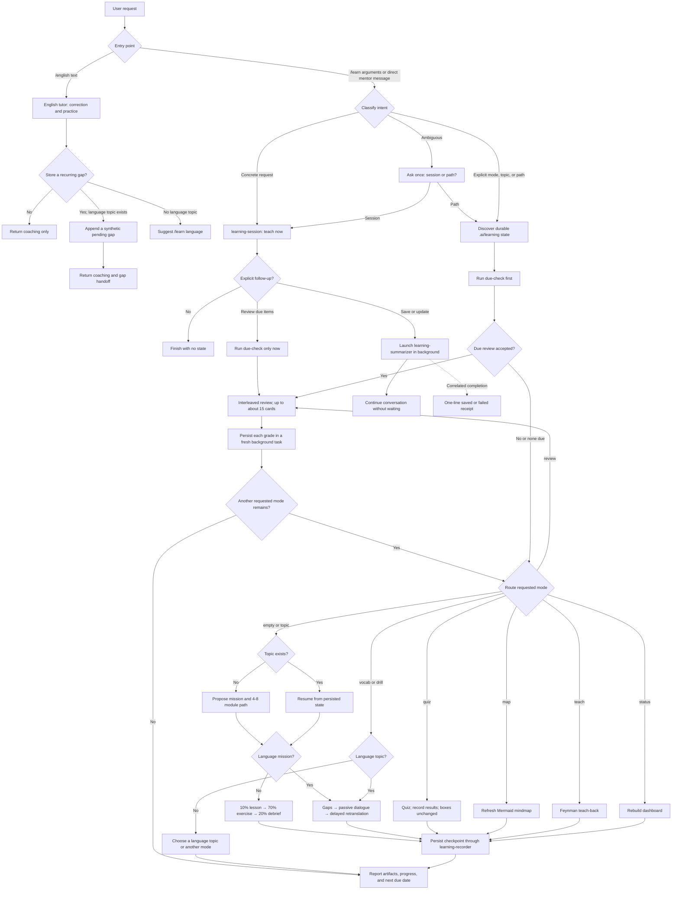
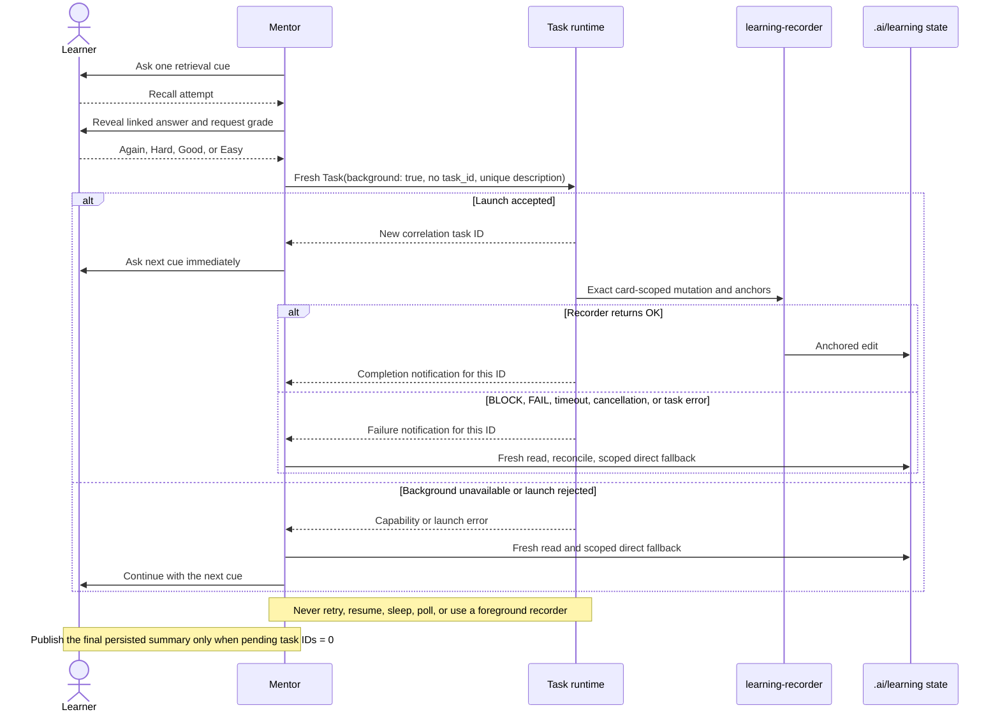

# Learning Domain

The `mentor` handles both bounded, one-off teaching and durable, multi-session learning. Bounded sessions create no state unless the learner explicitly requests a compact background summary; `/learn` also owns paths and reviews, while `/english` remains a separate coaching entry point.

## Quick path

1. Install the `learning,common` domains.
2. Ask `mentor` or `/learn <prompt>` a concrete question for a bounded session with no implicit state.
3. Explicitly ask for a path when you want durable progress, notes, and automatic due-review offers.

See the [operator guide](../../docs/learning-domain.md) for installation, runtime setup, state layout, and troubleshooting.

## Entry points

Both `/learn` and direct messages to `mentor` use the same routing. `/english` stays an explicit, separate coaching flow.

### Mentor flow map

```mermaid
flowchart TD
    U["User request"] --> E{"Entry point"}
    E -->|"/english text"| ET["English tutor: correction and practice"]
    ET --> OPT{"Store a recurring gap?"}
    OPT -->|"No"| EO["Return coaching only"]
    OPT -->|"Yes; language topic exists"| GAP["Append a synthetic pending gap"]
    OPT -->|"No language topic"| SUG["Suggest /learn language"]
    GAP --> EH["Return coaching and gap handoff"]

    E -->|"/learn arguments or direct mentor message"| CLASS{"Classify intent"}
    CLASS -->|"Concrete request"| SESSION["learning-session: teach now"]
    CLASS -->|"Ambiguous"| ASK["Ask once: session or path?"]
    ASK -->|"Session"| SESSION
    ASK -->|"Path"| DISC
    CLASS -->|"Explicit mode, topic, or path"| DISC["Discover durable .ai/learning state"]

    SESSION --> FOLLOW{"Explicit follow-up?"}
    FOLLOW -->|"No"| NOW["Finish with no state"]
    FOLLOW -->|"Review due items"| ONDEMAND["Run due-check only now"]
    ONDEMAND --> REV
    FOLLOW -->|"Save or update"| SBG["Launch learning-summarizer in background"]
    SBG --> CONT["Continue conversation without waiting"]
    SBG -.->|"Correlated completion"| RECEIPT["One-line saved or failed receipt"]

    DISC --> DUE["Run due-check first"]
    DUE --> OFFER{"Due review accepted?"}
    OFFER -->|"Yes"| REV["Interleaved review; up to about 15 cards"]
    REV --> BG["Persist each grade in a fresh background task"]
    BG --> MORE{"Another requested mode remains?"}
    MORE -->|"No"| CLOSE["Report artifacts, progress, and next due date"]
    MORE -->|"Yes"| ROUTE{"Route requested mode"}
    OFFER -->|"No or none due"| ROUTE

    ROUTE -->|"empty or topic"| TOPIC{"Topic exists?"}
    ROUTE -->|"review"| REV
    TOPIC -->|"No"| NEW["Propose mission and 4-8 module path"]
    TOPIC -->|"Yes"| RESUME["Resume from persisted state"]
    NEW --> KIND{"Language mission?"}
    RESUME --> KIND
    KIND -->|"No"| GEN["10% lesson → 70% exercise → 20% debrief"]
    KIND -->|"Yes"| LANG["Gaps → passive dialogue → delayed retranslation"]

    ROUTE -->|"quiz"| QUIZ["Quiz; record results; boxes unchanged"]
    ROUTE -->|"map"| MAP["Refresh Mermaid mindmap"]
    ROUTE -->|"teach"| TEACH["Feynman teach-back"]
    ROUTE -->|"vocab or drill"| ONLY{"Language topic?"}
    ONLY -->|"Yes"| LANG
    ONLY -->|"No"| PICK["Choose a language topic or another mode"]
    ROUTE -->|"status"| STATUS["Rebuild dashboard"]

    GEN --> FG["Persist checkpoint through learning-recorder"]
    LANG --> FG
    QUIZ --> FG
    MAP --> FG
    TEACH --> FG
    STATUS --> FG
    PICK --> CLOSE
    FG --> CLOSE
```

### Use cases and example prompts

| Use case | Example prompt | Expected route |
|---|---|---|
| Learn without saving | `Explícame cuándo conviene un puerto frente a un adaptador` | Bounded `learning-session`; answer now without date lookup, due-check, topic, path, or file. |
| Save a bounded session | `Guárdalo` | Launch `learning-summarizer` in background for one compact file under `summaries/`; continue without waiting. |
| Update and deduplicate | `Actualiza ese resumen con la corrección; evita repetir la misma idea` | Re-read the current summary, merge equivalent ideas, preserve distinct nuances, and rewrite one canonical file. |
| Review on demand | `¿Hay algo para repasar?` during a bounded session | Run the existing due-check only now; no review was offered when the session started. |
| Request a durable path | `/learn quiero un path de seis semanas para arquitectura hexagonal` | Durable `learning-loop`; discover topics, offer due reviews, then propose mission and path. |
| Start a general topic | `/learn arquitectura hexagonal para migrar un monolito Java` | Propose mission, cadence, path, and resources before module 1. |
| Continue learning | `/learn` | Offer due reviews, then resume the active topic; ask which topic when several are active. |
| Review due cards | `/learn review` | Interleave due cues, grade them, and schedule each card. |
| Run a low-stakes quiz | `/learn quiz arquitectura-hexagonal` | Quiz from Cornell cues and record results without moving Leitner boxes. |
| Refresh the concept map | `/learn map arquitectura-hexagonal` | Regenerate the topic's Mermaid mindmap from notes and path state. |
| Prove understanding | `/learn teach inversión de dependencias` | Learner explains; Mentor probes as a novice and records gaps and return paths. |
| Inspect progress | `/learn status` | Rebuild the cross-topic dashboard and upcoming-review view. |
| Start a language mission | `/learn inglés para entrevistas técnicas` | Use the input-first language loop instead of the 70-20-10 module flow. |
| Export language vocabulary | `/learn vocab entrevistas técnicas` | Create natural phrase cards for Anki and register their units without Leitner duplicates. |
| Practice delayed translation | `/learn drill 0006-small-talk` | Retranslate an older dialogue from memory, compare, classify, and capture differences. |
| Request English coaching | `/english I have worked here since three years` | Return correction, explanation, learning gap, and practice; store only synthetic gaps after opt-in. |
| Review a learner exercise | `/learn`, then `Terminé el ejercicio 0003; revisa mi solución y ejecuta los tests` | Resume the exercise, use the available graph first, announce the exact test command, and coach without editing or solving the repository work. |

### Background persistence protocols

Review persistence and compact-summary persistence are independent. Review grades may use a scoped direct fallback; summary writes never retry, run in foreground, or fall back to direct mutation.

#### Review grades

The next cue does not wait for the previous grade to be written. Final session output does wait until every task settles.

```mermaid
sequenceDiagram
    actor L as Learner
    participant M as Mentor
    participant T as Task runtime
    participant R as learning-recorder
    participant S as .ai/learning state

    M->>L: Ask one retrieval cue
    L-->>M: Recall attempt
    M->>L: Reveal linked answer and request grade
    L-->>M: Again, Hard, Good, or Easy
    M->>T: Fresh Task(background: true, no task_id, unique description)
    alt Launch accepted
        T-->>M: New correlation task ID
        M->>L: Ask next cue immediately
        T->>R: Exact card-scoped mutation and anchors
        alt Recorder returns OK
            R->>S: Anchored edit
            T-->>M: Completion notification for this ID
        else BLOCK, FAIL, timeout, cancellation, or task error
            T-->>M: Failure notification for this ID
            M->>S: Fresh read, reconcile, scoped direct fallback
        end
    else Background unavailable or launch rejected
        T-->>M: Capability or launch error
        M->>S: Fresh read and scoped direct fallback
        M->>L: Continue with the next cue
    end
    Note over M,T: Never retry, resume, sleep, poll, or use a foreground recorder
    Note over M,L: Publish the final persisted summary only when pending task IDs = 0
```

| Scenario | Mentor behavior |
|---|---|
| Third `Again` on one card | Ask whether to reformulate or split it, then persist one compound queue/path mutation. |
| Completion arrives while a cue is open | Settle only its task ID; never repeat, answer, or advance the cue. |
| Tasks finish out of order | Correlate by task ID and description; never settle another card. |
| All modules are complete but the capstone gate is open | Offer the capstone teach-back; do not mark the mission complete yet. |
| Pending language gaps exist | Offer each as a review card or translation drill; adopt only accepted rows. |
| Mentor receives a coding request | Reframe it as a learner exercise; never edit the learner repository or provide the solution. |

#### Compact summaries

```mermaid
sequenceDiagram
    actor L as Learner
    participant M as Mentor
    participant T as Task runtime
    participant W as learning-summarizer
    participant S as .ai/learning/summaries

    L->>M: Explicitly request save or update
    M->>T: Fresh Task(background: true, no task_id, exact target)
    T-->>M: New correlation task ID
    M->>L: Continue the open conversation
    T->>W: Operation, target, language, material, sources, corrections, ordinal
    W->>S: Create or rewrite one complete canonical summary
    alt Writer returns OK
        T-->>M: Completion for matching ID and target
        M->>L: Resumen guardado: path
    else Launch or task fails
        T-->>M: Matching failure
        M->>L: No se pudo guardar: reason; explicit retry remains available
    end
    Note over M,T: One pending mutation per target; latest explicit update is coalesced
    Note over M,S: No retry, foreground writer, direct fallback, review settlement, or implicit save
```

The summarizer receives only covered material and writes in the conversation language. Updates re-read the target, replace explicit corrections, merge semantic duplicates, preserve distinct nuances, and keep unresolved differences visible. `summaries/` is reserved state, never a learning topic.

## Components

| Type | Name | Purpose |
|---|---|---|
| Agent (primary) | `mentor` | Coordinates bounded and durable learning |
| Agent (subagent) | `english-tutor` | Provides explicit English coaching |
| Agent (subagent) | `learning-recorder` | Persists exact learning-state mutations |
| Agent (subagent) | `learning-summarizer` | Writes compact deduplicated session summaries |
| Command | `/learn` | Routes bounded and durable learning modes |
| Command | `/english` | Routes English correction and practice |
| Plugin | `recall-calc` | Calculates Leitner dates read-only |
| Skill | `anki-vocab` | Creates situation-driven vocabulary batches |
| Skill | `bidirectional-translation` | Runs delayed retranslation drills |
| Skill | `cognitive-doc-design` | Structures compact summaries for fast scanning |
| Skill | `cornell-notes` | Captures durable notes and compact summaries |
| Skill | `english-tutor` | Improves English and records gaps |
| Skill | `feynman-teachback` | Runs learner-led concept teach-backs |
| Skill | `language-loop` | Runs input-first language sessions |
| Skill | `learning-loop` | Runs mission-grounded learning loops |
| Skill | `learning-session` | Teaches bounded requests without implicit state |
| Skill | `spaced-recall` | Schedules Leitner-style Markdown reviews |

State lives only under `.ai/learning/**`; `summaries/` contains opt-in compact session documents and is excluded from durable topic discovery. Mentor may inspect a learner repository and verify exercises with an announced test command, but never edits that repository. Flow evidence: `commands/learn.md`, `commands/english.md`, `agents/mentor.md`, `agents/learning-summarizer.md`, `skills/learning-session/SKILL.md`, `skills/learning-loop/SKILL.md`, and `skills/spaced-recall/SKILL.md`.
