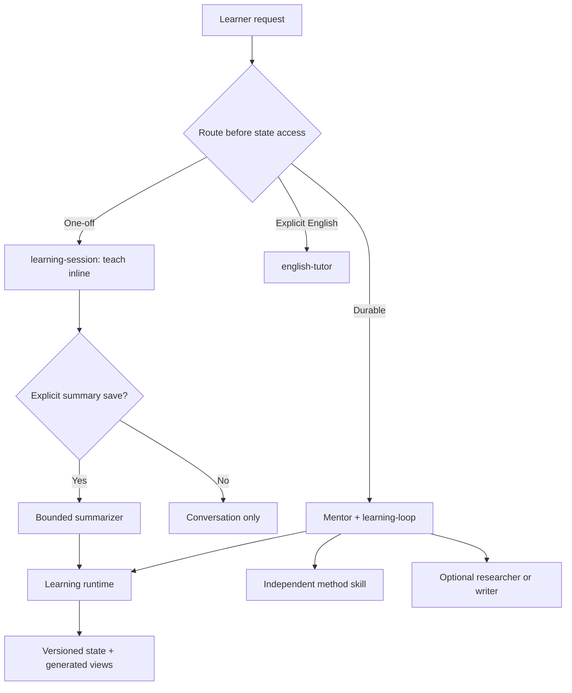

# Learning Domain

Learning provides one-off teaching, durable learning paths, explicit English coaching, dated review, and optional Anki exports. The domain is self-contained: installing `learning` provides its agents, commands, nine skills, deterministic state runtime, and recall calculator.

## Quick start

```bash
installers/opencode.sh install --domain learning
```

Use an explicit route when you know what you want:

```text
/learn session explícame por qué HTTP es stateless con un ejemplo
/learn path validación de caché HTTP para decidir reutilizar, revalidar o descargar
/english I have worked here since three years
```

A one-off session stays in conversation unless the learner explicitly approves a standalone summary. A path stores authoritative state and generated views under the active project's `.ai/learning/` directory. A genuinely ambiguous request such as `/learn pizza` presents a localized session/path choice before reading state.

See the [operator guide](../../docs/learning-domain.md) for isolated setup, runtime boundaries, state recovery, and verification.

## Flow


```mermaid
flowchart TD
    U["Learner request"] --> R{"Route before state access"}
    R -->|"One-off"| S["learning-session: teach inline"]
    R -->|"Durable"| M["Mentor + learning-loop"]
    R -->|"Explicit English"| E["english-tutor"]
    S --> Q{"Explicit summary save?"}
    Q -->|"No"| C["Conversation only"]
    Q -->|"Yes"| SUM["Bounded summarizer"]
    SUM --> RT["Learning runtime"]
    M --> K["Independent method skill"]
    M --> W["Optional researcher or writer"]
    M --> RT
    RT --> ST["Versioned state + generated views"]
```

Mentor owns teaching, the rubric, learner questions, and progression. Skills accept explicit inputs and return useful results inline; they do not discover state, invoke siblings, or write files. Researcher, writer, and summarizer children return bounded results. The runtime alone validates durable events and writes Learning state.

## One-off learning

`/learn session <request>` teaches answer-first in the conversation language and asks at most one focused question at a time. It performs no due-check and creates no state.

An explicit summary request uses a native host choice. After approval, a fresh `learning-summarizer` composes one bounded JSON result while teaching can continue. `learning_summary_create` writes one collision-resistant file exclusively under `.ai/learning/summaries/`. The same approval cannot be reused, completion does not create an unsolicited parent turn, and no route or review card is implied.

## Durable learning

Durable topics use `.ai/learning/<topic>/.state.json` as their single semantic authority. `mission.md`, `path.md`, `review-queue.md`, `vocabulary.md`, `gaps.md`, and approved artifacts are generated views of a committed revision.

Non-language modules follow this sequence:

| Phase | Learner-visible result |
| --- | --- |
| Class | Explain the objective and central relationships, show a distinct worked example, then ask one focused question. |
| Retention preview | Show zero to two eligible fundamental cards with exact cue, answer, and rationale. Selected, none, and deferred are all valid. |
| Practice readiness | Ask separately. Only a later learner readiness answer starts a new application exercise. |
| Practice | Record the learner's actual attempt and fade hints from observed performance. |
| Consolidation | Reuse sufficient causal explanation and transfer evidence; otherwise explain a specific gap and invite another attempt. |
| Close | Require completed practice, essential learner explanation, no blocking gap, and a resolved retention disposition. Selected card IDs may be empty. |

The mission defines stable concept IDs and prerequisites. The default fundamental shortlist is at most `floor(concept_count / 5)`; fewer than five concepts can yield zero. A learner can explicitly override the shortlist for a shown, taught concept. Cornell questions remain useful retrieval prompts even when no card is saved.

Review cards use intervals of 1, 3, 7, 14, and 30 days. Box 5 remains on 30-day maintenance until the learner explicitly suspends or retires it. Every durable choice includes an exact topic/entity subject and canonical digest; card selection and replacement use the stored preview itself. A third cumulative `Again` requires a confirmed reformulate/split decision; replacements get new IDs and preserve lineage.

## Background work

`learning_job_start` creates an actual child session for bounded research or composition and immediately returns its accepted ID. Mentor may continue an independent explanation or learner question. The runtime observes the same child, never treats silence as completion, and attaches one status notice to a later real learner message.

Topic jobs carry a source revision. Same-topic work is serialized, a newer request coalesces behind an active worker, stale output cannot commit, and a completed host child can be recovered after an OpenCode restart. The writer composes complete artifacts but has no file, shell, question, or delegation access. Loading `cornell-notes` supplies its full inline lesson template. The runtime verifies worker kind, destination, source revision, and exact content before writing.

## Language learning

Language units store passive exposure date, active due date, attempt outcome, and status. The initial pilot interval is three days. Counts never make a unit due, and the final active units of a finite course remain available until completed.

Input-only practice is valid. If the mission requires production, input-only evidence keeps that criterion pending and the unit remains eligible for later productive practice. Completion requires observed comprehension and meaning-preserving production.

Vocabulary phrases begin as candidates and can be corrected under the same ID until export. Each edit requires a fresh preview and confirmation. Consent binds the full displayed rows; only the selected subset is exported, and exported rows remain immutable. After a native selection, one state event marks the exact rows exported and creates the semicolon batch. Duplicate keys normalize target language plus NFKC/lowercase/whitespace-normalized unit. Export does not prove Anki import or mastery and does not create a second Leitner card.

`/english` runs only when explicitly invoked. With a separate learner choice it may record a synthetic gap category and invented pattern. Raw corrections, private text, and correction history never enter durable state; adopting a gap does not admit a review card.

## Components

| Type | Name | Responsibility |
| --- | --- | --- |
| Primary agent | `mentor` | Route, teach, assess, and coordinate validated state |
| Specialist | `english-tutor` | Explicit English correction and practice |
| Worker | `learning-researcher` | Bounded source-grounded findings |
| Worker | `learning-writer` | Complete artifact composition from approved inputs |
| Worker | `learning-summarizer` | One explicit independent summary |
| Command | `/learn` | Thin session/path/mode dispatch |
| Command | `/english` | Thin explicit English dispatch |
| Plugin | `learning-runtime` | Event reference, host-correlated choices, async jobs, versioned state, recovery, and exclusive summary creation |
| Plugin | `recall-calc` | Bounded queue parsing and deterministic dates |
| Skills | nine Learning-owned directories | Independent teaching and transformation methods |

Mentor can read a learner repository for teaching. Raw edits and broad shell writes are denied. A known test/build command must be announced and accepted through its separate host permission prompt.

After changing runtime behavior or an instruction contract, run the affected [Learning manual tests](manual-tests.md).
