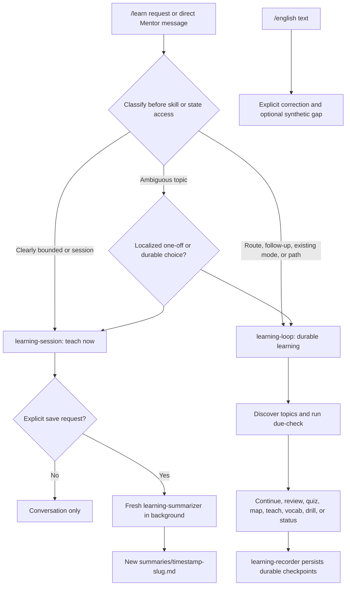

# Learning Domain

`mentor` chooses between a one-off session and a durable path before it reads learning state. One-off teaching stays in the conversation unless the learner explicitly saves a standalone summary; durable learning keeps missions, reviews, exercises, and progress under `.ai/learning/`.

## Quick path

1. Install the `learning,common` domains.
2. Use `/learn session <request>` for an explanation now, or `/learn path <topic>` for multi-session learning.
3. If `/learn <topic>` is ambiguous, choose the localized one-off or durable option before Mentor accesses state.

Examples:

```text
/learn session explícame por qué HTTP es stateless con un ejemplo
/learn path arquitectura hexagonal para migrar un monolito Java
```

Return with `/learn` to continue a durable path. See the [operator guide](../../docs/learning-domain.md) for setup, state, background persistence, and troubleshooting.

## Entry points

Both `/learn` and direct messages to `mentor` use the same classification. Both choice labels and summary notices follow the conversation language; the internal routes remain `learning-session` and `learning-loop`. `/english` remains a separate explicit coaching flow.

### Flow


```mermaid
flowchart TD
    U["/learn request or direct Mentor message"] --> C{"Classify before skill or state access"}
    C -->|"Clearly bounded or session"| S["learning-session: teach now"]
    C -->|"Route, follow-up, existing mode, or path"| D["learning-loop: durable learning"]
    C -->|"Ambiguous topic"| Q{"Localized one-off or durable choice?"}
    Q --> S
    Q --> D

    S --> SAVE{"Explicit save request?"}
    SAVE -->|"No"| CHAT["Conversation only"]
    SAVE -->|"Yes"| SUM["Fresh learning-summarizer in background"]
    SUM --> FILE["New summaries/timestamp-slug.md"]

    D --> STATE["Discover topics and run due-check"]
    STATE --> MODE["Continue, review, quiz, map, teach, vocab, drill, or status"]
    MODE --> REC["learning-recorder persists durable checkpoints"]

    E["/english text"] --> ET["Explicit correction and optional synthetic gap"]
```

### Which route to use

| Intent | Example | Result |
|---|---|---|
| Learn one bounded concept now | `/learn session diferencia entre proceso e hilo` | Teaches in the user's language; no due-check or durable state. |
| Build a durable route | `/learn path concurrencia en Java` | Proposes a mission, cadence, path, and resources. |
| Resolve an ambiguous topic | `/learn pizza` | Asks a localized one-off or durable choice before reading `.ai/learning/`. |
| Continue or inspect durable work | `/learn`, `/learn status` | Runs due-check first, then resumes or reports progress. |
| Use an existing durable mode | `/learn review`, `/learn quiz`, `/learn map`, `/learn teach`, `/learn vocab`, `/learn drill` | Preserves the existing learning-loop behavior. |
| Request explicit English coaching | `/english I have worked here since three years` | Corrects and practices; stores only synthetic gaps after opt-in. |

### One-off summary lifecycle

A one-off session is not saved automatically. After an explicit positive save request, Mentor sends only the pertinent session segment and sources actually used to a fresh `learning-summarizer` with `background: true` and no reused task ID. Teaching continues immediately.

The summarizer creates one new standalone Cornell file under `.ai/learning/summaries/`. Its notification never interrupts or advances the conversation. The next normal response appends exactly one brief parenthetical notice in the conversation language: success says the summary was saved and includes `.ai/learning/summaries/<YYYY-MM-DD>-<HHMMSS>-<slug>.md`; failure says it could not be saved. Internal `OK summary=<path>`, `BLOCK`, and `FAIL` receipts remain unchanged.

Failure, timeout, cancellation, `BLOCK`, or `FAIL` does not retry, resume, poll, or fall back to foreground writing.

`summaries` is reserved infrastructure, never a durable topic slug. Topic discovery excludes that directory and resumes only directories containing `mission.md`; a learning topic named “summaries” therefore uses a distinct confirmed slug such as `summaries-topic`.

### Durable persistence

General, non-language modules follow `Due-check → Class → Practice → Consolidation → Close`. Mentor offers due reviews before new material, then explains the objective, core concepts and relationships, an example, and a short recap before assigning one tangible exercise. `Notes` preserves Mentor's explanation; `Summary` is requested only after meaningful practice and preserves the learner's own 2–3 sentences. The staged checkpoint, resume, and scoped-gap rules below apply only to these modules; language topics keep the `language-loop` flow.

After the class, `learning-recorder` saves a staged Cornell note with `Map` and `Notes`, while `Summary` and `Recall hand-off` remain explicitly pending. Its header records `Teach-back: required` for a load-bearing concept or `Teach-back: not-required` otherwise. Pending cues are neither scheduled cards nor quiz-bank entries. The Class checkpoint stores the note link in the active `path.md` row, reports the module `🔄`, asks exactly one readiness or clarification question, and stops. Practice is created and linked only after later learner input; a clarification is answered before Mentor repeats the same boundary.

Later learner input, including a fresh session, starts from that active `🔄` row and follows its persisted lesson and exercise links instead of inferring filenames from a directory. A `—` cell is replaced only when its artifact is created; a recorded link whose target is absent is recreated at that exact path without changing the cell. A staged note with no completed exercise resumes `Practice`; `Result: done` with a pending Summary resumes `Consolidation`. An active legacy note that already has a learner Summary and actual recall IDs remains unmigrated and resumes `Practice` when its exercise is absent or incomplete.

During consolidation, Mentor confirms what is correct, explains any missing or incorrect concept, and asks for a revised summary before closing. Once the Summary is accepted, Mentor schedules the cues and records the same card IDs in the note and exercise; Close still waits for the debrief and any required Feynman evidence. A requested supporting concept that still fits the module's single win and 3–7 cues joins the class, note, exercise, and final summary. A detected gap or scope-expanding concept gets a localized choice with a recommendation: address it now or record it in `path.md` as later reinforcement. Deferred material stays out of the current note, summary, cues, and exercise; a blocking gap keeps the module `🔄`.

Close requires a real learner Summary, actual recall card IDs, `Result: done`, a completed debrief, and `Cues sent to review queue` finalized with those same IDs. A load-bearing concept marked `Teach-back: required` must complete Feynman and replace that state with its `teachbacks/...` evidence path; its `## Verdict` must be `gap-free`. A verdict with gaps keeps the module `🔄` through its return paths until a later gap-free teach-back replaces the evidence. `not-required` is the explicit non-teach-back state. Each review grade uses a fresh background `learning-recorder`; other checkpoints use foreground handoffs. Automatic task notifications correlate by ID and never advance an open cue. See the operator guide for exact markers, capability flags, and fallback details.

After changing this domain, run the affected [Learning manual tests](manual-tests.md).

## Components

| Type | Name | Purpose |
|---|---|---|
| Agent (primary) | `mentor` | Classifies and coordinates one-off or durable learning |
| Agent (subagent) | `english-tutor` | Provides explicit English coaching |
| Agent (subagent) | `learning-recorder` | Persists exact learning-state mutations |
| Agent (subagent) | `learning-summarizer` | Creates isolated one-off summaries |
| Command | `/learn` | Routes one-off sessions and durable modes |
| Command | `/english` | Routes English correction and practice |
| Plugin | `recall-calc` | Calculates Leitner dates read-only |
| Skill | `learning-session` | Teaches one bounded request without automatic state |
| Skill | `learning-loop` | Runs mission-grounded durable learning |
| Skill | `cornell-notes` | Defines route-note and standalone-summary profiles |
| Skill | `spaced-recall` | Schedules Leitner-style Markdown reviews |
| Skill | `language-loop` | Runs input-first language sessions |
| Skill | `bidirectional-translation` | Runs delayed retranslation drills |
| Skill | `feynman-teachback` | Runs learner-led concept teach-backs |
| Skill | `anki-vocab` | Creates situation-driven vocabulary batches |
| Skill | `english-tutor` | Improves English and records synthetic gaps |
| Skill | `cognitive-doc-design` | Keeps standalone summaries easy to scan |

Mentor may inspect a learner repository and verify a durable exercise with an announced test command, but never edits or solves that repository work. `learning-recorder` remains the mechanical writer for durable state. OpenCode's scoped `edit` permission exposes the summarizer's file tools only under `summaries/**`; its contract permits one new file and forbids editing or overwriting existing files.
