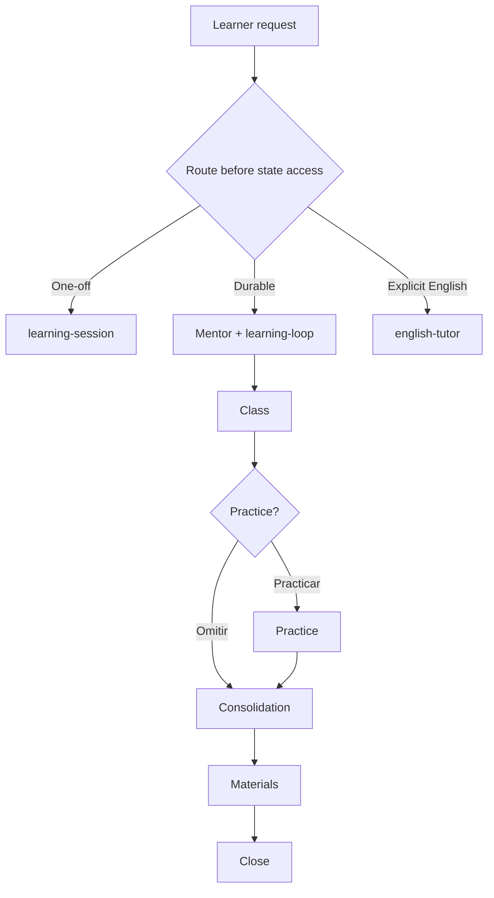

# Learning Domain

Learning provides one-off teaching, durable learning paths, explicit English coaching and optional Anki vocabulary export. The domain is self-contained: installing `learning` provides its agents, commands, eight skills and deterministic state runtime.

## Quick start

```bash
installers/opencode.sh install --domain learning
```

```text
/learn session explícame por qué HTTP es stateless con un ejemplo
/learn path validación de caché HTTP para decidir reutilizar, revalidar o descargar
/learn review cache-http
/english I have worked here since three years
```

One-off sessions stay in conversation unless the learner explicitly approves a standalone summary. A durable path stores authoritative state and generated views under `.ai/learning/`. See the [operator guide](../../docs/learning-domain.md) for setup, recovery and verification.

## Flow


```mermaid
flowchart TD
    U["Learner request"] --> R{"Route before state access"}
    R -->|"One-off"| S["learning-session"]
    R -->|"Durable"| M["Mentor + learning-loop"]
    R -->|"Explicit English"| E["english-tutor"]
    M --> C["Class"] --> P{"Practice?"}
    P -->|"Practicar"| A["Practice"]
    P -->|"Omitir"| K["Consolidation"]
    A --> K --> W["Materials"] --> X["Close"]
```

Mentor owns teaching, assessment and progression. Skills accept explicit inputs and return useful results inline; they do not discover state, invoke siblings or write files. The runtime alone validates durable events and writes state.

## Durable learning

Durable topics use `.ai/learning/<topic>/.state.json` as their semantic authority. New views are `mission.md`, `path.md`, `vocabulary.md`, `gaps.md` and approved artifacts. Existing `review-queue.md` files remain readable historical files but are no longer generated.

Non-language modules follow this sequence:

| Phase | Learner-visible result |
| --- | --- |
| Class | Objective, central relationships, a distinct worked example and one focused response. |
| Practice readiness | One native **Practicar / Omitir** choice. The recorded decision is reused on resume. |
| Practice | An actual attempt on a new application, with hints faded from observed performance. |
| Consolidation | Learner explanation of essential decisions and transfer, with no blocking gap. |
| Materials | Cornell note, then exercise, each generated and saved in sequence. |
| Close | Current materials, sufficient verified evidence and completed or explicitly omitted practice. |

Omission preserves any partial attempt and never proves competence. Closing never depends on an internal card, a schedule or a delayed observation. Existing schema-1 states may retain historical fields; new events do not create or consult them.

Standalone quizzes, maps, dialogues and teach-backs receive only the exact references explicitly selected in `artifact.evidence_refs`; notes and exercises use verified references from their owned module. The runtime checks the complete writer payload before launching a child, omits oversized teacher guidance with an explicit marker, and rejects oversized literal evidence with a recoverable selection message without truncating quotes.

Learners can adapt a path without losing evidence:

| Need | Operation | What stays pending |
| --- | --- | --- |
| Change the goal | `revise_scope` with native approval of the exact goal and wins | Reassessment and current materials; retired requirements are not credited. |
| Already know the material | `skip_practice` from Class or unfinished Practice | Any uncovered criterion and materials; no teaching or practice is invented. |
| Study another module now | `select_module` with native approval of destination and reason | The previous module is deferred at its actual phase. |

The mission defines stable concept IDs and prerequisites. Cornell questions, quizzes, teach-backs and drills are practice resources, not scheduled obligations. `/learn review <topic>` is a point-in-time practice request chosen by the learner.

## Evidence and materials

Practice and Consolidation store literal learner references with `session_id`, `message_id`, `part_id` and exact `quote`. The runtime verifies them against the learner session and deduplicates references within the module. Mentor assessment and composition instructions are separate fields; prose supplied by Mentor is never treated as a learner quote.

After Consolidation, Mentor commissions the Cornell note, saves it, then commissions and saves the exercise at the new revision. On resume, only missing or invalidated materials are generated. The writer receives the complete loaded exercise template and returns exact content; the runtime checks owner, source revision, destination and content before saving.

## Language learning

Language practice is available on the same day as exposure. Units remain available in learner order when pending, unfinished, erroneous or `input-only`; there is no wait period, due date or grade. `input-only` leaves production criteria pending when the mission requires production. Completion requires observed comprehension and meaning-preserving production.

Vocabulary candidates can be corrected before export. Anki export previews exact five-field rows, exports only the learner-selected subset, prevents duplicate keys and does not prove import or mastery. Export creates no internal learning cards or review dates.

## Components

| Type | Name | Responsibility |
| --- | --- | --- |
| Primary agent | `mentor` | Route, teach, assess and coordinate validated state |
| Specialist | `english-tutor` | Explicit English correction and practice |
| Workers | `learning-researcher`, `learning-writer`, `learning-summarizer` | Bounded research, composition and summaries |
| Commands | `/learn`, `/english` | Thin route dispatch |
| Plugin | `learning-runtime` | Choices, sequential jobs, versioned state, recovery and views |
| Skills | eight Learning-owned directories | Independent teaching and transformation methods |

After changing runtime behavior or an instruction contract, run the affected [Learning manual tests](manual-tests.md).
