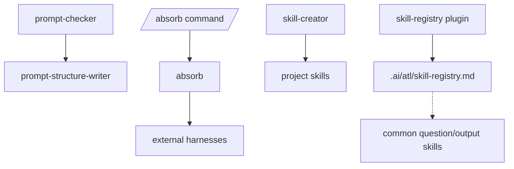

# Meta Domain

Prompt, skill, and registry maintenance utilities for this artifact repo.

Commands: `prompt-checker`, `absorb`.

Skills: `absorb`, `prompt-structure-writer`, `skill-creator`, `skill-registry`.

Plugins: `skill-registry`.

## Skill Registry Plugin

`plugins/skill-registry.ts` generates `.ai/atl/skill-registry.md` and `.ai/atl/skill-registry.hash` on OpenCode startup without blocking the session. On startup it migrates legacy `.atl/` to `.ai/atl/` when the new location does not already exist. It scans project and user skill directories, resolves symlinks, deduplicates by skill name with project skills winning, and writes only when its staleness hash changes.

CodeGraph MCP and compaction settings are runtime-local OpenCode configuration, not repo artifacts.
