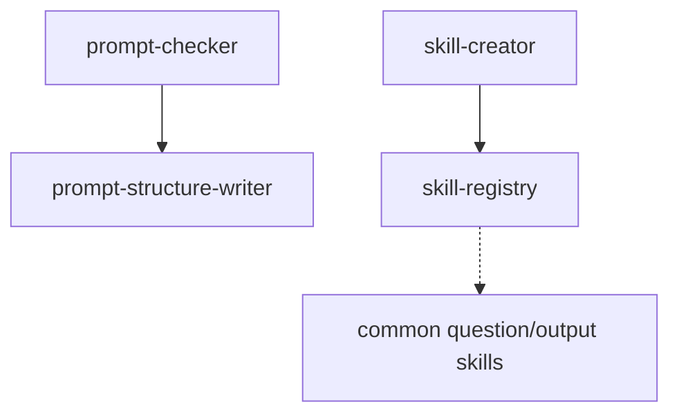

# Meta Domain

Prompt, skill, and registry maintenance utilities for this artifact repo.

Command: `prompt-checker`.

Skills: `prompt-structure-writer`, `skill-creator`, `skill-registry`.

```mermaid
graph TD
  prompt[prompt-checker] --> writer[prompt-structure-writer]
  creator[skill-creator] --> registry[skill-registry]
  registry -.-> common[common question/output skills]
```
