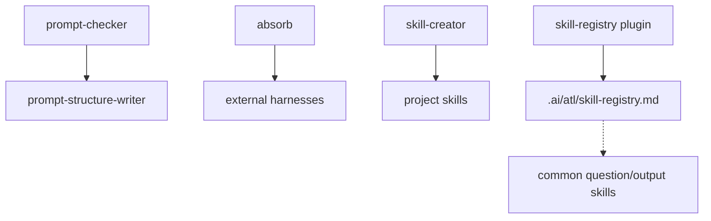

# Meta Domain

Prompt, skill, and registry maintenance utilities for this artifact repo.

Command: `prompt-checker`.

Skills: `absorb`, `prompt-structure-writer`, `skill-creator`, `skill-registry`.

Plugins: `skill-registry`.

