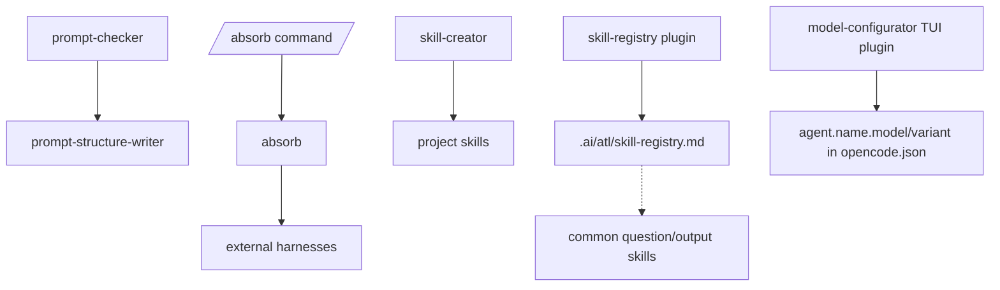

# Meta Domain

Prompt, skill, and registry maintenance utilities for this artifact repo.

Commands: `prompt-checker`, `absorb`.

Skills: `absorb`, `prompt-structure-writer`, `skill-creator`, `skill-registry`.

Plugins: `skill-registry`.

TUI plugins: `model-configurator`.

## Skill Registry Plugin

`plugins/skill-registry.ts` generates `.ai/atl/skill-registry.md` and `.ai/atl/skill-registry.hash` on OpenCode startup without blocking the session. On startup it migrates legacy `.atl/` to `.ai/atl/` when the new location does not already exist. It scans project and user skill directories, resolves symlinks, deduplicates by skill name with project skills winning, and writes only when its staleness hash changes.

## Model Configurator TUI Plugin

`tui-plugins/model-configurator.tsx` (plus its `model-configurator/` companion sources) is an OpenCode TUI plugin that assigns per-agent `model`/`variant` blocks through a staged assistant — scope, tier profile, tier decisions, per-agent overrides, review, confirm — writing targeted JSONC edits with backup and rollback. The OpenCode installer generates local copies (so `jsonc-parser` resolves from the target's `package.json`), snapshots `profiles/` and the agent catalog beside them, registers the exact entry in `$TARGET/tui.json`, and pins the dependency; re-run install after changing repo profiles or agents. Requires OpenCode >= 1.17.15. See `docs/agent-models.md`.

CodeGraph MCP and compaction settings are runtime-local OpenCode configuration, not repo artifacts. CodeGraph setup is documented in `docs/codegraph.md`; the opt-in per-project initializer belongs to the `common` domain so every engineering workflow can use it.
