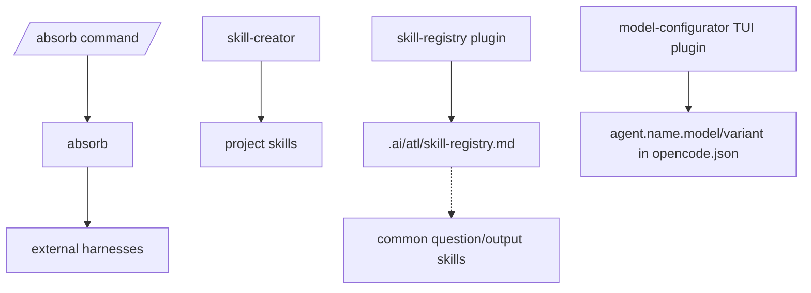

# Meta Domain

Prompt, skill, and registry maintenance utilities for this artifact repo.

## Components

| Type | Name | Purpose |
|---|---|---|
| Command | `/absorb` | Compares external AI harness practices |
| Skill | `absorb` | Compare external AI harness practices |
| Skill | `prompt-structure-writer` | Turn rough ideas into executable prompts |
| Skill | `skill-creator` | Create Agent Skills-compliant skills |
| Skill | `skill-registry` | Generate the project skill registry |
| External server plugin | [`skill-registry`](https://github.com/andresnator/opencode-skill-registry) | Generates the runtime skill index |
| External TUI plugin | [`model-configurator`](https://github.com/andresnator/opencode-agent-model-configurator) | Assigns per-agent models and variants |

```mermaid
graph TD
  absorbCmd[/absorb command/] --> absorb[absorb]
  absorb --> external[external harnesses]
  creator[skill-creator] --> skills[project skills]
  plugin[skill-registry plugin] --> registry[.ai/atl/skill-registry.md]
  registry -.-> common[common question/output skills]
  tui[model-configurator TUI plugin] --> config[agent.name.model/variant in opencode.json]
```

## Skill Registry Plugin

`external-plugins/skill-registry.server.json` pins a tested release artifact from the standalone Skill Registry repository. The plugin generates `.ai/atl/skill-registry.md` and `.ai/atl/skill-registry.hash` on startup without blocking the session; its source, detailed behavior, tests, and manual installation instructions live in that repository.

## Model Configurator TUI Plugin

`external-plugins/model-configurator.tui.json` pins the standalone Model Configurator bundle. The installer checksum-verifies it, copies this repository's abstract `profiles/` beside it, and registers `./plugins/model-configurator/tui.js` in the target's `tui.json`. The plugin owns its implementation, tests, dependency bundle, and releases; this repository owns only the integration lock and profiles. Requires OpenCode >= 1.17.15. See `docs/agent-models.md`.

Graphify MCP and compaction settings are runtime-local OpenCode configuration, not repo artifacts. Graphify setup is documented in `docs/graphify.md`; the default-on per-project initializer belongs to the `common` domain so every engineering workflow can use it.
