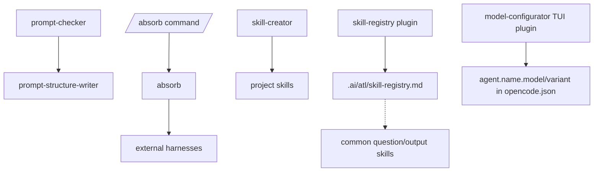

# Meta Domain

Prompt, skill, and registry maintenance utilities for this artifact repo.

## Components

| Type | Name | Purpose |
|---|---|---|
| Command | `/absorb` | Compares external AI harness practices |
| Command | `/prompt-checker` | Evaluates and refines prompt text |
| Skill | `absorb` | Compare external AI harness practices |
| Skill | `prompt-structure-writer` | Turn rough ideas into executable prompts |
| Skill | `skill-creator` | Create Agent Skills-compliant skills |
| Skill | `skill-registry` | Generate the project skill registry |
| Plugin | `skill-registry` | Generates the runtime skill index |
| TUI plugin | `model-configurator` | Assigns per-agent models and variants |

```mermaid
graph TD
  prompt[prompt-checker] --> writer[prompt-structure-writer]
  absorbCmd[/absorb command/] --> absorb[absorb]
  absorb --> external[external harnesses]
  creator[skill-creator] --> skills[project skills]
  plugin[skill-registry plugin] --> registry[.ai/atl/skill-registry.md]
  registry -.-> common[common question/output skills]
  tui[model-configurator TUI plugin] --> config[agent.name.model/variant in opencode.json]
```

## Skill Registry Plugin

`plugins/skill-registry.ts` generates `.ai/atl/skill-registry.md` and `.ai/atl/skill-registry.hash` on OpenCode startup without blocking the session. On startup it migrates legacy `.atl/` to `.ai/atl/` when the new location does not already exist. It scans project and user skill directories, resolves symlinks, deduplicates by skill name with project skills winning, and writes only when its staleness hash changes. To install this plugin manually without the repo installer, see `docs/manual-plugin-install.md`.

## Model Configurator TUI Plugin

`tui-plugins/model-configurator.tsx` (plus its `model-configurator/` companion sources) is an OpenCode TUI plugin that assigns per-agent `model`/`variant` blocks through a staged assistant — scope, tier profile, tier decisions, per-agent overrides, review, confirm — writing targeted JSONC edits with backup and rollback. The agent list comes live from the running server, so built-in, repo, and user agents are all configurable, grouped by the primaries that delegate to them. The OpenCode installer generates local copies (so `jsonc-parser` resolves from the target's `package.json`), snapshots `profiles/` beside them, registers the exact entry in `$TARGET/tui.json`, and pins the dependency; re-run install after changing repo profiles. Requires OpenCode >= 1.17.15. See `docs/agent-models.md`; for installing it manually without the repo installer, see `docs/manual-plugin-install.md`.

Graphify MCP and compaction settings are runtime-local OpenCode configuration, not repo artifacts. Graphify setup is documented in `docs/graphify.md`; the default-on per-project initializer belongs to the `common` domain so every engineering workflow can use it.
