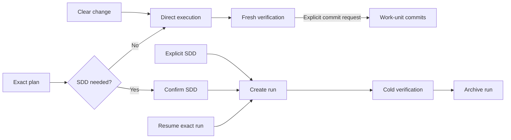

# Orchestration Domain

`orchestraitor` executes safe local changes directly and escalates only work that needs durable SDD coordination.

## Quick path

1. Select `orchestraitor` and request a change or exact plan.
2. Confirm SDD only when risk or coordination requires it.
3. Inspect fresh verification and any archived run.

## Entry points

| Request | Route | Result |
|---|---|---|
| Clear localized change | Direct | Verified working-tree change; commits only when explicitly requested |
| `ejecuta el plan <path>` | Plan execution | Direct work or confirmed SDD |
| `continúa <run>` | Resume | Continue the exact SDD run |
| Ambiguous request | Closed choice | Change, plan, or resume route |

Direct execution is the default for localized, reversible work that one session can verify. It includes protected local refactors and renames. It creates no plan, run, canonical spec, or SDD worker. Delivery stays in the working tree unless the current request explicitly asks for commits; then `orchestraitor` creates only cohesive, verified work-unit commits and never pushes.

Use SDD only for dependent groups, public contracts, migrations, high risk, durable resume, parallel coordination, or canonical specs. After explicit intent or confirmation, it records immutable plan evidence under `.ai/orchestration/runs/<slug>/`, executes internal waves, cold-verifies, optionally merges canonical specs, and archives the run. `Delivery: working-tree` is recommended; `Delivery: commit-per-unit` gives Git-index ownership only to `orchestraitor`, never its workers. See [Orchestration verification](../../docs/orchestration-test-plan.md).

### Development and delivery

One SDD intake resolves both values. The current instruction wins over explicit plan language; one grouped question asks only for values still missing.

| Development | Contract |
|---|---|
| `tdd` | Observe the focused test fail for the absent behavior before production edits. |
| `characterization-first` | Protect and run existing behavior before changing it. |
| `alongside` | Tests and implementation may be written in either order. |
| `not-applicable` | Record why tests do not apply and the exact alternative verification. |

| Delivery | Contract |
|---|---|
| `working-tree` | Keep verified implementation uncommitted; baseline is `working-tree`. |
| `commit-per-unit` | Commit each green unit serially from a captured full `HEAD`; never include `.ai/` or push. |

Resume reuses the recorded values. Development may change explicitly for future units. Delivery may change only before the first implementation edit while the intake scope remains intact. A dirty target scope blocks `commit-per-unit` without discarding the active run or changing delivery automatically.

Review is independent. After Orchestration completes, select `review-coordinator` for a separate evaluation; Orchestration never waits for or reconciles review state.

## Components

| Type | Name | Purpose |
|---|---|---|
| Agent (primary) | `orchestraitor` | Executes direct work and SDD runs |
| Agent (subagent) | `sdd-explore` | Explores code read-only |
| Agent (subagent) | `sdd-implement` | Implements one scoped work unit |
| Agent (subagent) | `sdd-canonical-merge` | Merges verified canonical spec deltas |
| Agent (subagent) | `sdd-verify` | Cold-checks behavior and commands |
| Skill | `behavior-characterization` | Captures current behavior during hardening |
| Skill | `code-conventions` | Applies code and test conventions |
| Skill | `cognitive-doc-design` | Keeps human-facing documentation clear |
| Skill | `graphify-cli` | Queries code graphs read-only |
| Skill | `java-testing` | Implements focused Java tests |
| Skill | `legacy-code-safety` | Protects behavior during legacy changes |
| Skill | `sdd-cold-verification` | Verifies scenarios and required checks |
| Skill | `implementation-skill-routing` | Selects skills for implementation work |
| Skill | `systematic-debugging` | Finds root causes before fixes |
| Skill | `work-unit-commits` | Delivers verified units when commits are explicitly enabled |
