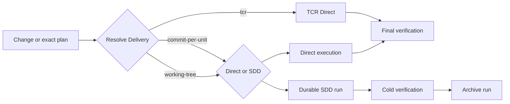

# Orchestration Domain

`orchestraitor` executes safe local changes directly and escalates only work that needs durable SDD coordination. Git delivery is opt-in; the default is a verified, uncommitted working-tree diff.

## Quick path

1. Select `orchestraitor` and request a change or exact plan.
2. State commits or TCR explicitly only when wanted; otherwise delivery stays `working-tree`.
3. Inspect fresh verification, optional commit SHAs, and any archived run.

## Entry points

| Request | Route | Result |
|---|---|---|
| Clear localized change | Direct | Verified working-tree change by default |
| Explicit commits | Direct or SDD | Cohesive green commits created only by `orchestraitor` |
| Explicit TCR | Direct only | Green micropsteps commit; attributable red micropsteps revert exactly |
| `ejecuta el plan <path>` | Plan execution | Direct work or confirmed SDD using the resolved delivery |
| `continúa <run>` | Resume | Continue the exact recorded SDD run and `HEAD` |



Direct execution is the default for localized, reversible work that one session can verify. It creates no plan, run, canonical spec, or SDD worker. `working-tree` never stages, commits, or pushes. `commit-per-unit` commits each cohesive unit after its focused check. `tcr` additionally requires a green baseline and clean target, then rolls back only a failing micropstep whose exact changes are provable.

Use SDD for dependent groups, public contracts, migrations, high risk, durable resume, parallel coordination, or canonical specs. It records immutable plan evidence under `.ai/orchestration/runs/<slug>/`, cold-verifies, optionally merges canonical specs, and archives the run. TCR cannot run under SDD; Orchestraitor asks whether to use `commit-per-unit` or reduce the scope before editing.

## Delivery contract

Delivery precedence is current execution instruction, then the plan's optional `Delivery:` line, then `working-tree`. A valid plan line authorizes its mode without a second confirmation. Duplicate, unknown, or contradictory values block before editing. Delivery cannot change after the first implementation edit.

| Delivery | Contract |
|---|---|
| `working-tree` | Leave verified changes unstaged and uncommitted. |
| `commit-per-unit` | Capture full `HEAD`, check each unit, stage exact paths, run hooks, and commit serially. |
| `tcr` | Direct only; run the complete baseline, commit each focused green micropstep, and revert only an attributable red step. |

Only `orchestraitor` owns the index. Workers never stage, commit, roll back, or push. Existing out-of-scope changes remain untouched, `.ai/` never enters commits, hooks are never skipped, and automatic amend, reset, rebase, squash, rewrite, push, PR, or merge are forbidden.

An SDD `run.md` persists one concrete value on each line:

```text
Delivery: working-tree | commit-per-unit
Baseline: working-tree | <full SHA>
Commits: none
```

In commit mode, each delivered unit replaces or appends `Commits: <unit-id> | <full SHA> | <message>`. Units implement and commit serially, resume requires `HEAD` continuity, and cold verification inspects exactly `<Baseline>..HEAD`. Working-tree SDD keeps disjoint implementation waves available and verifies the scoped working-tree diff.

Review and Judgment remain independent. After Orchestration completes, select `review-coordinator` for a separate evaluation. Publication also remains outside Orchestration.

See the [Orchestration manual tests](manual-tests.md).

## Components

| Type | Name | Purpose |
|---|---|---|
| Agent (primary) | `orchestraitor` | Executes Direct work, SDD runs, and opt-in Git delivery |
| Agent (subagent) | `sdd-explore` | Explores code read-only |
| Agent (subagent) | `sdd-implement` | Implements one scoped work unit without Git authority |
| Agent (subagent) | `sdd-canonical-merge` | Merges verified canonical spec deltas |
| Agent (subagent) | `sdd-verify` | Cold-checks behavior and commands |
| Skill | `implementation-skill-routing` | Selects implementation skills without delivery skills |
| Skill | `sdd-cold-verification` | Verifies `working-tree` or the recorded commit range |
| Skill | `tcr` | Runs exact Direct Test && Commit || Revert micropsteps |
| Skill | `work-unit-commits` | Delivers cohesive verified units when commits are enabled |
