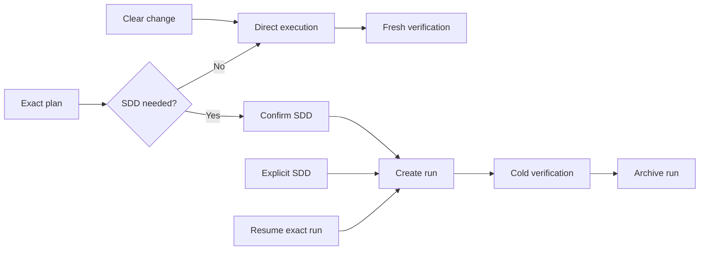

# Orchestration Domain

`orchestraitor` executes safe local changes directly and escalates only work that needs durable SDD coordination.

## Quick path

1. Select `orchestraitor` and request a change or exact plan.
2. Confirm SDD only when risk or coordination requires it.
3. Inspect fresh verification and any archived run.

## Entry points

| Request | Route | Result |
|---|---|---|
| Clear localized change | Direct | Edit plus narrow verification; no `.ai/` state |
| `ejecuta el plan <path>` | Plan execution | Direct work or confirmed SDD |
| `continúa <run>` | Resume | Continue the exact SDD run |
| Ambiguous request | Closed choice | Change, plan, or resume route |

Direct execution is the default for localized, reversible work that one session can verify. It includes protected local refactors and renames. It creates no plan, run, canonical spec, or SDD worker.

Use SDD only for dependent groups, public contracts, migrations, high risk, durable resume, parallel coordination, or canonical specs. After explicit intent or confirmation, it records immutable plan evidence under `.ai/orchestration/runs/<slug>/`, executes internal waves, cold-verifies, optionally merges canonical specs, and archives the run. Git delivery stays outside this primary. See the [Orchestration manual tests](manual-tests.md).

Review is independent. After Orchestration completes, select `review-coordinator` for a separate evaluation; Orchestration never waits for or reconciles review state.

## Components

| Type | Name | Purpose |
|---|---|---|
| Agent (primary) | `orchestraitor` | Executes direct work and SDD runs |
| Agent (subagent) | `sdd-explore` | Explores code read-only |
| Agent (subagent) | `sdd-implement` | Implements one scoped work wave |
| Agent (subagent) | `sdd-canonical-merge` | Merges verified canonical spec deltas |
| Agent (subagent) | `sdd-verify` | Cold-checks behavior and commands |
| Skill | `behavior-characterization` | Captures current behavior during hardening |
| Skill | `code-conventions` | Applies code and test conventions |
| Skill | `cognitive-doc-design` | Keeps human-facing documentation clear |
| Skill | `graphify-cli` | Queries code graphs read-only |
| Skill | `java-testing` | Implements focused Java tests |
| Skill | `legacy-code-safety` | Protects behavior during legacy changes |
| Skill | `sdd-cold-verification` | Verifies scenarios and required checks |
| Skill | `implementation-skill-routing` | Selects skills for implementation work |
| Skill | `systematic-debugging` | Finds root causes before fixes |
