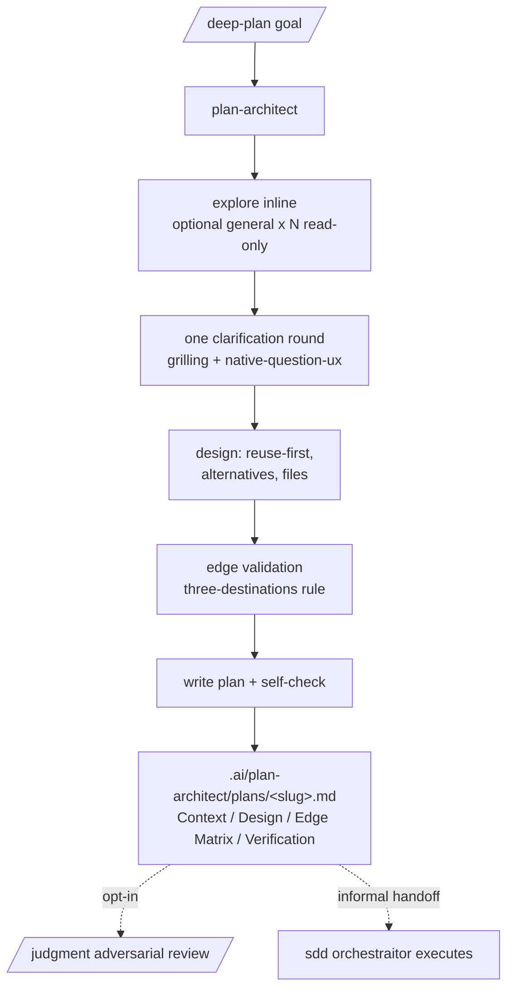

# Plan Domain

Fable-style deep planning for features, changes, and technical decisions, producing single plan documents. The `refactor` domain covers refactor/hardening planning with ready-for-sdd bundles; this domain covers everything else you want planned rigorously before touching code.

One primary agent: `plan-architect` (plan-only; explores inline, with optional read-only fan-out to the built-in `general` subagent when scope spans several independent areas). One command: `/deep-plan`. The methodology lives in the `fable-planning` skill so any agent can reuse it; `grilling` + `native-question-ux` drive the single clarification round, `code-conventions` supplies the language/tool-version evidence rule, and `judgment-day` is the opt-in adversarial review of the finished plan.

The plan is a human-readable document under `.ai/plan-architect/plans/<plan-slug>.md` with four sections: Context (why + decisions made with the user), Design (approach, rejected alternatives, files, reused `path:symbol`), an Edge Case Matrix where every edge ends in exactly one destination (handled / out of scope / open question — never silently dropped), and an end-to-end Verification section that exercises the real flow.

Deliberately **not** a ready-for-sdd bundle: the output is for humans first; execution is informal (hand the file to the sdd `orchestraitor` in direct mode). If automatic adoption is ever wanted, add a bundle mode following `docs/plan-handoff.md`.

