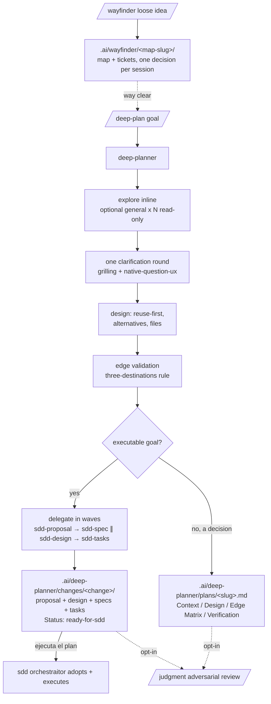

# Plan Domain

The planning front-door: where rigorous, evidence-first planning happens before any code is written, so the sdd `orchestraitor` stays lean at execution time. Fable-style planning is the method; the output has two shapes. For **executable goals** (feature, change, bugfix) `/deep-plan` produces a **ready-for-sdd bundle** the orchestraitor adopts and executes. For **decisions and investigations** it produces a single **plan document** for humans. The `refactor` domain still owns refactor/hardening bundles; this domain covers everything else you want planned rigorously.

One primary agent: `deep-planner` (plan-only; explores inline, with optional read-only fan-out to the built-in `general` subagent when scope spans several independent areas). Commands: `/deep-plan` and `/wayfinder` (discovery on-ramp, below). The methodology lives in the `fable-planning` skill so any agent can reuse it; `grilling` + `native-question-ux` drive the single clarification round, `code-conventions` supplies the language/tool-version evidence rule, and `judgment-day` is the opt-in adversarial review of the finished plan or bundle.

When the effort is too big and foggy for one `/deep-plan` sitting, `/wayfinder` sits upstream: the `wayfinder` skill charts a multi-session discovery map under `.ai/wayfinder/<map-slug>/` — investigation tickets (research / prototype / grilling / task) resolved one decision per session, with `grilling` + `domain-modeling` driving the HITL tickets — until the way is clear, then hands off to `/deep-plan`.

Assumes the `common` domain is installed: `grilling`, `judgment-day`, `native-question-ux`, `domain-modeling`, and `code-conventions` live there. Bundle drafting assumes the `sdd` domain is installed: the phase subagents `sdd-proposal`, `sdd-spec`, `sdd-design`, and `sdd-tasks` write the four artifacts from the deep-planner's briefs (no sdd changes required — their write boundary is brief-enforced).

**Bundle output** (executable goals) lands under `.ai/deep-planner/changes/<change>/` with the four ready-for-sdd artifacts (`proposal.md` with the `Status: ready-for-sdd | Source: deep-planner` marker first line, `design.md`, `specs/<capability>/spec.md`, `tasks.md`), conforming to `docs/plan-handoff.md`. The orchestraitor discovers it on `ejecuta el plan <change>`, adopts it kickoff-lite, and runs implement onward — no re-interview, no re-drafting.

**Plan-document output** (decisions) is a human-readable file under `.ai/deep-planner/plans/<plan-slug>.md` with four sections: Context (why + decisions made with the user), Design (approach, rejected alternatives, files, reused `path:symbol`), an Edge Case Matrix where every edge ends in exactly one destination (handled / out of scope / open question — never silently dropped), and an end-to-end Verification section that exercises the real flow.

## Components

| Type | Name | Purpose |
|---|---|---|
| Agent (primary) | `deep-planner` | Produces ready-for-sdd bundles or evidence-first plan documents |
| Command | `/deep-plan` | Plans an executable goal into a bundle, or a decision into a plan document |
| Command | `/wayfinder` | Advances multi-session discovery maps |
| Skill | `fable-planning` | Build evidence-first plans with edge validation |
| Skill | `wayfinder` | Map multi-session discovery decisions |

