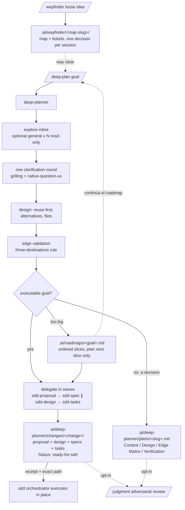

# Plan Domain

Rigorous, evidence-first planning before code is written, coordinated by `deep-planner` behind the SDLC primary. Fable-style planning is the method; the output has three shapes. For **executable goals** (feature, change, bugfix) Deep Plan produces a **ready-for-sdd bundle** that SDD executes without redrafting — oversized executable goals split into an ordered **slice roadmap** of such bundles, one slice planned per sitting. For **decisions and investigations** it produces a single **plan document** for humans. The `refactor` domain still owns refactor/hardening bundles.

One subagent coordinator: `deep-planner` (plan-only; explores inline, with optional read-only fan-out to `general` when scope spans independent areas). The `/deep-plan` and `/wayfinder` commands are compatibility aliases to `sdlc-orchestrator`; natural-language requests reach the same coordinator. The methodology lives in `fable-planning`. Clarifications return as `needs_input`, so the SDLC primary asks and resumes the same planner child.

When the effort is too big and foggy for one `/deep-plan` sitting, `/wayfinder` sits upstream: the `wayfinder` skill charts a multi-session discovery map under `.ai/wayfinder/<map-slug>/` — decision tickets (research / prototype / grilling / task) resolved one decision per session, with `grilling` + `domain-modeling` driving the HITL tickets and research tickets burned down in parallel by delegated subagents — until the way is clear, then hands off to `/deep-plan`.

Assumes the `common` domain is installed: `grilling`, `judgment-day`, `native-question-ux`, `domain-modeling`, and `code-conventions` live there. Bundle drafting assumes the `sdd` domain is installed: the phase subagents `sdd-proposal`, `sdd-spec`, `sdd-design`, and `sdd-tasks` write the four artifacts from `Draft context: handoff` briefs under `.ai/deep-planner/changes/`; their active SDD context continues to target `.ai/orchestrator/changes/`.

**Bundle output** (executable goals) lands under `.ai/deep-planner/changes/<change>/` with the four ready-for-sdd artifacts (`proposal.md` with the exact source marker, `design.md`, delta specs, and `tasks.md`). The planner returns an `sdlc-coordinator-receipt/v1` naming that exact path. SDD validates and executes the durable bundle in place from implementation onward — no planning interview or redrafting.

**Roadmap output** (oversized executable goals) splits a goal too big for one bounded change into an ordered slice roadmap at `.ai/roadmaps/<goal>.md`, plus a ready-for-sdd bundle for the first slice only — later slices are planned just-in-time via "continúa el roadmap <goal>", so they absorb what executed slices taught. Each slice bundle carries a `Roadmap: <goal> | Slice: <n>/<total>` second line in `proposal.md`; at archive the orchestraitor flips the slice to `done` and offers the next hop in one line (the user confirms each hop). Contract in `docs/plan-handoff.md`.

**Plan-document output** (decisions) is a human-readable file under `.ai/deep-planner/plans/<plan-slug>.md` with four sections: Context (why + decisions made with the user), Design (approach, rejected alternatives, files, reused `path:symbol`), an Edge Case Matrix where every edge ends in exactly one destination (handled / out of scope / open question — never silently dropped), and an end-to-end Verification section that exercises the real flow.

## Components

| Type | Name | Purpose |
|---|---|---|
| Agent (subagent) | `deep-planner` | Produces ready-for-sdd handoffs or evidence-first plan documents |
| Command | `/deep-plan` | Plans an executable goal into a bundle, or a decision into a plan document |
| Command | `/wayfinder` | Advances multi-session discovery maps |
| Skill | `fable-planning` | Build evidence-first plans with edge validation |
| Skill | `wayfinder` | Map multi-session discovery decisions |

```mermaid
graph TD
  wf[/wayfinder loose idea/] --> map[".ai/wayfinder/&lt;map-slug&gt;/<br/>map + tickets, one decision per session"]
  map -.->|way clear| cmd
  cmd[/deep-plan goal/] --> architect[deep-planner]
  architect --> explore[explore inline<br/>optional general x N read-only]
  explore --> clarify[one clarification round<br/>grilling + native-question-ux]
  clarify --> design[design: reuse-first,<br/>alternatives, files]
  design --> edges[edge validation<br/>three-destinations rule]
  edges --> shape{executable goal?}
  shape -->|yes| waves[delegate in waves<br/>sdd-proposal → sdd-spec ∥ sdd-design → sdd-tasks]
  shape -->|too big| roadmap[".ai/roadmaps/&lt;goal&gt;.md<br/>ordered slices, plan next slice only"]
  roadmap --> waves
  roadmap -.->|continúa el roadmap| cmd
  waves --> bundle[".ai/deep-planner/changes/&lt;change&gt;/<br/>proposal + design + specs + tasks<br/>Status: ready-for-sdd"]
  bundle -->|receipt + exact path| orchestraitor[sdd orchestraitor executes in place]
  shape -->|no, a decision| plan[".ai/deep-planner/plans/&lt;slug&gt;.md<br/>Context / Design / Edge Matrix / Verification"]
  bundle -.->|opt-in| judgment[/judgment adversarial review/]
  plan -.->|opt-in| judgment
```
