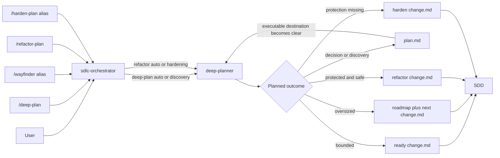
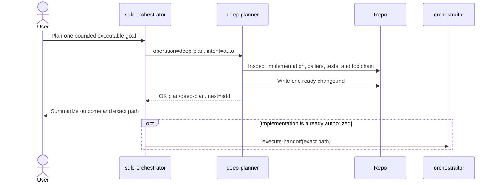
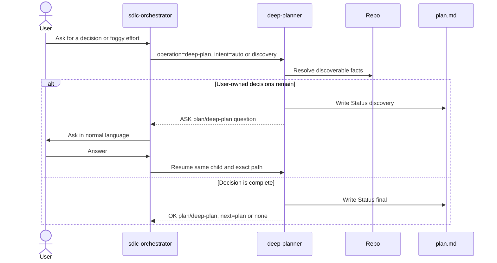
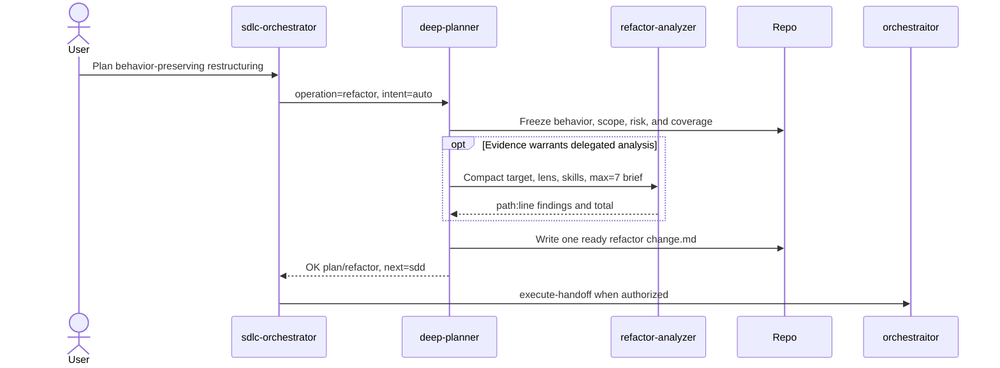
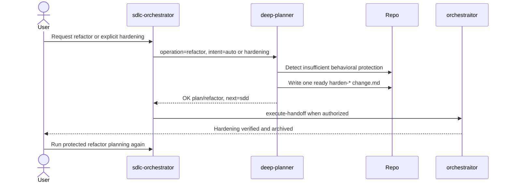

# Plan Domain

`deep-planner` turns repository evidence into a durable plan or one executable `change.md`. Public planning has two behaviors: normal `deep-plan` and protected `refactor`; SDD owns implementation.

## Quick path

1. Describe the outcome through `sdlc-orchestrator`, `/deep-plan`, or `/refactor-plan`.
2. Answer only unresolved product, acceptance, or risk decisions.
3. Review the returned plan, roadmap slice, or ready `change.md` before implementation.

## Routes

| Entry | Internal route | Use |
|---|---|---|
| Natural-language planning or `/deep-plan` | `deep-plan`, `intent=auto` | Executable change, decision, or roadmap |
| Discovery or `/wayfinder` | `deep-plan`, `intent=discovery` | One durable multi-session plan |
| Protected planning or `/refactor-plan` | `refactor`, `intent=auto` | Refactor when safe; harden first otherwise |
| Safety-net planning or `/harden-plan` | `refactor`, `intent=hardening` | Hardening only |

`/wayfinder` and `/harden-plan` are compatibility aliases. Machine returns use only `plan/deep-plan` or `plan/refactor`.

## Flow at a glance

```mermaid
flowchart LR
    U[User] --> O[sdlc-orchestrator]
    DP["/deep-plan"] --> O
    WF["/wayfinder alias"] --> O
    RP["/refactor-plan"] --> O
    HP["/harden-plan alias"] --> O
    O -->|deep-plan auto or discovery| P[deep-planner]
    O -->|refactor auto or hardening| P
    P --> D{Planned outcome}
    D -->|bounded| C[ready change.md]
    D -->|decision or discovery| N[plan.md]
    D -->|oversized| R[roadmap plus next change.md]
    D -->|protected and safe| F[refactor change.md]
    D -->|protection missing| H[harden change.md]
    C --> S[SDD]
    R --> S
    F --> S
    H --> S
    N -->|executable destination becomes clear| P
```

## Outputs

| Need | Output | Next |
|---|---|---|
| Bounded executable goal | `.ai/deep-planner/changes/<change>/change.md` | SDD executes in place |
| Decision or investigation | `.ai/deep-planner/plans/<slug>.md`, `Status: final` | Human review |
| Foggy multi-session effort | Same path, `Status: discovery` | Continue the exact plan |
| Oversized executable goal | `.ai/roadmaps/<goal>.md` plus one ready slice | Execute one slice, then `"continúa el roadmap <goal>"` |
| Protected refactor with reliable coverage | Ready refactor `change.md` | SDD executes the refactor |
| Protected refactor without reliable coverage | Ready `harden-*` `change.md` | SDD hardens, then plan the refactor again |

## Flow sequences

### 1. Bounded executable change

```mermaid
sequenceDiagram
    actor User
    participant SDLC as sdlc-orchestrator
    participant Plan as deep-planner
    participant Repo
    participant SDD as orchestraitor
    User->>SDLC: Plan one bounded executable goal
    SDLC->>Plan: operation=deep-plan, intent=auto
    Plan->>Repo: Inspect implementation, callers, tests, and toolchain
    Plan->>Repo: Write one ready change.md
    Plan-->>SDLC: OK plan/deep-plan, next=sdd
    SDLC-->>User: Summarize outcome and exact path
    opt Implementation is already authorized
        SDLC->>SDD: execute-handoff(exact path)
    end
```

The planner writes no production files and does not add execution choices; SDD adopts the exact producer-owned path.

### 2. Decision or multi-session discovery

```mermaid
sequenceDiagram
    actor User
    participant SDLC as sdlc-orchestrator
    participant Plan as deep-planner
    participant Repo
    participant Artifact as plan.md
    User->>SDLC: Ask for a decision or foggy effort
    SDLC->>Plan: operation=deep-plan, intent=auto or discovery
    Plan->>Repo: Resolve discoverable facts
    alt User-owned decisions remain
        Plan->>Artifact: Write Status discovery
        Plan-->>SDLC: ASK plan/deep-plan question
        SDLC->>User: Ask in normal language
        User->>SDLC: Answer
        SDLC->>Plan: Resume same child and exact path
    else Decision is complete
        Plan->>Artifact: Write Status final
        Plan-->>SDLC: OK plan/deep-plan, next=plan or none
    end
```

Discovery updates one exact file. A final executable destination re-enters `/deep-plan`; discovery itself never creates a ready handoff.

### 3. Oversized goal and roadmap slice

```mermaid
sequenceDiagram
    actor User
    participant SDLC as sdlc-orchestrator
    participant Plan as deep-planner
    participant Roadmap as roadmap.md
    participant SDD as orchestraitor
    User->>SDLC: Plan an oversized executable goal
    SDLC->>Plan: operation=deep-plan, intent=auto
    Plan->>Roadmap: Write ordered slices; first is planned
    Plan->>Roadmap: Link one ready slice change.md
    Plan-->>SDLC: OK plan/deep-plan, next=sdd
    SDD->>Roadmap: planned to adopted at intake
    SDD->>Roadmap: adopted to done after archive
    SDD-->>User: Offer the next unblocked slice
    User->>SDLC: "continúa el roadmap <goal>"
    SDLC->>Plan: operation=deep-plan, intent=auto, exact goal
    Plan->>Roadmap: First unblocked pending to planned
    Plan->>Roadmap: Write exactly one next-slice change.md
    Plan-->>SDLC: OK plan/deep-plan, next=sdd
```

Each slice is planned just in time. The continuation resolves only `.ai/roadmaps/<goal>.md`; it stops if another slice is already planned or adopted. The change marker identifies the roadmap and slice; SDD never plans the next slice automatically.

### 4. Protected refactor with reliable coverage

```mermaid
sequenceDiagram
    actor User
    participant SDLC as sdlc-orchestrator
    participant Plan as deep-planner
    participant Analyzer as refactor-analyzer
    participant Repo
    participant SDD as orchestraitor
    User->>SDLC: Plan behavior-preserving restructuring
    SDLC->>Plan: operation=refactor, intent=auto
    Plan->>Repo: Freeze behavior, scope, risk, and coverage
    opt Evidence warrants delegated analysis
        Plan->>Analyzer: Compact target, lens, skills, max=7 brief
        Analyzer-->>Plan: path:line findings and total
    end
    Plan->>Repo: Write one ready refactor change.md
    Plan-->>SDLC: OK plan/refactor, next=sdd
    SDLC->>SDD: execute-handoff when authorized
```

The ready change includes behavior-preservation scenarios, affected paths, rollback, and end-to-end verification.

### 5. Hardening before refactor

```mermaid
sequenceDiagram
    actor User
    participant SDLC as sdlc-orchestrator
    participant Plan as deep-planner
    participant Repo
    participant SDD as orchestraitor
    User->>SDLC: Request refactor or explicit hardening
    SDLC->>Plan: operation=refactor, intent=auto or hardening
    Plan->>Repo: Detect insufficient behavioral protection
    Plan->>Repo: Write one ready harden-* change.md
    Plan-->>SDLC: OK plan/refactor, next=sdd
    SDLC->>SDD: execute-handoff when authorized
    SDD-->>User: Hardening verified and archived
    User->>SDLC: Run protected refactor planning again
```

Hardening and restructuring remain separate handoffs. Discovered bugs are characterized as current behavior and fixed in separate work.

## Contracts

- A ready change starts with `Status: ready-for-sdd | Source: deep-planner`; roadmap slices add `Roadmap: <goal> | Slice: <n>/<total>` on line two.
- `change.md` contains outcome, scope, behavior deltas, approach, ordered work, verification, and non-empty risks. Disjoint `Files:` scopes may execute in parallel.
- Decision and discovery plans use the shared `evidence-first-planning` method. Roadmaps plan only the first pending slice whose dependencies are done.
- Planner and analyzer returns use compact Caveman-style A2A; human artifacts and questions use normal English.

Copy-ready hypothetical prompts and expected evidence are in [Plan flow test scenarios](../../docs/plan-flow-test-scenarios.md).

## Components

| Type | Name | Purpose |
|---|---|---|
| Agent (subagent coordinator) | `deep-planner` | Produces normal or protected plans and ready changes |
| Agent (subagent) | `refactor-analyzer` | Applies one evidence-backed read-only lens |
| Command | `/deep-plan` | Routes executable, decision, and roadmap planning |
| Command alias | `/wayfinder` | Routes one durable discovery plan |
| Command | `/refactor-plan` | Routes protected refactor planning |
| Command alias | `/harden-plan` | Forces hardening-only planning |
| Skill | `architecture-impact-review` | Classifies local versus architectural risk |
| Skill | `behavior-characterization` | Records observable legacy behavior |
| Skill | `characterization-test-scoping` | Scopes tests, seams, containment, and rollback |
| Skill | `dependency-seam-detection` | Finds testability seams |
| Skill | `evidence-first-planning` | Builds evidence-first plans and validates edges |
| Skill | `java-api-design` | Reviews Java API boundaries |
| Skill | `java-exception-robustness` | Reviews Java failure handling |
| Skill | `java-immutability-modeling` | Reviews safe Java data models |
| Skill | `java-naming-readability` | Reviews Java naming |
| Skill | `java-secure-coding` | Reviews Java security practices |
| Skill | `java-testing` | Designs Java test coverage |
| Skill | `legacy-code-safety` | Makes untested code safe to change |
| Skill | `null-safety` | Detects null hazards |
| Skill | `refactor` | Supplies cross-language refactoring techniques |
| Skill | `scope-analysis` | Delimits the target boundary |
| Skill | `sdd-draft-change` | Drafts the single pre-implementation change document |
| Skill | `tooling-audit` | Detects test-tooling gaps |
| Skill | `tooling-compatibility-matrix` | Selects compatible quality tooling |
| Skill | `type-contracts` | Detects weak type contracts |
