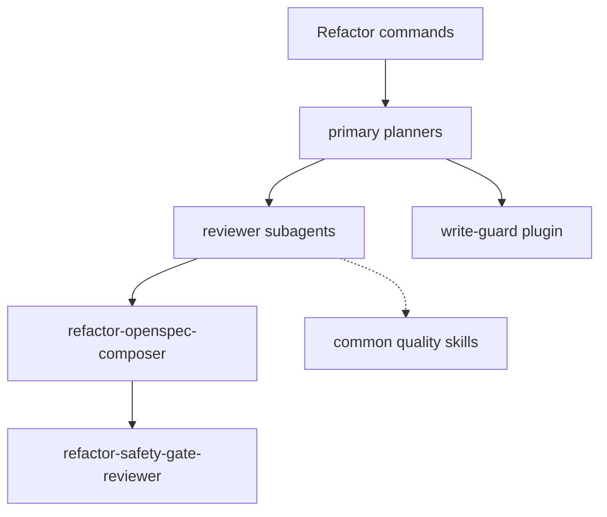

# Refactor Domain

Refactor planning, legacy safety planning, Java refactor guidance, reviewer agents, and the OpenCode write-guard plugin.

Primary entries: `refactorch`, `refactor-planner`, `legacy-safety-planner`.

Commands: `refactor-plan`, `legacy-safety-plan`.

