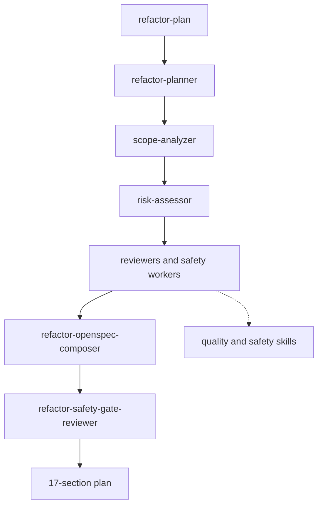

# Refactor Domain

Refactor planning, risk-gated legacy safety analysis, Java refactor guidance, reviewer agents, and the OpenCode write-guard plugin.

Primary entries: `refactor-planner`.

Commands: `refactor-plan`.

