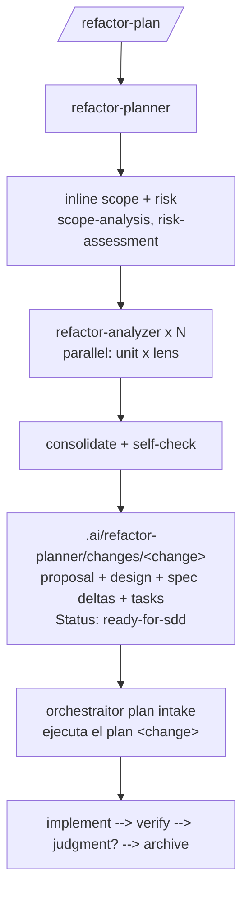

# Refactor Domain

Risk-gated refactor planning that produces ready-for-sdd OpenSpec change bundles, plus Java refactor skills.

One primary agent: `refactor-planner`. One subagent: `refactor-analyzer` (generic read-only analysis instance, launched N times in parallel with per-lens briefs). One command: `/refactor-plan`.

The planner scopes and risk-classifies inline, fans out analyzer instances by unit × lens, consolidates findings, and composes one or more OpenSpec bundles under `.ai/refactor-planner/changes/<change>/` using the `sdd-draft-*` templates. Execution belongs to the sdd `orchestraitor`, which adopts bundles via the plan-intake contract in `docs/plan-handoff.md` ("ejecuta el plan <change>").

Full lens coverage assumes the `common` domain is installed (lens skills such as `cohesion-coupling` or `kiss-yagni` live there); missing lens skills are reported as skipped, never as failures.

Legacy note: pre-2026-07 `.ia-refactor/plan/**` artifacts are frozen history. The planner ignores them and `/refactor-execute` no longer exists — execution now happens through sdd adoption.

