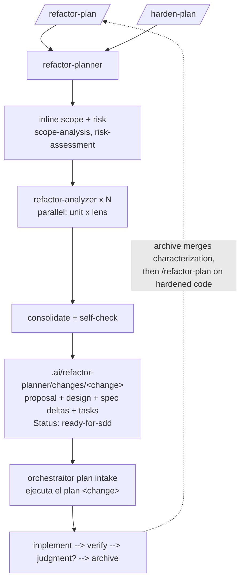

# Refactor Domain

Risk-gated refactor and test-hardening (CDD) planning that produces ready-for-sdd OpenSpec change bundles, plus Java refactor skills and the cross-language `refactor` technique catalog.

The planner scopes and risk-classifies inline, fans out analyzer instances by unit × lens, consolidates findings, and composes one or more OpenSpec bundles under `.ai/refactor-planner/changes/<change>/` using the `sdd-draft-*` templates. Execution belongs to the sdd `orchestraitor`, which adopts bundles via the plan-intake contract in `docs/plan-handoff.md` ("ejecuta el plan <change>").

`/harden-plan` is the Working-Effectively-with-Legacy-Code path: when the target lacks a safety net, harden first. It always runs the `behavior-safety`, `test-safety-net`, and `tooling` lenses (no risk gating, no structural lenses), inspects whether coverage (e.g. JaCoCo) and mutation (e.g. PIT) tooling is configured — missing tooling becomes explicit enablement tasks — and asks coverage/mutation thresholds at kickoff. Its tasks follow a fixed CDD order: tooling enablement → minimal behavior-preserving seams → characterization and unit tests → coverage/mutation baseline against the thresholds. The full CDD sequence: `/harden-plan` → "ejecuta el plan" (sdd) → archive merges the characterization deltas into canonical specs → `/refactor-plan` on the hardened code with fresh evidence → "ejecuta el plan".

Bundles carry Andres's style contract: the `code-conventions` skill rides the test-safety-net lens, `design.md` records language/tool versions plus convention deviations, and test tasks prescribe the test format (naming, `// Given // When // Then` sections, whole-object asserts, separate characterization classes).

Full lens coverage assumes the `common` domain is installed (lens skills such as `cohesion-coupling` or `kiss-yagni` live there, as do the transversal `code-conventions` and `risk-assessment`); missing lens skills are reported as skipped, never as failures. Bundle composition uses the `sdd-draft-*` templates from the `sdd` domain.

Legacy note: pre-2026-07 `.ia-refactor/plan/**` artifacts are frozen history. The planner ignores them and `/refactor-execute` no longer exists — execution now happens through sdd adoption.

## Components

| Type | Name | Purpose |
|---|---|---|
| Agent (primary) | `refactor-planner` | Plans risk-gated ready-for-sdd refactors |
| Agent (subagent) | `refactor-analyzer` | Analyzes one refactor lens read-only |
| Command | `/harden-plan` | Plans characterization, coverage, and mutation safety |
| Command | `/refactor-plan` | Plans behavior-preserving ready-for-sdd refactor bundles |
| Skill | `architecture-impact-review` | Classify risk as local or architectural |
| Skill | `behavior-characterization` | Record current legacy behavior |
| Skill | `characterization-test-scoping` | Scope tests, seams, containment, and rollback |
| Skill | `dependency-seam-detection` | Find seams for legacy testability |
| Skill | `java-api-design` | Design clear Java API boundaries |
| Skill | `java-exception-robustness` | Design robust Java failure handling |
| Skill | `java-immutability-modeling` | Model Java data safely |
| Skill | `java-naming-readability` | Evaluate Java naming and readability |
| Skill | `java-secure-coding` | Review Java security practices |
| Skill | `java-testing` | Generate and retrofit Java tests |
| Skill | `legacy-code-safety` | Make untested code safe to change |
| Skill | `null-safety` | Detect null hazards conservatively |
| Skill | `refactor` | Apply cross-language refactoring techniques |
| Skill | `scope-analysis` | Delimit class, package, or module scope |
| Skill | `tooling-audit` | Detect refactor safety tooling gaps |
| Skill | `tooling-compatibility-matrix` | Guide test, coverage, and mutation tooling |
| Skill | `type-contracts` | Detect weak or implicit Java contracts |

