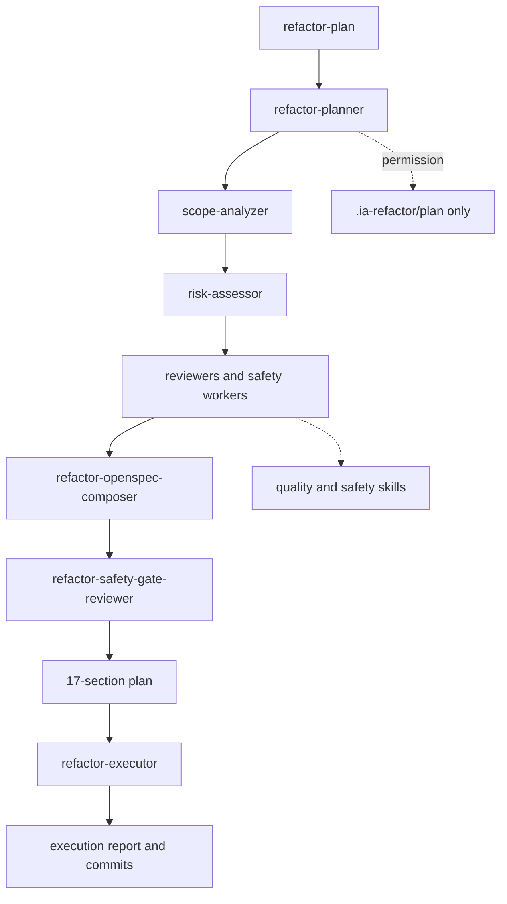

# Refactor Domain

Risk-gated refactor planning and execution, Java refactor guidance, and reviewer agents.

Primary entries: `refactor-planner`, `refactor-executor`.

Commands: `refactor-plan`, `refactor-execute`.

