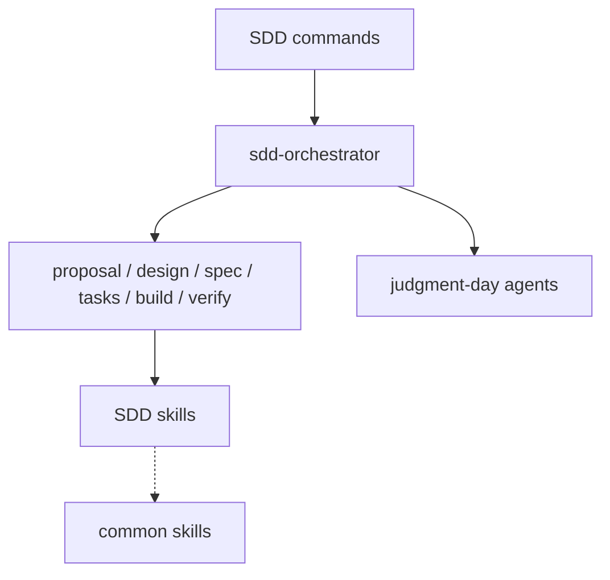

# SDD Domain

Spec-driven development workflows, SDD lifecycle commands, draft-spec skills, and judgment-day review agents.

Primary entries: `sdd-orchestrator`, `sdd-propose`, `sdd-design`, `sdd-spec`, `sdd-tasks`, `sdd-build`, `sdd-verify`.

Commands: `sdd-new`, `sdd-continue`, `sdd-quick`, `sdd-review`, `sdd-ship`, `sdd-status`.

