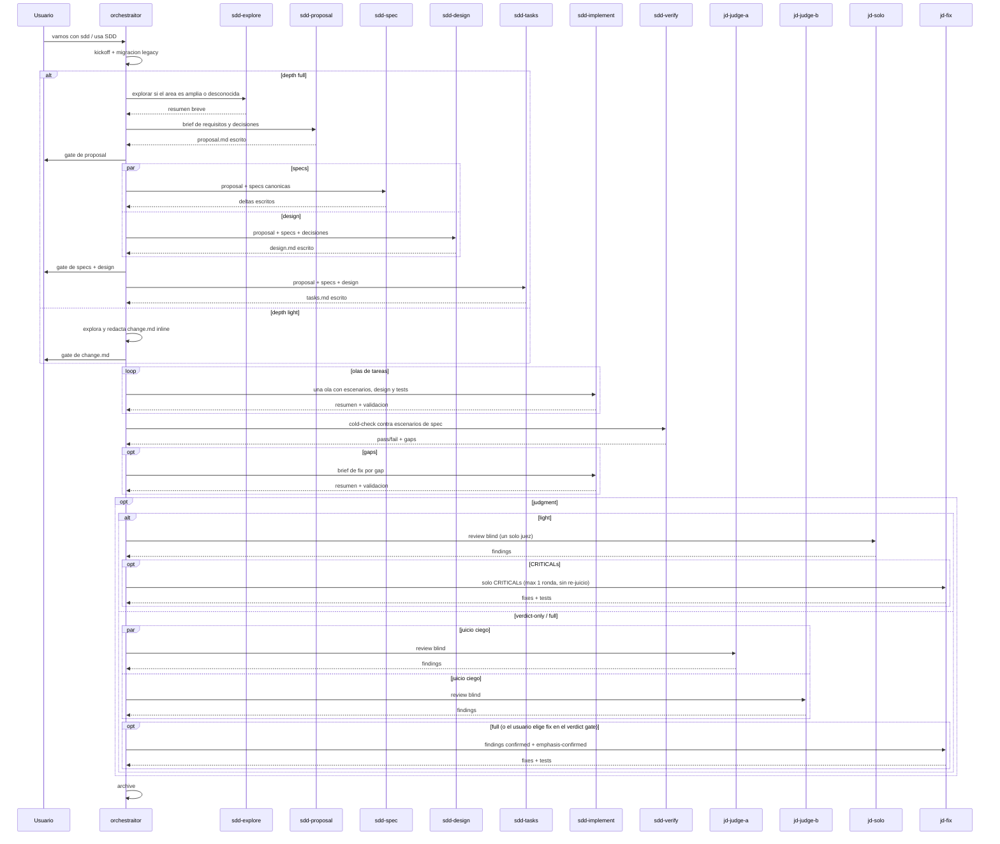

# SDD Domain

Spec-driven development around one primary coordinator: `orchestraitor`. The SDD cycle is explicit opt-in: start it conversationally ("vamos con sdd", "usa SDD") or with equivalent clear intent. Without an SDD mention, `orchestraitor` executes directly and keeps `general` only for auxiliary chores. Use `/judgment` for a standalone adversarial review, and `/grill` (installed with the `common` domain) to run the grill interview router explicitly (`/grill [me|docs|sdd] <topic>`) instead of relying on trigger phrases. Judgment-day is a high-signal gate for high-risk, high-size, or SDD verification moments — not a default pre-commit/pre-push action; routine work gets the cheap single-reviewer check formalized as the skill's Light Mode (`/judgment light <target>`, one `jd-solo` judge, automatic fix of CRITICALs only, no re-judge).

## Components

| Type | Name | Purpose |
|---|---|---|
| Agent (primary) | `orchestraitor` | Executes tasks and coordinates opt-in SDD |
| Agent (subagent) | `jd-fix` | Applies confirmed adversarial findings |
| Agent (subagent) | `jd-judge-a` | Reviews correctness adversarially |
| Agent (subagent) | `jd-judge-b` | Reviews security adversarially |
| Agent (subagent) | `jd-solo` | Runs balanced light-mode review |
| Agent (subagent) | `sdd-design` | Drafts `design.md` from code evidence |
| Agent (subagent) | `sdd-explore` | Discovers codebase structure read-only |
| Agent (subagent) | `sdd-implement` | Implements one approved task wave |
| Agent (subagent) | `sdd-proposal` | Drafts `proposal.md` from an approved brief |
| Agent (subagent) | `sdd-spec` | Drafts OpenSpec delta specifications |
| Agent (subagent) | `sdd-tasks` | Drafts dependency-ordered `tasks.md` |
| Agent (subagent) | `sdd-verify` | Cold-checks implementation against scenarios |
| Command | `/judgment` | Runs the adversarial review protocol |
| Skill | `sdd-draft-design` | Explore then draft an approved design |
| Skill | `sdd-draft-light` | Draft bounded light-depth `change.md` |
| Skill | `sdd-draft-proposal` | Draft an approved OpenSpec proposal |
| Skill | `sdd-draft-spec` | Draft delta specs with scenarios |
| Skill | `sdd-draft-tasks` | Draft ordered, verifiable implementation tasks |

Code written in either mode follows the shared `code-conventions` skill (Andres's style contract: constants, test format, whole-object asserts, separate characterization classes); a consistent repo convention wins on conflict.

Assumes the `common` domain is installed: the transversal `grilling`, `judgment-day`, `native-question-ux` (every user-facing question in the flow), `code-conventions`, `work-unit-commits` (commit shape under `Delivery: commit-per-wave`), and `tcr` (opt-in commit cadence for `sdd-implement`) skills live there.

The orchestraitor keeps the interview, confirmation gates, integration, checkbox updates, and archive in the main session. Phase work goes to dedicated subagents so each phase can receive its own model/provider via the user's `opencode.json` (see `docs/agent-models.md`) without changing the flow. The built-in `general` subagent remains allowlisted only for auxiliary self-contained chores such as lateral research, fixtures, or background test suites; it must not draft, implement, or verify SDD phases.

Artifacts live OpenSpec-style under `.ai/orchestrator/` in each project: canonical `specs/` per capability, active `changes/<name>/` with proposal/design/spec deltas/tasks, and `changes/archive/` with deltas merged into canonical specs on completion. At kickoff the orchestraitor proposes a depth — `full` (four artifacts via phase subagents) or `light` (a single `change.md` with Why/What, Spec Deltas, and Tasks, drafted inline via the `sdd-draft-light` skill); implement and the archive spec-merge are identical in both, and verify runs the same cold-check with a depth-scaled fix budget (one fix round at `light`, two at `full`). In automatic mode the Review Workload Forecast decision and the first `commit-per-wave` commit are applied and reported instead of blocking. Implementation runs in waves: task groups declare `Files:` scopes plus a `Shared hotspots:` guard line, and only waves with disjoint scopes and no shared hotspot launch in parallel — each on scoped validation, with the full suite run once per round by the orchestraitor; anything else serializes. At resume/startup, legacy `.orchestraitor/` or `.orchestrator/` state is migrated into `.ai/orchestrator/` without overwriting existing files.

The orchestraitor also adopts plans drafted elsewhere: external planners (e.g. `refactor-planner`) leave complete bundles under `.ai/<planner>/changes/<change>/` marked `Status: ready-for-sdd`, and "ejecuta el plan <change>" moves the bundle into `.ai/orchestrator/changes/` and runs it from implement onward. The contract is generic — see `docs/plan-handoff.md`. Bundles carrying a `Roadmap: <goal> | Slice: <n>/<total>` second line belong to a slice roadmap at `.ai/roadmaps/<goal>.md`: at archive the orchestraitor flips that slice to `done` and offers the next slice in one line — the user confirms each hop; it never auto-continues.

Kickoff runs only after explicit SDD activation and skips anything already stated in the request. When the orchestraitor assesses the scope as `light`, it collapses to one bundled accept-or-adjust confirmation (`light + automatic + tests alongside + judgment none + delivery none`); otherwise it asks one round of questions:

| Question | Options |
|---|---|
| Depth | `light` (single `change.md` drafted inline, no drafting subagents) / `full` (four artifacts via phase subagents); the orchestraitor assesses the scope and proposes one |
| Mode | `interactive` (interview plus confirmation gates) / `automatic` (draft everything, implement, summarize at the end) |
| TDD | test-first per task / tests alongside the implementation |
| Judgment | `none` (no adversarial review) / `light` (one solo `jd-solo` judge, automatic fix of CRITICALs only, one round, no re-judge) / `verdict-only` (blind dual judges plus verdict, no fixes) / `full` (fixes plus the gated re-judge loop) |
| Delivery | `none` (work stays uncommitted; the user commits) / `commit-per-wave` (the orchestraitor commits each verified wave as a work-unit commit from a recorded baseline; first commit confirmed with the user in interactive mode, committed-and-reported in automatic, never pushes). With commits, verify and judge briefs carry an explicit `baseline..HEAD` diff range |

Full session sequence (gates, waves, judgment):

Resume: artifacts are the state, the conversation is disposable — in a new session say "continúa <change>" and the orchestraitor rereads `.ai/orchestrator/changes/<change>/` and resumes from the first unchecked task without repeating kickoff.
