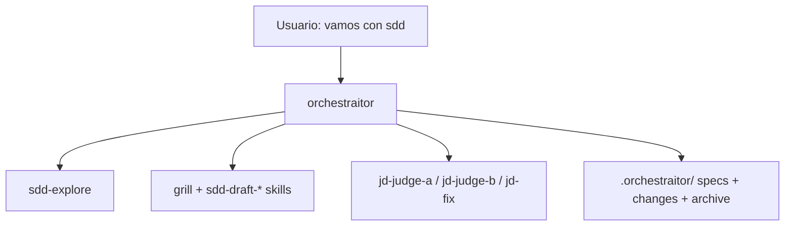

# SDD Domain

Spec-driven development around one primary agent: `orchestraitor`. No commands — you start it conversationally ("vamos con sdd") and it asks how you want the change (interactive/automatic, TDD, judgment).

Agents: `orchestraitor` (primary), `sdd-explore` (read-only discovery), `jd-judge-a`, `jd-judge-b`, `jd-fix` (judgment-day review, opt-in). The orchestraitor may also delegate self-contained work (independent tasks, lateral research, heavy test runs) to OpenCode's built-in `general` subagent, optionally in background; in automatic mode the artifact drafting itself goes to `general` drafters in waves (proposal, then specs and design in parallel, then tasks) so the main session stays clean.

Artifacts live OpenSpec-style under `.orchestraitor/` in each project: canonical `specs/` per capability, active `changes/<name>/` with proposal/design/spec deltas/tasks, and `changes/archive/` with deltas merged into canonical specs on completion.

