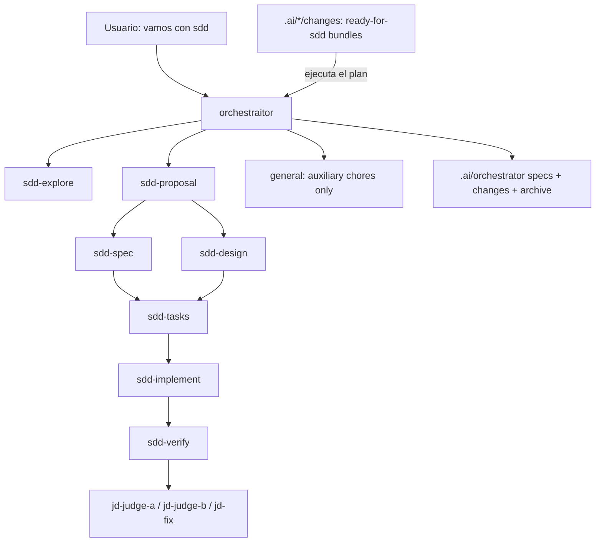

# SDD Domain

Spec-driven development around one primary coordinator: `orchestraitor`. The SDD cycle is explicit opt-in: start it conversationally ("vamos con sdd", "usa SDD") or with equivalent clear intent. Without an SDD mention, `orchestraitor` executes directly and keeps `general` only for auxiliary chores. Use `/judgment` for a standalone adversarial review.

Agents:

- `orchestraitor` (primary coordinator)
- `sdd-explore` (read-only discovery)
- `sdd-proposal`, `sdd-spec`, `sdd-design`, `sdd-tasks`, `sdd-implement`, `sdd-verify` (single-responsibility phase subagents)
- `jd-judge-a`, `jd-judge-b`, `jd-fix` (judgment-day review, opt-in)

The orchestraitor keeps the interview, confirmation gates, integration, checkbox updates, and archive in the main session. Phase work goes to dedicated subagents so each phase can receive its own model/provider via the user's `opencode.json` (see `docs/agent-models.md`) without changing the flow. The built-in `general` subagent remains allowlisted only for auxiliary self-contained chores such as lateral research, fixtures, or background test suites; it must not draft, implement, or verify SDD phases.

Artifacts live OpenSpec-style under `.ai/orchestrator/` in each project: canonical `specs/` per capability, active `changes/<name>/` with proposal/design/spec deltas/tasks, and `changes/archive/` with deltas merged into canonical specs on completion. At resume/startup, legacy `.orchestraitor/` or `.orchestrator/` state is migrated into `.ai/orchestrator/` without overwriting existing files.

The orchestraitor also adopts plans drafted elsewhere: external planners (e.g. `refactor-planner`) leave complete bundles under `.ai/<planner>/changes/<change>/` marked `Status: ready-for-sdd`, and "ejecuta el plan <change>" moves the bundle into `.ai/orchestrator/changes/` and runs it from implement onward. The contract is generic — see `docs/plan-handoff.md`.

