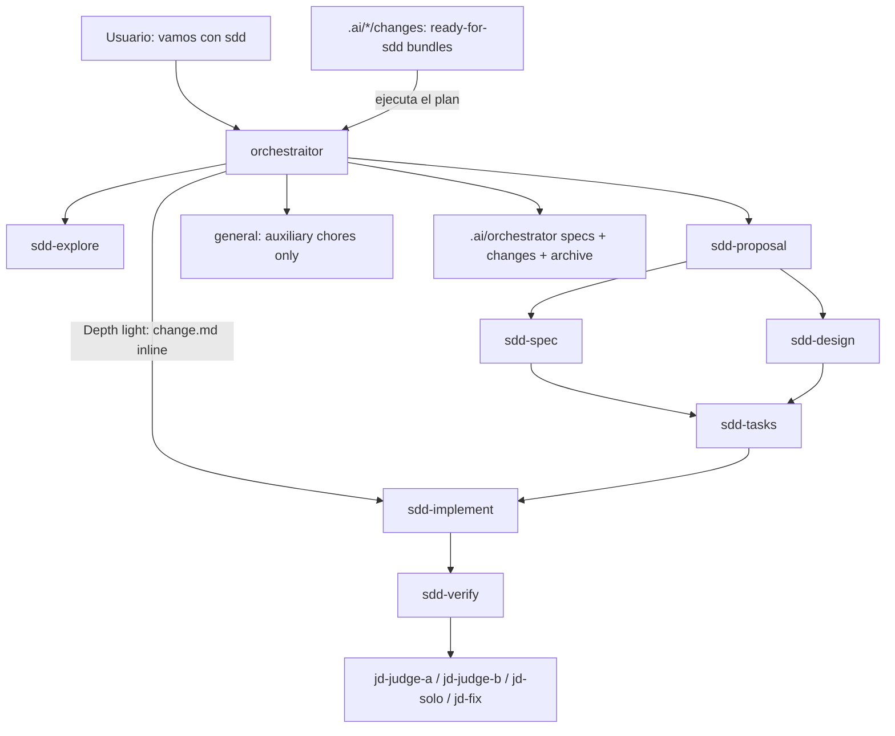
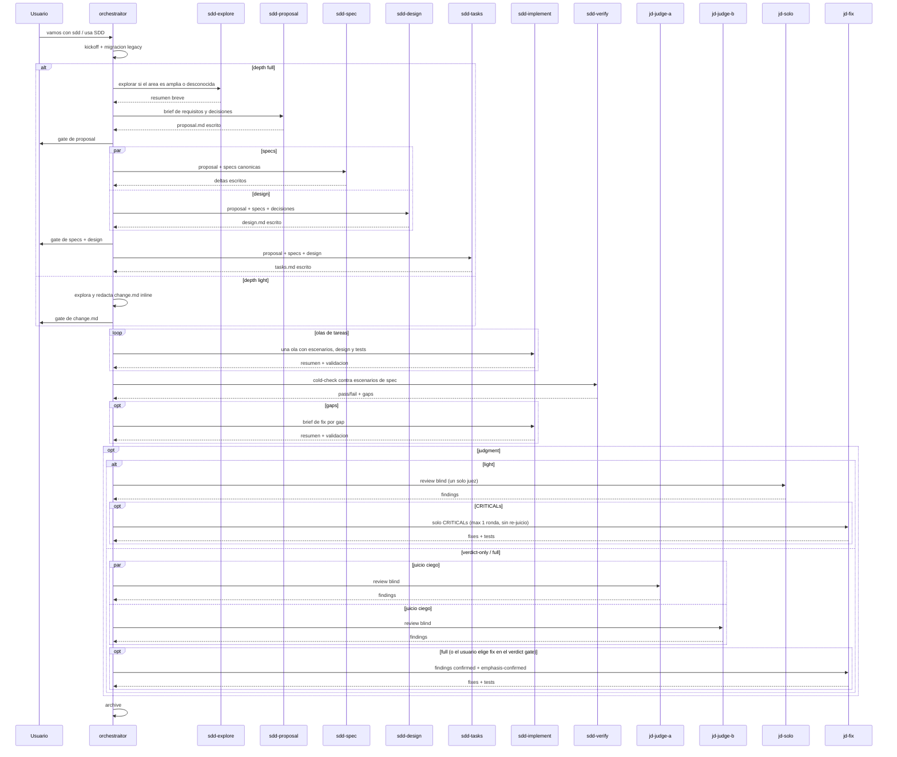

# SDD Domain

Spec-driven development around one primary coordinator: `orchestraitor`. The SDD cycle is explicit opt-in: start it conversationally ("vamos con sdd", "usa SDD") or with equivalent clear intent. Without an SDD mention, `orchestraitor` executes directly and keeps `general` only for auxiliary chores. Use `/judgment` for a standalone adversarial review, and `/grill` (installed with the `common` domain) to run the grill interview router explicitly (`/grill [me|docs|sdd] <topic>`) instead of relying on trigger phrases. Judgment-day is a high-signal gate for high-risk, high-size, or SDD verification moments — not a default pre-commit/pre-push action; routine work gets the cheap single-reviewer check formalized as the skill's Light Mode (`/judgment light <target>`, one `jd-solo` judge, automatic fix of CRITICALs only, no re-judge).

Agents:

- `orchestraitor` (primary coordinator)
- `sdd-explore` (read-only discovery)
- `sdd-proposal`, `sdd-spec`, `sdd-design`, `sdd-tasks`, `sdd-implement`, `sdd-verify` (single-responsibility phase subagents)
- `jd-judge-a`, `jd-judge-b`, `jd-solo`, `jd-fix` (judgment-day review, opt-in; `jd-solo` is the single light-mode judge)

Code written in either mode follows the shared `code-conventions` skill (Andres's style contract: constants, test format, whole-object asserts, separate characterization classes); a consistent repo convention wins on conflict.

Assumes the `common` domain is installed: the transversal `grilling`, `judgment-day`, `domain-modeling`, and `code-conventions` skills live there.

The orchestraitor keeps the interview, confirmation gates, integration, checkbox updates, and archive in the main session. Phase work goes to dedicated subagents so each phase can receive its own model/provider via the user's `opencode.json` (see `docs/agent-models.md`) without changing the flow. The built-in `general` subagent remains allowlisted only for auxiliary self-contained chores such as lateral research, fixtures, or background test suites; it must not draft, implement, or verify SDD phases.

Artifacts live OpenSpec-style under `.ai/orchestrator/` in each project: canonical `specs/` per capability, active `changes/<name>/` with proposal/design/spec deltas/tasks, and `changes/archive/` with deltas merged into canonical specs on completion. At kickoff the orchestraitor proposes a depth — `full` (four artifacts via phase subagents) or `light` (a single `change.md` with Why/What, Spec Deltas, and Tasks, drafted inline via the `sdd-draft-light` skill); implement, verify, and the archive spec-merge are identical in both. At resume/startup, legacy `.orchestraitor/` or `.orchestrator/` state is migrated into `.ai/orchestrator/` without overwriting existing files.

The orchestraitor also adopts plans drafted elsewhere: external planners (e.g. `refactor-planner`) leave complete bundles under `.ai/<planner>/changes/<change>/` marked `Status: ready-for-sdd`, and "ejecuta el plan <change>" moves the bundle into `.ai/orchestrator/changes/` and runs it from implement onward. The contract is generic — see `docs/plan-handoff.md`.

Kickoff runs only after explicit SDD activation, asks one round of questions, and skips anything already stated in the request:

| Pregunta | Opciones |
|---|---|
| Profundidad | `light` (un solo `change.md` redactado inline, sin subagentes de drafting) / `full` (cuatro artefactos con subagentes de fase); el orchestraitor evalúa el alcance y propone una |
| Modo | `interactivo` (entrevista + gates de confirmación) / `automático` (redacta, implementa y resume al final) |
| TDD | test-first por tarea / tests junto a la implementación |
| Juicio | `none` (sin review adversarial) / `light` (un solo juez `jd-solo`, fix automático solo de CRITICALs, una ronda, sin re-juicio) / `verdict-only` (jueces duales + veredicto, sin fixes) / `full` (fixes + loop de re-juicio con gates) |

Full session sequence (gates, waves, judgment):

Resume: artifacts are the state, the conversation is disposable — in a new session say "continúa <change>" and the orchestraitor rereads `.ai/orchestrator/changes/<change>/` and resumes from the first unchecked task without repeating kickoff.
