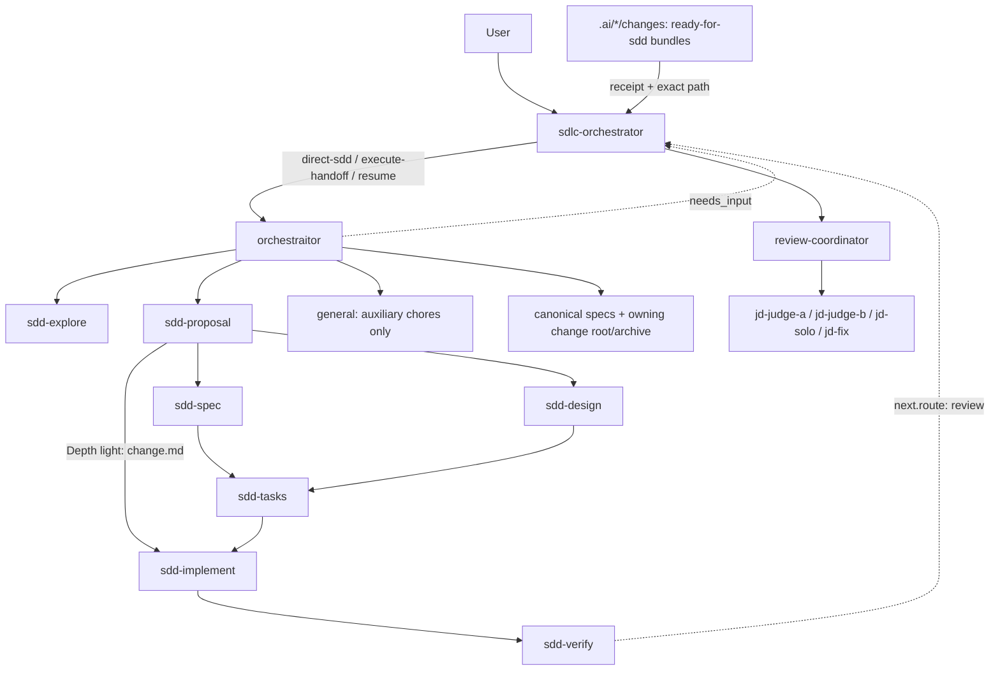

# SDD Domain

Spec-driven development through the `orchestraitor` subagent coordinator. `sdlc-orchestrator` routes direct SDD requests, ready-for-sdd handoffs, and resumes; the SDD coordinator returns any question as `needs_input` so the primary asks it and resumes the same child. The `/judgment` command is a compatibility alias to the shared `review-coordinator`; SDD also routes its optional post-verification Judgment through that coordinator.

## Components

| Type | Name | Purpose |
|---|---|---|
| Agent (subagent) | `orchestraitor` | Coordinates direct SDD and ready-bundle execution |
| Agent (subagent) | `jd-fix` | Applies confirmed adversarial findings |
| Agent (subagent) | `jd-judge-a` | Reviews correctness adversarially |
| Agent (subagent) | `jd-judge-b` | Reviews security adversarially |
| Agent (subagent) | `jd-solo` | Runs balanced light-mode review |
| Agent (subagent) | `sdd-design` | Drafts `design.md` from code evidence |
| Agent (subagent) | `sdd-explore` | Discovers codebase structure read-only |
| Agent (subagent) | `sdd-implement` | Implements one approved task wave, or merges deltas at archive |
| Agent (subagent) | `sdd-proposal` | Drafts `proposal.md`, or `change.md` at light depth, from an approved brief |
| Agent (subagent) | `sdd-spec` | Drafts OpenSpec delta specifications |
| Agent (subagent) | `sdd-tasks` | Drafts dependency-ordered `tasks.md` |
| Agent (subagent) | `sdd-verify` | Cold-checks implementation against scenarios |
| Command | `/judgment` | Runs the adversarial review protocol |
| Skill | `sdd-draft-design` | Explore then draft an approved design |
| Skill | `sdd-draft-light` | Draft bounded light-depth `change.md` |
| Skill | `sdd-draft-proposal` | Draft an approved OpenSpec proposal |
| Skill | `sdd-draft-spec` | Draft delta specs with scenarios |
| Skill | `sdd-draft-tasks` | Draft ordered, verifiable implementation tasks |

Code written through SDD follows the shared `code-conventions` skill (Andres's style contract: constants, test format, whole-object asserts, separate characterization classes); a consistent repo convention wins on conflict.

Assumes the `common` and `sdlc` domains are installed. `native-question-ux` shapes questions returned in receipts, while `sdlc-orchestrator` is the only agent that invokes the question tool. `code-conventions` and `work-unit-commits` retain their existing implementation and delivery roles. Judgment is owned by the SDLC domain's `review-coordinator` using the common `judgment-day` skill.

The orchestraitor keeps SDD decisions, integration, checkbox updates, Git index ownership, and archive in its child session. Every user gate returns to the parent receipt loop. Phase work goes to dedicated subagents so each phase can receive its own model/provider via the user's `opencode.json` without changing the flow. Drafting agents accept `active` for direct SDD artifacts under `.ai/orchestrator/changes/` and `handoff` for producer bundles under `.ai/<producer>/changes/`.

Every agent in the domain declares a `permission.skill` allowlist naming only the skills it actually loads. OpenCode advertises each installed skill's name and description in the system prompt of every turn, so an unfiltered catalogue is a fixed tax multiplied by the turn count — measured at 8,305 tokens per turn for the `orchestraitor` against an 84-skill install. The orchestraitor no longer sees the full catalogue for free; when it needs to know what else exists, it reads `.ai/atl/skill-registry.md` once. Adding a skill that an agent must load means adding it to that agent's allowlist. A loaded skill body may reference further skills (the drafting skills cite `grilling` and `native-question-ux` for their interactive mode); the phase agents run interview-free and are not expected to resolve those references — an unresolvable skill reference inside a drafting skill is intentional there, not an allowlist gap.

The orchestraitor's own context is the flow's scarcest resource — it accumulates across every phase while a subagent's is discarded on return — so it runs under a read budget: `state.md`, kickoff and marker lines, `tasks.md` guard lines and checkbox state, an artifact it is about to edit, and the exact `file:line` an evidence row names. It never reads source files to understand code, never rereads the files a receipt already asserts on, and reads state with ranged reads rather than whole files. Subagents return the compact receipts in `docs/delegation-receipts.md` carrying assertion fields precisely so integration is a field check, not a re-read.

Canonical specs and direct SDD changes live under `.ai/orchestrator/`. Direct entry proposes a depth — `full` (four artifacts) or `light` (one `change.md`) — and runs the existing implement/verify flow. A ready handoff stays under `.ai/<producer>/changes/<change>/`; orchestraitor adds `state.md`, executes that exact bundle from implementation, and archives it under the same producer root after merging deltas into canonical specs. Workers never stage or commit; under `Delivery: commit-per-wave`, orchestraitor remains the sole Git index owner.

External planners return `sdlc-coordinator-receipt/v1` with `handoff.kind: ready-for-sdd` and the exact durable bundle path. Orchestraitor validates the receipt, marker, and four-artifact shape, collects only missing execution options, and runs implement onward without redrafting. A new session can reconstruct the handoff from one unique valid bundle on disk. See `docs/plan-handoff.md`.

Direct SDD kickoff skips anything already stated. When the coordinator assesses the scope as `light`, it returns one bundled accept-or-adjust question (`light + automatic + tests alongside + judgment none + delivery none`); otherwise it returns one question round through the primary. Ready handoffs never ask Depth.

| Question | Options |
|---|---|
| Depth | `light` (single `change.md` via one drafting subagent) / `full` (four artifacts via phase subagents); the orchestraitor assesses the scope and proposes one |
| Mode | `interactive` (interview plus confirmation gates) / `automatic` (draft everything, implement, summarize at the end) |
| TDD | test-first per task / tests alongside the implementation |
| Judgment | `none` (no adversarial review) / `light` (one solo `jd-solo` judge, automatic fix of CRITICALs only, one round, no re-judge) / `verdict-only` (blind dual judges plus verdict, no fixes) / `full` (fixes plus the gated re-judge loop) |
| Delivery | `none` (work stays uncommitted; the user commits) / `commit-per-wave` (the orchestraitor commits each verified wave as a work-unit commit from a recorded baseline; first commit confirmed with the user in interactive mode, committed-and-reported in automatic, never pushes). With commits, verify and judge briefs carry an explicit `baseline..HEAD` diff range |

```mermaid
graph TD
  user[User] --> primary[sdlc-orchestrator]
  primary -->|direct-sdd / execute-handoff / resume| orch[orchestraitor]
  intake[".ai/*/changes: ready-for-sdd bundles"] -->|receipt + exact path| primary
  orch -.->|needs_input| primary
  orch --> explore[sdd-explore]
  orch --> proposal[sdd-proposal]
  proposal -->|Depth light: change.md| implement
  proposal --> spec[sdd-spec]
  proposal --> design[sdd-design]
  spec --> tasks[sdd-tasks]
  design --> tasks
  tasks --> implement[sdd-implement]
  implement --> verify[sdd-verify]
  verify -.->|next.route: review| primary
  primary --> review[review-coordinator]
  review --> jd[jd-judge-a / jd-judge-b / jd-solo / jd-fix]
  orch --> aux[general: auxiliary chores only]
  orch --> files[canonical specs + owning change root/archive]
```

Coordinator sequence, including the question and review handoffs:

```mermaid
sequenceDiagram
  participant U as User
  participant P as sdlc-orchestrator
  participant O as orchestraitor
  participant D as SDD phase agents
  participant R as review-coordinator
  participant J as jd-* agents

  U->>P: natural-language SDD request
  P->>O: direct-sdd or execute-handoff
  opt missing setting or gate
    O-->>P: receipt status needs_input
    P->>U: question
    U->>P: answer
    P->>O: resume with same task_id
  end
  O->>D: draft only for direct SDD; implement and verify
  D-->>O: phase receipts
  opt Judgment requested
    O-->>P: complete, next.route review
    P->>R: review brief
    R->>J: judgment phases
    J-->>R: findings/fixes
    R-->>P: review receipt
    P->>O: resume with review receipt
  end
  O->>D: merge deltas
  O-->>P: final receipt and archive path
  P-->>U: compact outcome
```

Resume is artifact-driven. The primary routes an exact active root when known; otherwise orchestraitor scans direct and producer `state.md` files, rejects ambiguous matches, locates the kickoff within the first five proposal/change lines, and resumes the recorded phase without repeating planning.

Deterministic coverage comes from `scripts/test-plan-sdd-contracts.sh`, `scripts/test-sdd-automode.sh`, and `scripts/test-sdlc-orchestrator-contracts.sh`. Model-backed flow tests remain opt-in because they spend credits.
