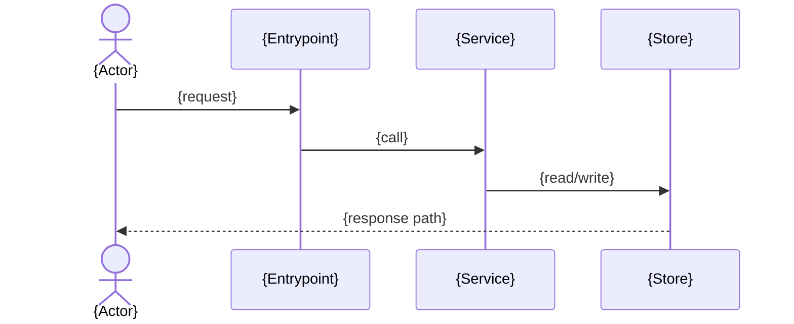

# Architecture Doc Set Skeletons

Copy these skeletons into `<docfolder>/architecture/` and replace placeholders. Keep each doc within the budgets from `SKILL.md`.

## index.md

```markdown
# Architecture Docs

- [overview.md](overview.md) — what the system is and what runs inside it (context + containers).
- [flows.md](flows.md) — how the key requests/events flow end to end.

Generated: {YYYY-MM-DD} · Source commit: `{short-sha}` · Regenerate with `/arch-map`.
```

## overview.md

```markdown
# {System} Overview

## System Context

```mermaid
flowchart LR
  user([{Actor}]) --> system[{System}]
  system --> ext1[({External dependency})]
```

{One paragraph: who uses the system and which external systems it depends on, with evidence refs.}

## Containers

```mermaid
flowchart TB
  subgraph system[{System}]
    api[{API / entrypoint}]
    core[{Core module}]
    db[({Database})]
  end
  api --> core --> db
```

{One paragraph: each container's responsibility and the evidence that proves it (manifest, config, entrypoint).}
```

## flows.md

```markdown
# Key Flows

## {Flow name, e.g. "Create order"}



{One paragraph: what this flow demonstrates and where it lives in code (file:line anchors).}
```

## projects/{name}.md (multi-deployable workspaces only)

```markdown
# {Project} Containers

```mermaid
flowchart TB
  subgraph project[{Project}]
    entry[{API / entrypoint}]
    core[{Core module}]
    store[({Store})]
  end
  entry --> core --> store
```

{One paragraph: this deployable's responsibility inside the workspace and the evidence that proves it (manifest, config, entrypoint). Cross-project edges cite manifest/config evidence only.}
```
