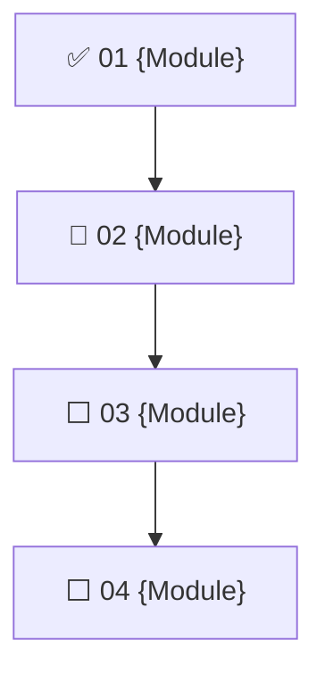

# Learning Path — {Topic}

> Mission: `mission.md` · Updated: {YYYY-MM-DD}

## Roadmap

## Modules

| # | Module | Single tangible win | 10% lesson | 70% exercise | Status |
| --- | --- | --- | --- | --- | --- |
| 01 | {name} | {outcome} | `notes/0001-{lesson}.md` | `exercises/0001-{name}.md` | ✅ |
| 02 | {name} | {outcome} | — | — | 🔄 |

## Completion

| Gate | Status | Evidence |
| --- | --- | --- |
| Capstone teach-back vs mission goal | ⬜ | — |

## Log

- {YYYY-MM-DD}: {what happened; pacing/ZPD decision and why}
