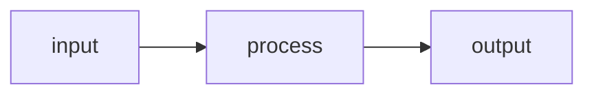

topic-a × topic-b

# Deck title

## topic-a × topic-b

One-line subtitle describing what connects the two topics

  topic-a · its one-line role
  topic-b · its one-line role

---

topic-b

# Content slide

Short lead-in sentence framing the slide.

- **Key point** — supporting detail
- **Key point** — supporting detail
- **Key point** — supporting detail

<!--
Presenter notes go in a trailing HTML comment inside the slide.
Expand on the bullets here; the audience never sees this.
-->

---
class: diagram-center
---

topic-a

# Diagram slide

<!--
Node accents: `class <id> a|b|aux` — the classes are styled by the theme's
mermaid-setup.ts in the scheme-correct palette. No classDef in fences:
mermaid cannot parse var() there and hardcoded hexes break day/night.
-->

Caption: move detail out of wide node labels into a line like this.

