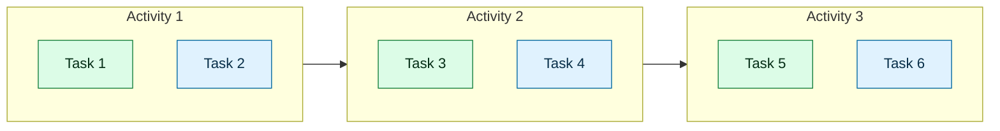

# {Product or Feature Name} User Story Map

Remove template guidance lines from the final output.

## Metadata

| Field | Value |
| --- | --- |
| Product / Feature | {name} |
| Status | {draft/review/final} |
| Primary Actor | {primary actor} |
| Date | {date} |
| Language | {artifact language} |

## Goal & Context

{Outcome the map supports, current context, and any source inputs used such as raw idea, PRD, RFC, issue, or notes.}

## Actors

Repeat actor rows as needed. Omit secondary actors when none exist.

| Actor | Role in Map |
| --- | --- |
| {Primary Actor} | Primary journey owner |

Add one row per secondary actor when present.

## User Journey Backbone

| Order | Activity | User Intent |
| --- | --- | --- |
| 1 | {Activity 1} | {intent} |
| 2 | {Activity 2} | {intent} |
| 3 | {Activity 3} | {intent} |

## User Tasks by Activity

### {Activity 1}

- [{slice}] {concise user task}
- [{slice}] {concise user task}

### {Activity 2}

- [{slice}] {concise user task}
- [{slice}] {concise user task}

### {Activity 3}

- [{slice}] {concise user task}
- [{slice}] {concise user task}

## Slice Plan

### MVP Slice

{End-to-end slice description and why it is the first usable release.}

- {MVP task from early journey}
- {MVP task from middle journey}
- {MVP task from late journey}

### Later Release Slices

Omit this section when no later slices were planned. If included, add one bullet per release slice.

## Mermaid Story Map

If the user explicitly requests a narrative journey diagram, add a Mermaid `journey` diagram here after the flowchart. Otherwise omit this note.

## Open Questions

- {Question, owner if known, and why it matters}

## Risks

- {Risk, impact, and possible mitigation}

## Assumptions

- {Assumption and what would invalidate it}

## Next Steps

- Review the MVP Slice with stakeholders.
- Convert the MVP Slice into buildable issues when ready.
- Resolve the highest-impact open questions before implementation starts.
